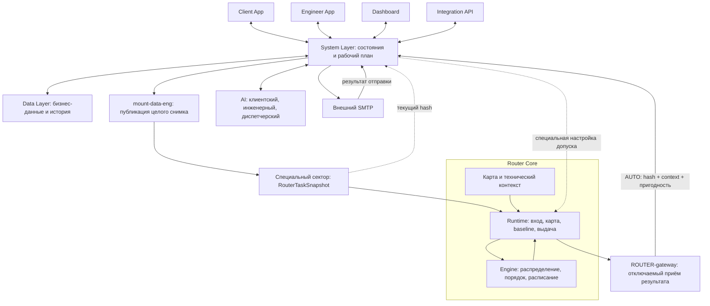

# Концепция системы — v14

**Интеллектуальная диспетчеризация выездных инженеров · «Билайн Бизнес»**  
**Редакция:** 15 сентября 2026 года. Консолидированная концепция после обсуждения v4–v13.  
**Политика по умолчанию:** `fast`. Иерархию целей задаёт политика диспетчера, а не неизменная последовательность в Engine.

## Навигация по комплекту

| Документ | Назначение |
|---|---|
| **Этот файл** | Вся система: продукт, зоны, роли, сценарии, границы ответственности, данные и поставка |
| [router_contract_v2.md](./router_contract_v2.md) | Внешний контракт Router Core, специальный входной сектор, результат, версии и правила применения |
| [engine_contract_v2.md](./engine_contract_v2.md) | Внутреннее устройство Runtime / Engine, математическая постановка, интеграция OR-Tools и надстройки |
| [short_concept.md](./short_concept.md) | Краткое содержательное введение для команды |

### Как читать статус решений

**Согласовано** — решения пользователя из обсуждения, включая последние уточнения о `fast` и трёх путях обработки Engine. **Проект реализации** — конкретизация механизма, предложенная в технических документах; она не выдаётся за уже написанный или измеренный код. **Требует детализации** — значения или системные сценарии, которые ещё не определены.

Комплект описывает целевую систему и опорный проект её реализации. Он не является отчётом о готовом прототипе, пройденных интеграционных тестах или достигнутом ускорении. Ранее обсуждавшиеся, но затем заменённые варианты не действуют одновременно с новыми.

**Граница источников:** [ТЗ] — предоставленное задание «3. Билайн Бизнес.pdf»; [Обсуждение] — согласованные в переписке решения; [Проект] — инженерная конкретизация. Требования ТЗ и расширения команды разделены ниже. Документация библиотек подтверждает только их указанные возможности, не работоспособность всего проекта.

---

## 1. Суть продукта и задача хакатона

Система принимает клиентские заявки, распределяет их между выездными инженерами, строит последовательности посещений и расписания, сопровождает фактическое выполнение и перепланирует оставшуюся работу при изменении условий. Диспетчер видит применённый план, карту, причины решений, неназначенные заявки, проблемы и сравнение с базовым распределением.

Клиенту не требуется разбираться в квалификационных кодах и оптимизации. Он описывает проблему, место и удобное окно. Инженер получает понятный рабочий план и подтверждает ключевые фактические события. Диспетчер управляет условиями и политикой; при экстренной необходимости полностью перехватывает управление рабочим планом.

**Вычислительная задача:** совместно выбрать исполнителей, порядок заявок, времена визитов и обеды, соблюдая обязательные ограничения и сравнивая допустимые планы по выбранной политике. Система не сводится к поиску кратчайшего пути между двумя адресами.

### 1.1. Обязательное ядро кейса

ТЗ требует распределение заявок, карту, соблюдение квалификации / времени / транспорта, минимум один сценарий перепланирования, понятные объяснения и сравнимые метрики. Упорядоченные заявки, время, причины неназначения, число инженеров и индивидуальный / суммарный пробег входят в результат. Математический оптимум доказывать не требуется. [ТЗ: стр. 2–5]

ТЗ не требует промышленной FSM-платформы, мобильного приложения, полноценной авторизации, Kafka или тысяч заявок. Наши собственные интерфейсы, AI, почта, ручной перехват и обеды — расширения концепции, а не дополнительные обязательства организатора. [ТЗ: стр. 6]

### 1.2. Образ демонстрации

Показать исходные заявки и инженеров; применённый автоматический план; объяснение одной заявки; событие изменения; новый план и видимую разницу; сравнение с baseline. Дополнительные возможности должны усиливать этот сценарий, а не быть необходимым условием существования основного расчёта. Демонстрация 5–7 минут и возможность видеозаписи вместо live предусмотрены заданием. [ТЗ: стр. 6–7]

Рекомендация организатору предоставить 10–15 инженеров и не более 100 заявок не означает, что такой фактический набор уже получен. Конкретный датасет в обсуждении не исследован; поля и нормативы не выдумываются. [ТЗ: стр. 7]

---

## 2. Архитектура: зоны и границы

### 2.1. Четыре внешних входа

| Зона | Пользователь / назначение | Основной обмен |
|---|---|---|
| `client-app` | Клиент | Создать / подтвердить заявку, посмотреть состояние, изменить условия в разрешённом сценарии |
| `eng-app` | Инженер | Получить план, передавать GPS, рабочую доступность, отметки и проблемы |
| `dashboard` | Диспетчер | Контроль, политики, правки данных, импорт, чаты, alerts, экстренный ручной режим |
| Интеграционный `API` | Существующая система | Те же разрешённые операции через ролевые интеграционные токены |

Под «четырьмя шлюзами» в дальнейшем понимаются эти четыре внешних контура. Их не следует смешивать с внутренними адаптерами `AI-gateway`, `SMTP-gateway`, `ROUTER-gateway`.

### 2.2. Центральные компоненты

**System Layer** владеет бизнес-состояниями, авторизацией, операциями пользователей, применённым рабочим планом и его исполнением. Он готовит вход для Router, принимает актуальный результат и обслуживает интерфейсы, AI и почту.

**Router Core** — автономный вычислительный модуль. Внутри два юнита: `Router Runtime` обслуживает вход, карту, baseline, вычислительный процесс и выдачу; `Routing Engine` принимает основные маршрутные решения. Оба остаются внутри одного внешнего модуля.

**Data Layer** хранит бизнес-данные, применённое состояние, историю и опубликованный входной сектор. Специальный сектор не является зеркалом каждого события в базе.

**AI** содержит три ролевых агента. Они объясняют и выполняют разрешённые системные действия через tools, но не записывают маршруты в память Engine.

**SMTP — внешний сервис на другом сервере.** Это не контейнер основной Docker-сети. Адаптер `SMTP-gateway` внутри sys не меняет место размещения почтового сервиса.

### 2.3. Актуальная схема



Пунктир настройки допуска — узкое согласованное исключение, а не универсальный командный API ядра. Политика поступает как данные задачи. Изменение допуска поступает как специальная техническая операция.

### 2.4. Историческая схема с доски


Изображение сохранено как исходный материал. Для реализации приоритет имеют актуальные границы выше: SMTP вне сервера, отключаемый выход Router, собственная память результата, отдельный применённый план и специальный входной снимок. Старые двунаправленные стрелки не дают права редактировать Router извне.

---

## 3. Четыре разных состояния данных

| Состояние | Владелец и содержание | Что его меняет |
|---|---|---|
| **Живое состояние** | Sys / Data Layer: события, стадии работ, GPS, текущая занятость, обед, пользователи | Пользовательские действия и обработка событий |
| **Опубликованный вход** | Специальный сектор: оставшиеся работы, старты / доступность, обеды, политика | Целая публикация через `mount-data-eng` |
| **Автоматический результат** | Кратковременная память Router: main + baseline + принадлежность к входу | Только Router |
| **Применённый рабочий план** | Sys / Data Layer: то, что получают приложения и по чему идёт работа | Новый результат в AUTO; диспетчер в MANUAL; штатное продвижение исполнения в обоих режимах |

История отдельно сохраняет прошлые планы, события, ручные действия и переключения. Она не является управляющей копией маршрута.

Одинаковый `input_hash` означает одинаковый опубликованный вход, но не доказывает, что в живом приложении с тех пор никто не выполнил очередную работу. Это различие учитывается при применении нового результата, особенно после ручного режима.

---

## 4. Client App: полный согласованный пользовательский путь

### 4.1. Форма заявки

Поля: ФИО, адрес или точка на карте, проблема из списка, дата и временное окно, срочность, email. Локальная дата / время преобразуются в абсолютные секунды на входе. Пользователь не вводит технические требования к оптимизатору вручную.

Система формирует длительность работы, требуемый навык и ограничение транспорта **по локации и типу работ**. При наличии готовых значений в датасете требуется определить приоритет источников; пока это не решено. Router получает подготовленные значения, не классифицирует свободный текст клиента и не придумывает нормативы.

### 4.2. Клиентский AI

Клиент описывает проблему естественным языком. Агент уточняет недостающие сведения, предлагает кнопки, ввод и выбор точки. Перед отправкой клиент подтверждает собранную заявку. Разрешённые действия агента исполняются инструментами sys с правами клиента.

Создание заявки и разрешённые изменения её состояния не означают право агента назначить инженера, объявить работу выполненной или поменять маршрут. Точный список tools и подтверждений предстоит описать на этапе AI.

### 4.3. Отправка, назначение и письма

```text
Собрана заявка
→ клиент подтвердил данные и email кодом
→ pending
→ результат назначения принят системой:
   назначение есть → письмо с подтверждением;
   приезд в выбранное окно невозможен → стандартное письмо
   со ссылкой на изменение даты / времени.
```

Подтверждение email / отправки, назначение и начало выполнения — три разные стадии. Пока актуальный расчёт не получен, отсутствие назначения не превращается в отказ. Техническая ошибка Router также не является основанием отправить клиенту письмо «приезд невозможен».

Письмо формируется sys на основании применённого результата и бизнес-перехода. Не каждый повторный read Router создаёт новый переход. Отметка инженера «Опаздываю» сама по себе не вызывает письмо; малое отклонение и установленная невозможность визита в окно различаются.

### 4.4. Просмотр и завершение

Вход по email и коду. Клиент видит активные заявки: проблему, дату / окно, конкретное расчётное время визита после назначения и доступные сведения о выполнении. Поездка и состояние заявки не смешиваются. Точные правила показа «в пути / опаздывает» ещё требуют системной детализации.

Предусмотрено изменение даты / времени. Перенос уже подтверждённого визита, отмена и сохранение старого назначения до подтверждения нового пока не расписаны окончательно.

После подтверждённого выполнения заявка уходит из активного списка, но не удаляется из базы и истории. При пустом списке клиент по-прежнему может войти.

---

## 5. Engineer App: план, события и доступность

### 5.1. Основной интерфейс

Дневной список заявок с типом, временем и маршрутом; карточка с адресом / картой, именем и email клиента, проблемой, временем и отсчётом; кнопка «Маршрут на день»; инструменты сообщения о проблеме, техническом перерыве и рабочей доступности. Настройки профиля включают навыки, транспорт и офис, права на их изменение ещё уточняются.

Инженер получает **применённый план sys**, а не фоновый результат Router напрямую. Поэтому в MANUAL приложение показывает ручной план, даже если ядро параллельно рассчитало другой.

### 5.2. Три независимые группы состояния

| Группа | Пример | Нельзя трактовать как |
|---|---|---|
| Рабочая доступность | Online / offline, техническая остановка, смена | Наличие сетевого соединения |
| Связь | Последнее сообщение, потеря соединения | Факт отказа работать или освобождения |
| Выполнение | Едет, прибыл, работает, завершил, сообщил проблему | Автоматическое наступление времени по расписанию |

`online` означает участие в работе, но не «свободен сейчас». Техническая остановка может иметь ожидаемый возврат `expected_online_at`. Исходная продолжительность технического перерыва — 15 минут; это не длительность обеда. Наступление ожидаемого возврата не создаёт фиктивную отметку online.

### 5.3. Расчётное время и ключевые отметки

Каждая назначенная заявка имеет расчётное время внутри клиентского окна. Именно от него работает отсчёт. При окне 14:00–16:00 и расчётном визите 15:00 этап «за 15 минут» наступает в 14:45. Это иллюстрация, не заданный режим дня.

За 15 минут предлагаются «Буду вовремя» и «Опаздываю». «Буду вовремя» необязательно. Прибытие к выполнению и завершение обязательны как факты; начало работы нельзя приписать инженеру только потому, что наступило время визита.

В штатном случае возможна объединённая кнопка «Прибыл, начинаю работу». Если инженер на месте, но не может начать, прибытие и начало должны оставаться разными событиями. Окончательные названия / доступность кнопок — следующий этап Engineer App.

В исходной записи на момент визита указаны «Выполнено», «Проблема», «Опаздываю». Примечание с доски относится только к последней кнопке и её прежнему нажатию; оно не распространяется на две другие. Эта запись сохраняется как исходная UI-логика, но не заменяет согласованные реальные переходы начала / завершения.

### 5.4. Нет отметки — неизвестность, а не успех или опоздание

До визита система использует план как прогноз. После ожидаемого прибытия без отметки отображает неподтверждённость. После периода ожидания — напоминание инженеру. При отсутствии ответа — предупреждение диспетчеру с последними известными стадией и состоянием связи.

Постоянных запросов «всё ли хорошо» нет. Отсутствие новой проблемы позволяет продолжать пользоваться прогнозом, но не доказывает завершение этапа. Расчётная длительность не закрывает заявку и не делает инженера фактически свободным.

Численные интервалы напоминаний и предупреждений не выбраны. Время ожидания отметки и малый допуск задержки — разные параметры.

### 5.5. GPS, задержки и переезды

Sys получает и хранит GPS / события. Сырой поток координат не записывается непосредственно в хэшируемый сектор. При публикации новой задачи используется актуальная подготовленная стартовая точка.

Нажатие «Опаздываю» не равно письму клиенту или обязательной перестановке маршрута. Для оценки допуска нужна величина отклонения либо уточнённый прогноз; способ её получения ещё уточняется на уровне sys. Порог находится внутри Router.

Инженера в пути можно направить на другую **ещё не начатую** заявку, если это улучшает план по действующей политике. Начатую работу Router не перебрасывает: она исключена из свободного пула и отражена во времени освобождения исполнителя.

### 5.6. Чат и обед

Инженерный AI помогает с проблемами, формирует разрешённые обращения / заявки и меняет разрешённые статусы через sys. Сообщения диспетчера приходят в тот же чат с явным указанием человеческого автора.

Обед показывает система по применённому расписанию. Факт его начала устанавливает `lunch_taken=true` для инженера и рабочего дня. Уже начатый обед учитывается в `available_from`; Router второй обед не назначает.

---

## 6. Dashboard: контроль и вмешательство

### 6.1. Картина дня

Диспетчер видит все заявки с деталями и объяснениями; отдельный список неназначенных с причинами; инженеров, позиции, доступность и связь; карту со слоями; alerts; сводку и сравнение main / baseline. Для строк предусмотрены подробности, в исходной концепции — в том числе при hover.

Обязательные показатели: число инженеров хотя бы с одной заявкой, пробег каждого и суммарный. Дополнительные принятые показатели: покрытие заявок, срочные, время дороги, работ, ожидания и обедов. Сравнение показывает изменившиеся назначения, порядок и маршруты, а не только итоговый процент.

Неназначенная заявка, отсутствие готового результата, техническая ошибка и неподтверждённое прибытие — разные состояния интерфейса. Новые данные при отставшем hash означают загрузку, а не автоматически невыполнимость.

### 6.2. Политика диспетчера — важное уточнение v14

**Диспетчер выбирает политику, а политика задаёт иерархию / коэффициенты целей. Engine не содержит неизменного бизнес-порядка «сначала срочные, потом всё остальное».** Он знает допустимые критерии и умеет исполнять их конкретную конфигурацию.

Первая политика по умолчанию — **`fast`**. В её стартовом описании из обсуждения ресурсный порядок: суммарное время перемещений → суммарный пробег → число инженеров. Это не минимизация времени завершения последней заявки: makespan был бы отдельной целью.

Для полного начального пресета предложенная ранее иерархия покрытия / обедов используется как **содержимое каталога `fast`**, а не как ограничение архитектуры:

```text
fast, стартовый профиль:
неназначенные срочные
→ неназначенные всего
→ пропущенные включённые необязательные обеды
→ суммарное время дороги
→ суммарный пробег
→ инженеры с заявками.
```

Это явное оформление стартового пресета. Другая политика может использовать другой порядок или согласованные коэффициенты, не заменяя Engine. Жёсткая квалификация, окна / смены, отсутствие пересечений, запрет второго обеда и установленный `lunch.required` не становятся ценовыми предпочтениями.

ТЗ требует повышенный приоритет срочной заявки, но не требует строгое правило «любая одна срочная ценнее любого количества обычных». Строгая лексикография выше — свойство стартового пресета, а не доказательство смысла этого слова в задании. Каталог политик должен явно показывать диспетчеру этот обмен. [ТЗ: стр. 5]

`compact` остаётся возможным дополнительным пресетом с ресурсным порядком персонал → пробег → время, **не значением по умолчанию**. Смена политики обновляет данные задачи и не переключает реализацию solver произвольной командой.

### 6.3. Обычные ручные действия

Диспетчер меняет окно, локацию и приоритет заявки, навыки / транспорт в рамках будущих прав, доступность инженера, политику и предпочтения. Sys проверяет права, формат и ссылки, сохраняет изменение и публикует значимое новое состояние. Router самостоятельно обнаруживает вход.

В AUTO ручная правка данных не означает ручную запись результата. Sys не подбирает другой адрес или окно, чтобы скрыто «сделать задачу выполнимой». Конфликт отображается.

Предусмотрены чат с инженером, ручное отключение от работы, генерация интеграционных токенов и догрузка данных. Точные ролевые ограничения этих операций будут определены в системных контрактах.

### 6.4. AI диспетчера

`read-only` разрешает чтение и объяснение; tools записи должны быть реально недоступны. `fix` разрешает конкретные системные изменения с правами диспетчера. Это не разрешение напрямую менять Router.

Переключатель `read-only / fix` независим от `AUTO / MANUAL`. Возможность AI включать экстренный режим, менять ручной план и использовать техническую настройку допуска не утверждена автоматически.

---

## 7. Экстренный ручной перехват

### 7.1. Включение

Отдельная кнопка Dashboard фиксирует текущий применённый план как исходную точку и **отключает передачу результата Router → sys**. Не останавливает Router, чтение сектора, приём заявок, GPS, авторизацию, чаты или фактические события.

План не становится навсегда неизменяемым: диспетчер теперь сам назначает, перенаправляет и меняет очереди через sys. Изменения сохраняются в Data Layer и видны приложениям.

### 7.2. Что происходит с Router

Runtime продолжает получать входные снимки и считать baseline; Engine — собственный основной план. Их результаты остаются внутри Router и не обрабатываются sys. Поэтому они не меняют ручной план, не рассылают клиентские письма и не создают alerts от новых автоматических решений наверху.

Ручные будущие назначения **не передаются как обязательные ограничения ядру**. Реальные изменения доступности и уже совершившиеся события по-прежнему учитываются при подготовке следующего снимка.

### 7.3. Возврат AUTO

Шина восстанавливается. Sys проверяет текущий опубликованный вход, активный контекст Router, пригодность результата и совместимость с уже произошедшими фактами. Актуальный результат заменяет будущее ручное распределение. Это не слияние и не восстановление утреннего снимка.

Начатые / завершённые работы и использованный обед не отменяются. Если входная проекция устарела относительно текущих фактов, sys публикует новую и ожидает соответствующий результат. Он не исполняет собственную переоптимизацию при «подрезании» чужого ответа.

Обычное повторное чтение `result_id` идемпотентно. Явный возврат из MANUAL — отдельный переход, который может однократно применить встречавшийся ранее результат, если он всё ещё соответствует текущей задаче. Точная транзакционная граница перехода — предмет System Layer.

---

## 8. Обеды: согласованный сценарий и минимальное восстановление

Условия на инженера: `enabled`, положительная `duration_sec`, начало / конец допустимого окна, `required`; отдельно `lunch_taken`. Общий переключатель Dashboard разворачивается в значения инженеров. Точные часы и длительность пока не названы и должны быть заполнены конфигурацией до включения функции.

Обычный обед Router пытается разместить в середине дня по загрузке, целиком внутри окна и без работы / движения в этом интервале. В согласованном автоматическом сценарии при конфликте заявки и необязательного обеда предпочтение отдаётся заявке, а пропуск сопровождается alert.

`lunch_taken=true` ставит sys при фактическом начале; это означает, что единственный обед дня уже использован, не обязательно закончен. Публикация расписания флаг не ставит. Переключение режимов или выключение / включение обедов не сбрасывают факт.

**«Вернуть обед»** — одно системное действие: связать решение с актуальным alert / результатом, проверить неизрасходованный обед, исключить только явно подтверждённые заявки из нового свободного пула и выставить `lunch.required=true` соответствующему инженеру на день. Публикуется один снимок. Будущий интервал снова выбирает Router.

`required` нельзя молча снять, если задача не решилась. Дополнительные отказы от других заявок не превращаются в автоматическое бизнес-действие этой операции. Если выбранного исключения недостаточно, показывается конфликт; гарантированный `restore_option` выдаётся только после проверки.

**Проект системной защиты:** перед применением результата восстановления проверять дополнительные потери ранее назначенных работ и требовать нового решения диспетчера, а не автоматически отправлять отказы всем затронутым клиентам. Это не дополнительный язык ограничений Router и не его ручное редактирование.

---

## 9. System Layer: принятые границы, без преждевременного полного ТЗ

### 9.1. Его задачи

Sys обрабатывает четыре внешних входа; авторизацию / права; изменения бизнес-данных; техническое заполнение заявки; подтверждённые события; живые GPS; напоминания; формирование входного снимка; проверку и применение результата; рабочий план; AUTO / MANUAL; AI-tools; письма и импорт.

Он знает, что значит «работает», «ожидает доступа», «завершил», «обед уже начат». На расчёт передаётся не история этих стадий, а подготовленные оставшиеся работы и стартовая пара.

### 9.2. Подготовка старта

Если инженер свободен в точке Б, она становится `start_location`, а `available_from` — подготовленной нижней границей начала дальнейшего пути. Если ещё работает в Б, sys передаёт прогноз освобождения. Текущая работа остаётся вне свободного `requests[]`.

Неизвестное время нельзя заменять на ноль или считать свободой. Консервативная рабочая интерпретация контракта: при `available_from=null` новые работы не назначать и показывать диагностику. Конкретный источник прогноза и поведение при его просрочке пользователь отдельно не утвердил — это вопрос System Layer, а не новая FSM в Router.

### 9.3. Чего sys не делает

Не редактирует память результата Router. Не меняет назначения основного плана после Engine в AUTO. Не создаёт факты выполнения из времени. Не передаёт произвольные команды «пересчитать / назначить / переключить алгоритм». Не копирует каждый результат обратно во вход как новое ограничение. Не выводит отказ клиенту из продолжающегося расчёта.

### 9.4. Внутренние блоки из обсуждения

`REST API`, `auth-engine`, `dataengine`, `mount-data-eng`, `AI-gateway`, `SMTP-gateway`, `ROUTER-gateway`, `orchestrator backend`. Их упаковка в классы / сервисы / процессы пока не определена. Backend-orchestrator координирует приложение, не командует внутренним поиском Engine.

Четыре внешних gateway-контракта и подробная модель sys — следующий этап документации. Здесь фиксируются ответственность и границы, а не выдуманные endpoints / схемы транзакций.

---

## 10. Router Core: контракт и внутренний механизм

### 10.1. Вход и выход

Полная таблица полей находится в [router_contract_v2.md](./router_contract_v2.md). Вход: версия схемы, `planning_as_of`, горизонт, оставшиеся заявки, инженеры со стартами / доступностью / обедом, политика. Карта и допуск — отдельные ресурсы.

Выход: `status`, `result_id`, использованные `input_hash` и `router_context_version`, время состояния / расчёта, main и baseline одной формы, ошибки. Каждый Plan содержит назначение каждой входной заявки, маршруты / расписание, результат обеда, объяснения и метрики.

`ready` не означает, что назначены все работы. `is_usable` отделяет допустимый план от варианта, который нельзя применять. `metric_scope=snapshot_remaining` отделяет будущую задачу от полного прошедшего рабочего дня.

### 10.2. Два внутренних юнита

| Runtime | Engine |
|---|---|
| Целостное чтение входа и контекста | Совместное назначение, последовательность и расписание |
| Подготовка дорожных данных | Проверка, восстановление и улучшение основного кандидата |
| Последовательный baseline | Подбор обедов и соблюдение обязательных условий |
| Управление заданиями и публикацией | Расчёт непосредственно связанных метрик / оснований |
| Служебные версии, ошибки, упаковка | Использование OR-Tools через собственный адаптер |

Runtime не исправляет основной маршрут после расчёта. Может независимо проверить его, отвергнуть ошибочный результат и агрегировать величины. Общие чистые функции проверки — не третья подсистема принятия решений.

### 10.3. Три согласованных пути Engine

**Малое отклонение:** взять свой прежний порядок как кандидат, пересчитать расписание на новом входе и проверить. При допустимости и соблюдении технического критерия сохранить порядок без полной переоптимизации.

**Существенное изменение:** адаптировать прежний кандидат к новому пулу / стартам, восстановить допустимость, вставить или перераспределить работы и улучшать под действующей политикой.

**Первый запуск / нет пригодного кандидата:** построить первое допустимое решение, затем улучшать его в пределах бюджета.

Новый hash нельзя просто приклеить к непроверенному старому ответу. Изменение политики, квалификации, транспорта, окна, required-обеда или состава срочных не объявляется малым только потому, что разница минут невелика. Старый результат — подсказка, не обязательное назначение и не свидетельство того, какой план сейчас использует sys.

### 10.4. Опорная реализация с OR-Tools

В [engine_contract_v2.md](./engine_contract_v2.md) предложен единый путь: OR-Tools Routing Solver для совместного поиска; собственные адаптеры данных и политики; моделирование времени / совместимости / необязательных работ; специальная модель обеда; seed прежнего результата; независимая проверка; baseline вне основного solver.

Техническая база: вставка `PARALLEL_CHEAPEST_INSERTION`, улучшение `GUIDED_LOCAL_SEARCH`, явный бюджет; при пригодном предыдущем решении — запуск от assignment. Это стартовая инженерная конфигурация, не доказанный лучший набор настроек. Детали и предупреждения по API проверены по официальным источникам и перечислены в engine-документе.

Список надстроек важен: OR-Tools сам по себе не предоставляет наши политики, публикацию снимков, права, обеды с `lunch_taken`, идемпотентность, источник фактов, объяснения и ручной режим. Всё это описано отдельной логикой вокруг него.

### 10.5. Карта и геометрия

Runtime готовит время и расстояние между нужными точками по транспортным профилям. Main и baseline используют одинаковые данные. Время и расстояние пары должны относиться к одному выбранному пути. Не предполагаются симметрия направлений, одинаковая проходимость car / walk и поддержка расписаний transit без соответствующих данных.

Путь для отображения формируется после выбора последовательности. Геометрия опциональна, но карта интерфейса и числа должны оставаться согласованными. Прямая линия между адресами не выдаётся за точный дорожный маршрут.

### 10.6. Малый допуск

Порог хранится внутри Router, не в политике и не в секторе. Меняется только специальной разрешённой конфигурационной операцией sys → Runtime. Эта операция не предоставляет доступ на произвольную запись маршрутов. Значение порога пока не названо.

Смена допуска увеличивает / меняет `router_context_version`; старый ответ не получает новую версию задним числом. Допуск стабилизирует порядок при малых изменениях, но не расширяет обязательные клиентские окна или смены.

---

## 11. Полный путь опубликованного снимка

1. Sys принимает разрешённое событие и обновляет живое состояние.
2. Если событие влияет на задачу планирования, `mount-data-eng` готовит целую текущую проекцию.
3. В той же публикации фиксируется `planning_as_of`; новая запись не является просто «тикающим timestamp».
4. Runtime обнаруживает изменение hash, фиксирует снимок и активный контекст.
5. Runtime подготавливает общие дорожные данные и baseline; Engine формирует main.
6. Результаты проверяются и публикуются с принадлежностью к реально использованным данным.
7. Sys в AUTO проверяет hash, контекст, пригодность и текущие факты; применяет допустимый новый результат один раз.
8. Приложения обновляются из sys, история сохраняется, бизнес-переходы запускают разрешённые уведомления.

Сам ход часов, каждое чтение, прогресс solver, полученный `result_id`, почтовый статус и сырой GPS не создают новую задачу сами по себе. Новая заявка, отмена, правки условий, доступность, политика, обеды и значимый новый прогноз — основания подготовки актуального входа.

**Публикация полного снимка не означает принудительный пересчёт любого поля базы.** Именно sys переводит события в задачу. **Сохранение порядка не означает отказ обрабатывать новый вход:** Engine обязан подтвердить его применимость.

---

## 12. AI: три агента и ограниченные действия

| Агент | Чтение / объяснение | Запись |
|---|---|---|
| Клиентский | Проблема и собственная заявка | Сформировать заявку и разрешённые изменения в клиентском сценарии |
| Инженерный | Текущие работы, проблемы, помощь | Разрешённые обращения и статусы инженера |
| Диспетчерский | Планы, причины, alerts, политики | Только в `fix`, через разрешённые sys-tools |

Режим read-only обеспечивается правами инструментов, а не одной фразой в промпте. Агент не должен изобретать основания маршрута. Engine / Runtime возвращают проверяемые данные; AI переводит их в понятное объяснение.

Техническая запись из исходной концепции: работа с API моделей, OpenAI SDK / Agents SDK как кандидаты, fallback и контекст `pgvec`. Прямая шина чтения векторов пока не утверждена. Даже её разрешение не даст прямой канал бизнес-записи.

Исходное «парсинг thinking и tools» сохранено как неоднозначная техническая заметка. Конкретные модели, протоколы ответа и доступность reasoning-полей не установлены. **Проектная граница:** инструменты и структурированные объяснения не должны зависеть от предположения, что провайдер выдаёт скрытый процесс рассуждений модели. Это предстоит формализовать отдельно, не заменяя источник маршрутизации LLM-текстом.

---

## 13. Внешний SMTP

Почтовый сервис находится на другом сервере. Его обязанности — отправка подготовленного письма, обслуживание очереди и доступный результат доставки / отправки. Sys генерирует код, выбирает шаблон, заполняет данные, связывает письмо с бизнес-событием и сохраняет состояние.

В исходной схеме соединение обозначено как VPN-туннель с fallback на TLS. Конкретный протокол адаптера, поставщик, retries и гарантии отправки не выбраны; это не API внутри основной Docker-сети.

Письма: подтверждение email / входа, подтверждение назначения, стандартное предложение поменять дату / окно при невозможности визита. Повторные чтения Router не должны создавать дубли. Нажатие «Опаздываю» не отправляет письмо автоматически. Правила уведомлений после ручных изменений ещё предстоит закрепить.

---

## 14. Data Layer

Согласованный состав: `engineers`, `clients`, `admins`, `sessions`, `requests`, сведения отправки `sent`, `admin-moves`, `decisions`, `politic-catalog`, общий `eternal-log`, применённый план, режим управления, история версий, фактические события, `lunch_taken` по дню, чаты и векторный контекст.

Названия сохранены как смысловые сущности, не обязательная финальная SQL-схема. `sent` не заменяет очередь внешнего SMTP. `politic-catalog` описывает поддержанные политики, а не произвольный исполняемый код от пользователя.

Отдельно находится специальный сектор `RouterTaskSnapshot`. Его writer — sys / `mount-data-eng`, reader — Router. Память main / baseline и производные дорожные кеши принадлежат Router и не записываются в сектор.

`pgvec` предназначен для контекста трёх AI-чатов. Неразборчивое на доске имя embedding-модели `[неразборчивое название]-OSS-270` не идентифицировано и не заменено догадкой. Redis остаётся открытым техническим выбором, а не принятой обязательной зависимостью.

Физическая публикация снимка — транзакционная запись, shared memory, файл или другой механизм — пока не выбрана. Важны неизменность читаемого снимка, один writer-контур и отсутствие частично обновлённого состояния. Выбор носителя не меняет смысл hash.

---

## 15. API, авторизация и сетевые связи

Прикладные операции четырёх внешних контуров идут через авторизованный REST API sys. **Исключения до сессии:** запрос и проверка кода входа. Это не делает операции с заявками и планами публичными.

Интеграционные типы из исходной концепции: `client-app-token`, `eng-app-token`, `master-token`; токены создаёт Dashboard. Типы client / engineer / dashboard и запросы к диспетчерскому AI используют соответствующие права. Режим read-only / fix соблюдается и через API.

Прежние «низкоуровневые запросы к router + data» не означают обход sys, произвольный SQL или запись в память Router. Точная область master-token, сессий и права специальной настройки допуска ещё не определены. UI, интеграция и AI не получают скрытых разных обходных путей записи.

AI и Router могут взаимодействовать с sys по внутренним API Docker-сети с дополнительной проверкой секретом, как записано в исходном проекте. Router читает сектор напрямую. Внешний SMTP в этот список не входит. Реальные URLs, transport, TLS-termination, секреты и rate limits будут описаны при детализации соответствующих слоёв.

---

## 16. Начальные данные, догрузка и поведение без лишних зависимостей

Начальный датасет поставляется в репозитории и автоматически подгружается при предусмотренной инициализации. Dashboard позволяет догружать CSV / JSON. Импорт проходит через sys и формирует нормальные бизнес-данные, а не пишет готовые маршруты в Engine.

Порядок поступления заявок и порядок инженеров сохраняются явно для baseline. Сортировка ради hash не должна менять этот смысл. Некорректные записи не исправляются выдуманными длительностями / транспортом. Дубликаты, повторная инициализация и приоритет значений датасета перед системными правилами — отдельный импортный контракт.

Самостоятельный Router должен работать на подготовленном снимке и подключённой карте без обязательного запуска AI, SMTP и UI. Отсутствие AI не запрещает форму; отсутствие почты в специальном демонстрационном образе должно явно отражаться как отключённая интеграция, а не имитация успешной доставки.

---

## 17. Качество результата, ошибки и измерение

### 17.1. Что проверяется

Квалификация и транспорт; окно начала и конец смены с дорогой / работой; единственное назначение; отсутствие наложений; стартовая доступность; допустимая география; единственный обед; целое обеденное окно; обязательный обед; согласованность метрик и версий.

Техническая ошибка входа отличается от корректной неназначенной заявки. Результат `NO_FEASIBLE_ASSIGNMENT_FOUND` не выдаётся за доказательство глобальной невозможности. Числа и причины main нельзя заменять AI-догадкой.

### 17.2. Baseline и честное сравнение

Базовое правило неизменно: arrival_order заявок, первый подходящий доступный инженер по input_order, добавление в конец очереди, без глобальной оптимизации. Повышение срочности не даёт права изменить исходное сравнение, сортируя baseline по выгоде. [ТЗ: стр. 4]

Main и baseline получают одну задачу, одну карту и одинаковые ограничения. При дневном снимке сравниваются два остатка дня, не остаток против полного утра. Полный фактический день собирает sys, не складывая механически количества уникальных инженеров разных версий.

Меньший пробег после отказа от части заявок не объявляется безусловным улучшением. Отображаются покрытие, срочные, обеды, пригодность и политика. Никакие проценты улучшения и секунды производительности на реальном наборе пока не измерены.

### 17.3. Минимальные приёмочные сценарии

| Сценарий | Проверяемый результат |
|---|---|
| Несовместимый навык / транспорт | Неподходящий инженер не назначен, причина различима |
| Узкое окно, долгая работа | Начало в окне, окончание в смене; нет подмены окна концом работы |
| Новая срочная / отмена / offline | Новый снимок, актуальный результат, видимая разница |
| Малая задержка | Применимость порядка перепроверена, факты не выдуманы |
| Работа / обед уже начаты | Нет переназначения текущей работы или второго обеда |
| MANUAL и возврат | Фоновый Router не меняет ручной план; актуальный результат заменяет будущее |
| Повторный read результата | Нет возврата завершённых пунктов и дубля письма |
| Смена карты / допуска | Контекст меняется, старый ответ не становится новым |
| Разные политики | Меняется критерий выбора, не обязательная выполнимость |

---

## 18. Поставка и репозиторий

Сохраняются целевые варианты: полный контур с подключёнными внешним SMTP и AI; без SMTP / AI; минимально рабочий; отдельный «голый» Router. Внешний SMTP не переезжает в основной образ.

Материалы: полная кодовая база, README и AGENTS, `/context`, `/docs`, схема / FigJam, Figma, презентация, видео-демо, результаты benchmark, воспроизводимый тестовый набор. Код должен иметь тесты, CI/CD, игноры и `.env.example`. Это требования к будущей поставке, не заявление о наличии этих материалов сейчас.

```text
README.md / AGENTS.md / .env.example
/context
/docs
  /backend/api /backend/system /backend/AI /backend/SMTP
  /frontend /router /data /bench /demo
/tests
  /frontend /backend
/router-core
/AI
/SMTP
```

Файлы почтовой интеграции в `/SMTP` не определяют физическое размещение почтового сервиса. Конкретная директория датасета и правила повторного запуска ещё выбираются. Адрес `____.droidie.com` сохранён как намерение публичного стенда, а не работающий URL.

---

## 19. Стек: происхождение и степень определённости

| Зона | Записано в исходной концепции | Статус в этом комплекте |
|---|---|---|
| Frontend | React 19, Tailwind 4.5, React-Motion | Имена / версии сохранены, совместимость не перепроверялась; отдельный этап |
| Backend | Node.js 26, Nest API | Исходная запись, не выбранный здесь lockfile |
| Хранение | PostgreSQL 18, pgvector 0.8, Redis? | Семантика данных описана; Redis не утверждён |
| AI | OpenAI SDK / Agents SDK | Кандидаты из обсуждения; конкретные модели / API-контракт позднее |
| Deploy | npm 14, Docker / Compose | Исходная запись; не заявление о доступной проверенной комбинации |
| Router | Python 3.14, Google OR-Tools | В engine-документе проверены официальные API и предложен опорный профиль OR-Tools 9.15; интеграционные тесты ещё нужны |

Версии исходного списка не исправлены скрыто и не превращены в рекомендацию просто потому, что они присутствовали на доске. Подробная проверка сделана только для обсуждаемой интеграции Router, с обозначением её ограничений.

---

## 20. Следующие этапы и оставшиеся значения

Дальнейшее обсуждение идёт в согласованном порядке: **System Layer → Client App → Engineer App → Dashboard → интеграционный API → AI → внешний SMTP → Data Layer.**

Для sys нужны точные переходы, приём результатов при изменившейся живой проекции, возвращение AUTO, источники / просрочка прогнозов, уведомления, операция восстановления обеда и права. Для UI — окончательные кнопки и состояния. Для AI — tools / подтверждения. Для данных — SQL / snapshot storage / импорт.

Неблокирующие численные значения: длительность и окно обеда, величина внутреннего допуска, интервалы напоминаний, бюджеты solver после измерений. До их задания включаемая функция не должна молча работать на выдуманном нормативе. Технические стартовые бюджеты, предложенные в engine-документе, отмечены как профиль для испытаний, не SLA.

Контракт Router не возвращается к обсуждению уже принятых принципов. Новые изменения должны фиксироваться в соответствующем документе с явным статусом, а затем отражаться в остальных трёх.

---

## 21. Основания и итог v14

**Первичные материалы:** «3. Билайн Бизнес.pdf»; исходная схема и записи `system_concept_v4.md` (внутренний заголовок ранней версии — v2); вся текущая переписка; последняя полная версия `system_concept_v13.md` и companion `router_contract_v2.md`.

**Последние изменения:** `fast` принят по умолчанию; иерархия целей перенесена из постоянной логики Engine в политику; три пути Engine приняты; описание разделено на четыре специализированных артефакта. Устаревшие предложения про ручные обязательные назначения Router, SMTP внутри сети, часы как периодический триггер и полную FSM в ядре не являются действующими.

**Проектные дополнения этого комплекта:** конкретное подключение OR-Tools, модель внутренних обеденных узлов, компиляция целей, технические стартовые настройки и проверки реализации описаны в engine-документе отдельно от согласованных бизнес-решений. Они требуют кодирования и тестов.

**Текущее состояние:** единая архитектурная база и контракты для команды. Следующая работа — последовательная детализация системных зон и реализация, а не заявление о завершённых испытаниях.
