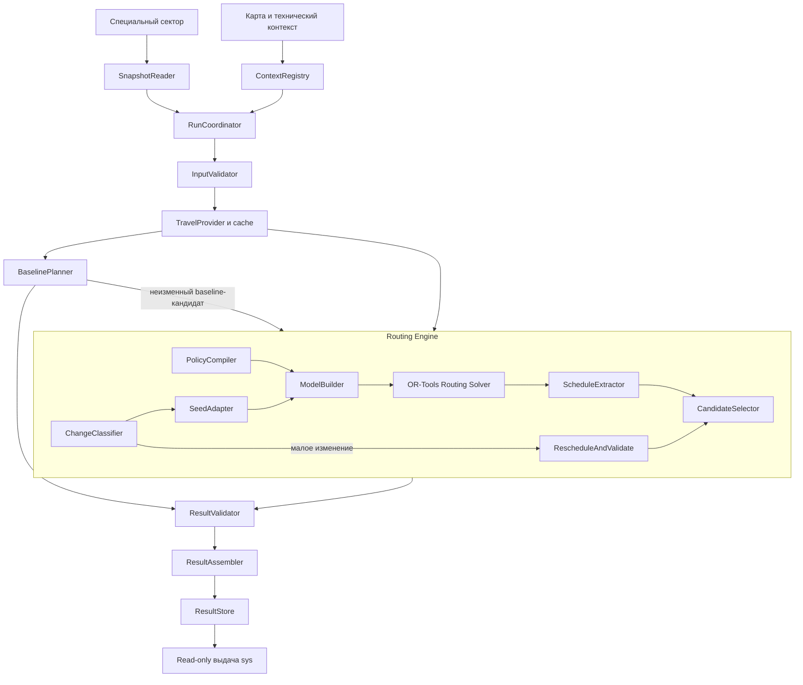

# Router Core — внутреннее устройство, модель и интеграция OR-Tools

**engine_contract_v2 · комплект system_concept_v14 · обновлено 17.09.2026**
**Политика по умолчанию:** `compact` (QA 16.09, [50](./50-concept-changes-after-qa.md) §1). Иерархия критериев принадлежит политике диспетчера.  
Связанные документы: [система](./32-system_concept_v14.md), [внешний контракт](./33-router_contract_v2.md), [обзор команды](./19-short_concept.md).

## 0. Назначение и степень готовности

Документ описывает **весь Router Core изнутри**, то есть служебный Router Runtime и основной Routing Engine. Имя файла не означает, что Runtime исключён из описания. Внешний input/output не дублируется полностью: его нормативная форма находится в `router_contract_v2.md`.

Согласованная основа: два юнита; независимое чтение снимка; `input_hash` и версия контекста; sys как менеджер фактов; собственная память результата; baseline в Runtime; default `compact`; три пути Engine; обеды (по умолчанию выключены) и восьмиполевая техническая ревизия. Новые детали ниже обозначаются как **опорный проект реализации**, выбранный для конкретности технической спецификации, а не как ранее утверждённые пользователем настройки.

V2 в `core/` реализует и тестирует описанные ниже снимок, OR-Tools модель, baseline, lunch-узлы, пять политик, три пути изменения, процессный Runtime, восьмиполевую техническую ревизию с durable-квитанциями операций и выдачу evidence. Golden-проверки выполнены на East, South-central и Southeast, а также на их едином мультизональном снимке (205 заявок / 35 инженеров). Это подтверждает текущие acceptance-наборы, но не заменяет промышленный performance-test или end-to-end приёмку с sys/data-layer.

Официальные источники [O1–O8] приведены в конце. Их роль ограничена API / поведением библиотеки. Все описания нашей политики, снимков, обедов и надстроек — проект, не пересказ существующего продукта OR-Tools.

---

## 1. Зафиксированные границы

### 1.1. Что Router решает

На входе — оставшиеся не начатые заявки, инженеры, их точки продолжения и время доступности, смены, навыки / транспорт, условия обедов и выбранная политика. Router выбирает назначения, порядок, расписание, допустимые обеды и объясняет полученный результат.

Назначение и порядок решаются совместно. Предварительное безвозвратное закрепление всех работ за ближайшими инженерами не используется: такое закрепление может лишить единственного подходящего специалиста времени для другой заявки, а последующая перестановка внутри маршрута уже не исправит распределение.

### 1.2. Что Router не решает

Он не ведёт стадии фактического выполнения, не создаёт отметки начала / завершения, не подтверждает online, не отправляет письма, не управляет правами AI, не читает произвольную живую БД и не знает будущий ручной план диспетчера как обязательное условие.

Начатая работа исключена sys из свободного пула и отражена в `start_location + available_from`. Текущий начатый обед имеет `lunch_taken=true` и занятие до `available_from`. Новый расчёт не отменяет эти факты.

### 1.3. Режимы приложения не являются режимами математической модели

В MANUAL Router продолжает тот же внутренний процесс. Отключён приём его выдачи sys. Нет второго solver «для ручного режима» и нет требования копировать будущие ручные назначения в Engine.

Специальная настройка допуска — отдельная ограниченная техническая операция Runtime. Она не даёт право изменить назначение, прочитать / перезаписать внутренние переменные поиска или выполнить переданный пользователем код.

---

## 2. Карта внутренних компонентов



Названия компонентов — предлагаемые границы кода, не дополнительные внешние сервисы. Функции проверки / арифметики расписания могут быть общими чистыми модулями. Они не должны обращаться к sys или выбирать новую бизнес-политику.

### 2.1. Router Runtime

| Компонент | Контракт ответственности |
|---|---|
| `SnapshotReader` | Получить целостный опубликованный снимок, независимо вычислить / проверить hash его представления |
| `ContextRegistry` | Дать зафиксированную карту, технические настройки и активную версию |
| `RunCoordinator` | Обнаружить новую задачу, управлять поколением вычисления, одним активным и последним ожидающим заданием |
| `InputValidator` | Проверить типы, единицы, ID, ссылки, наличие обязательных полей; не подставлять вымышленные значения |
| `TravelProvider` | Подготовить время, расстояние, достижимость и идентичность пути для требуемых точек / транспортов |
| `BaselinePlanner` | Выполнить заданное ТЗ последовательное распределение без глобальной оптимизации |
| `ResultValidator` | Проверить готовые main / baseline без изменения выбранных назначений |
| `ResultAssembler` | Свести проверенные данные в внешний контракт, добавить версии, ID, диагностику |
| `ResultStore` | Атомарно заменить опубликованную выдачу, не позволить старому поколению перезаписать новое |
| `ToleranceConfig` | Обслужить только разрешённое изменение технического допуска и контекста |

### 2.2. Routing Engine

| Компонент | Контракт ответственности |
|---|---|
| `PolicyCompiler` | Превратить выбранное определение политики в comparator и стоимость / последовательные задачи solver |
| `ChangeClassifier` | Выбрать проверку малого отклонения, repair или построение с нуля |
| `SeedAdapter` | Сопоставить старые бизнес-ID новому снимку, подготовить необязательный начальный кандидат |
| `EligibilityBuilder` | Вычислить допустимых исполнителей и доказуемые причины отсутствия совместимости |
| `ModelBuilder` | Создать RoutingIndexManager / RoutingModel, время, совместимость, обеды и цели |
| `SearchRunner` | Выполнить ограниченный поиск с нужными параметрами и контролем отмены |
| `ScheduleExtractor` | Преобразовать найденные переменные в конкретные секунды и реальные интервалы |
| `CandidateSelector` | Выбрать лучший проверенный кандидат по действующей политике; не гарантировать глобальный оптимум |
| `ReasonBuilder` | Сформировать основания, которые действительно следуют из входа / найденного решения |

---

## 3. Внутренние структуры и принадлежность данных

### 3.1. `CalculationContext`

Внутренний неизменный контекст одного расчёта:

```text
CalculationContext
  generation                 внутренний порядковый номер задания
  input_hash                 hash реально прочитанного снимка
  router_context_version     зафиксированная версия ресурсов / настроек
  snapshot                   RouterTaskSnapshot, неизменный
  travel_context             версии и подготовленные данные перемещения
  technical_settings         полная восьмиполевая ревизия (обеды, допуски, оценка дороги)
  policy_spec                разрешённое определение policy_id + parameters
  deadline                   монотонный срок окончания вычислительного бюджета
```

`generation` не является полем специального сектора. Он нужен для порядка вычислений, потому что hash нельзя сравнить по величине, а Unix-секунда не уникальна для двух публикаций. `deadline` использует монотонное время для бюджета, не изменяет `planning_as_of` и не становится бизнес-временем.

### 3.2. `EngineInput`

Эквивалентная снимку расчётная форма: массивы заявок / инженеров со стабильными ID, нормализованные окна в относительных секундах, совместимость, дорожные данные, `PolicySpec`, технические настройки и необязательные предыдущий / baseline кандидаты.

Подготовка формы может изменить технический порядок массивов, но обязана сохранить `arrival_order`, `input_order` и обратные отображения. Нельзя нормализовать неизвестное время в ноль, отсутствующую дорогу в бесплатный переход, а несовместимую квалификацию — в «почти подходящую».

### 3.3. `EngineResult`

Основной `Plan`, проверяемые основания, происхождение кандидата (`retained / repaired / cold / baseline_fallback` как внутренняя диагностика), статус поиска и значения критериев. Runtime добавляет общий внешний `result_id`, baseline и принадлежность.

Происхождение не обязано создавать новое поле внешней схемы: оно может передаваться через имеющиеся `Reason.facts` / служебную диагностику. Нельзя назвать baseline улучшенным решением, если Engine вернул его неизменённым.

### 3.4. Состояние, которое разрешено хранить между расчётами

Собственный последний корректный результат Router, его исходный hash / контекст, business-ID последовательностей, дорожные кеши, технический контекст и ограниченная диагностика. Старый объект solver / Assignment не переносится без адаптации в новую модель с другими индексами.

Отсутствие этой памяти не должно ломать правильность: cold path строит задачу из полного снимка. Предыдущий результат ускоряет поиск, а не заменяет обязательный вход.

---

## 4. Дорожный контекст

### 4.1. Два уровня графа

Дорожный граф содержит перекрёстки / рёбра / профили карты. Расчётный граф маршрутизации содержит только реальные заявки, подготовленные старты и внутренние служебные вершины. Engine не обязан выбирать каждого инженера одновременно с перебором всех дорожных перекрёстков.

Runtime готовит для физической пары точек и транспортного профиля:

```text
TravelQuote:
  reachable
  duration_sec
  distance_m
  path_ref / geometry_ref
  map_version
  transport_profile
```

Это **внутренняя** структура. Во внешнем результате расстояния остаются `distance_km`; целые метры используются для стоимости solver. Перевод единиц производится один раз по явно описанному правилу.

### 4.2. Как выбирать путь

Для первого профиля `fast` предлагается маршрут с минимальным временем в рамках поддержанного дорожного профиля; его расстояние берётся с того же пути. Для другой политики допустим другой поддержанный способ оценки, но он должен быть явен в подготовленном контексте. Нельзя взять время быстрого пути и расстояние другого короткого пути и считать их одним переездом.

Первый технический вариант — статические оценки на снимок. Time-dependent пробки / transit-расписания не объявляются реализованными. Если позже появится зависимость от отправления, её нужно отразить в TravelProvider, ключе кеша и модели; простого неизменного callback уже недостаточно для описания динамической среды.

### 4.2.1. Техническая настройка времени дороги — реализовано

Поверх любого неизменяемого TravelProvider действует обёртка `TechnicalTravel` (`core/geo.py`, `configure_travel`), применяющая поля технической ревизии ко **всем** путям расчёта — main, baseline, seed-проверка, benchmark: `graph_with_access_buffer` добавляет `access_buffer_sec` к длительности графа, `fixed_normative` заменяет длительность ненулевого плеча на `fixed_travel_time_sec`; нулевое плечо остаётся нулевым в обоих режимах. Путь и расстояние обёртка не меняет. Её версия выводится как hash из `base_version + конфигурации оценки`, поэтому смена только оценки инвалидирует результаты без смены карты. Обёртка идемпотентна: повторная конфигурация теми же настройками возвращает тот же объект.

### 4.3. Кеш и источники

Ключ кеша включает как минимум версию карты / профиля и идентичность пары физических точек. При разных критериях выбора дорожного пути — также этот режим. Координаты не округляются произвольно для объединения двух разных входов; любое допустимое округление — явное правило адаптера и часть контекста.

Данные готовятся **до** горячих callbacks OR-Tools. В callback нельзя делать сетевой запрос, ждать карту, читать изменяемую БД или получать каждый раз новое значение времени в пути. Оба плана используют тот же подготовленный набор.

Нельзя предполагать симметрию A→B и B→A, одинаковую достижимость car / walk / bike или реальное транспортное расписание для `transit` без данных. Упрощённая модель по координатам допустима заданием только с описанными допущениями. [ТЗ: стр. 6]

### 4.4. Недостижимые и отсутствующие пути

Неверная точка / неготовая карта — ошибка подготовки. Корректная, но недостижимая заявка — задача с ограничением достижимости и объяснением. Эти исходы различаются.

Внутренняя недостижимость не передаётся как `0`, `NaN` или бесконечность в целочисленную стоимость. Для модели используются запрет соответствующего перехода и конечное безопасное техническое значение вне горизонта как дополнительная защита. Итоговый валидатор независимо отвергает использование недостижимого участка.

### 4.5. Финальная геометрия

После выбора main / baseline Runtime материализует только используемые пути. `geometry` может быть `null`; это не отменяет вычисленные точки / порядок. Если линия возвращается, она относится к тому же пути, по которому считались показатели. Внешний frontend не получает весь дорожный граф ради повторного решения нашей задачи.

---

## 5. Математическая постановка

### 5.1. Объекты и переменные

Пусть `J` — ещё не начатые заявки, `E` — переданные инженеры. Для заявки `j`: точка, длительность `p_j`, окно начала `[a_j,b_j]`, приоритет, один требуемый навык и опциональное ограничение транспорта. Для инженера `e`: старт `s_e`, доступность, смена, навыки / транспорт и условия обеда.

Модель выбирает `assigned(j) ∈ E ∪ {unassigned}`, порядок `π_e`, время начала каждой работы и, когда требуется, место / время единственного будущего обеда. Уже начатые работы не являются переменными нового распределения.

Это открытые маршруты: конец последней работы не требует возвращения к утреннему офису. Пропуск части заявок разрешён как результат планирования с причиной, а не как техническая ошибка. [ТЗ: стр. 3–5]

### 5.2. Время старта

При известных значениях:

```text
release_e = max(planning_as_of, horizon_start_at,
                shift_start_at, available_from,
                expected_online_at — когда используется прогнозный возврат)
end_limit_e = min(shift_end_at, horizon_end_at)
```

Если `release_e > end_limit_e`, будущая работа на этой смене не помещается. Неизвестный `available_from` не равен текущему времени. Консервативный адаптер исключает новые назначения и выдаёт диагностику; точная политика подготовки / просрочки прогноза находится в sys, не в FSM ядра.

Точка и время старта образуют одну согласованную пару. ETA на другом адресе не заменяет available_from текущей точки: иначе дорога может учитываться дважды. Корректную проекцию сообщения о задержке готовит sys; Router получает уже определённые исходные условия.

Для обычного online-инженера `expected_online_at` не используется. Для offline с явно подготовленным будущим прогнозом нижняя граница не раньше него. Прогноз не создаёт фактический online. Неясный / просроченный срок не следует автоматически считать уже состоявшимся возвратом.

### 5.3. Последовательность

Для двух последовательных реальных работ `i,j` без промежуточного обеда:

```text
arrival_j >= start_i + p_i + travel_e(i,j)
start_j   >= max(arrival_j, a_j)
start_j   <= b_j
finish_j   = start_j + p_j
finish_j  <= end_limit_e
```

Ожидание и обед добавляют непересекающиеся интервалы. Приезд до окна допускает ожидание. Конец работы может быть позже `b_j`: ограничение клиента относится к началу, а окончание ограничено сменой / горизонтом. Длительность не дробится между инженерами.

### 5.4. Совместимость

Назначение разрешено только при наличии навыка, совпадении обязательного транспорта и участии в доступном временном диапазоне. У инженера не пересекаются дороги, работа и обед. Одна заявка не встречается у двух инженеров или дважды в одном маршруте.

Неразмещённый `lunch.required` не считается допустимым компромиссом. Необязательный обед может пропускаться с объяснением. `lunch_taken=true` означает отсутствие второго будущего обеда.

### 5.5. Относительные секунды внутри solver

Внешний контракт — Unix-seconds. Внутри предлагается `t_rel = t_unix - origin`, где `origin=horizon_start_at`, а горизонт `H=horizon_end_at-origin`. Это точное смещение, не округление в минуты. На выходе origin прибавляется обратно.

Окна пересекаются с доступным горизонтом аккуратно: корректная уже прошедшая задача может быть заранее признана неразмещаемой; некорректная пара границ остаётся ошибкой данных. Не нужно передавать в `SetRange` инвертированный диапазон и затем трактовать сбой как пользовательскую причину отказа.

---

## 6. Политика: динамическая иерархия, default compact

### 6.1. Разделение допустимости и качества

Hard constraints определяют множество допустимых планов. Policy определяет сравнение внутри него. **Порядок срочности, покрытия, мягких обедов и ресурсных целей не зашит отдельными постоянными `if` в Engine.** Он берётся из выбранного `PolicySpec`.

Поддержанные политики должны соответствовать продуктовому назначению и явным правилам каталога. Допуск, квалификация и клиентское окно нельзя превратить в произвольный штраф только потому, что пользователь хочет более короткий путь. Произвольный код или промпт вместо `PolicySpec` не исполняется.

### 6.2. Начальное описание fast

Для первого пресета из обсуждения оформляется такая упорядоченная минимизация:

```text
fast:
  unassigned_urgent
  unassigned_total
  missed_optional_lunches
  travel_time_sec
  distance_m
  engineers_used_for_jobs
```

Это **начальный профиль каталога**, не универсальная иерархия. Строгое старшинство первой срочной над несколькими обычными — явное следствие данного пресета; оно должно быть видимо при выборе политики и может быть выражено иначе другим согласованным пресетом.

`fast` минимизирует сумму времени перемещений, не последнюю секунду завершения всего плана. Каталог V2 также содержит: `compact` (число инженеров с работой), `sla` (сумма задержки начала относительно открытия окна), `balanced` (максимальное число задач на одного инженера) и `eco` (пробег). Каждый пресет после своего главного business-value применяет фиксированные вторичные критерии. Default после QA 16.09 — `compact` ([50](./50-concept-changes-after-qa.md) §1: покрытие → число инженеров, официальные критерии); `fast` сохранён в каталоге и не удалён.

Начальный профиль сохраняет ранее обсуждённое предпочтение работы необязательному обеду. При одинаковом покрытии пытается сохранить обед до мелкой экономии маршрута. Другой баланс должен быть явно определён политикой, а не скрытой сменой коэффициента библиотечного callback.

### 6.3. Внутренний `PolicySpec`

Предлагаемая структура каталога:

```text
PolicySpec
  id / definition_version
  comparison_mode         lexicographic или явно описанный weighted
  ordered_criteria[]      поддержанные критерии и направления
  supported_parameters    имена, типы, границы и значения по умолчанию
  eligibility_rules       ссылка на общие неизменяемые hard constraints
```

Во внешнем секторе по-прежнему `policy_id + parameters` со скалярными значениями. Каталог преобразует их в эту структуру. Смена определения под тем же ID без изменения версии контекста / данных запрещена. Все callbacks, CandidateSelector и диагностика используют **одно** скомпилированное определение, иначе solver будет улучшать не ту цель, по которой выбирается выход.

Неизвестная политика — ошибка. Default-политику (`compact`) подставляет sys при инициализации; Engine не заменяет неизвестный ID на дефолт молча. Неподдержанное изменение порядка не игнорируется.

### 6.4. Полный вектор оценки

Для каждого проверенного кандидата вычисляются из реальных работ и интервалов:

- `Uu`: неназначенные urgent;
- `U`: неназначенные всего;
- `L`: включённые, ещё не использованные, необязательные обеды, которые не размещены;
- `T`: сумма реального времени в дороге;
- `D`: сумма целых метров реальных переездов;
- `K`: число инженеров хотя бы с одним job.

Предварительно доказанные неназначения учитываются в общих U, даже если их узлы не добавлены в solver. Недоступный по данным обед может давать постоянную часть L, но причина не должна называться «пожертвовали ради работы», если работы не было. Обед без заявки не увеличивает K.

Сравнение кандидатных решений вне solver использует вектор именно выбранного пресета. Наличие `work_time_sec` или `waiting_time_sec` в отчёте не делает его ещё одной целью автоматически.

### 6.5. Перевод иерархии в целочисленную стоимость

**Проект реализации:** не назначать произвольные «очень большие» штрафы. Для критериев `f_i ∈ [0,B_i]` в одном лексикографическом блоке вычислять коэффициенты снизу вверх:

```text
w_last = 1
w_i = 1 + sum(w_j * B_j for all j below i)
C = sum(w_i * f_i)
```

Так единица старшего критерия доминирует над всем диапазоном младших **в этом блоке**. Границы должны быть консервативными, рассчитанными по текущему снимку / допустимой модели, а не подобранными после ответа. Сам ограниченный поиск не становится от этого доказательством глобального оптимума.

U ограничен числом заявок, L и K — количеством соответствующих инженеров. Для T используется безопасная сумма возможных длительностей маршрутов в сменах либо более широкий конечный предел. Для D — количество возможных реальных дуг, умноженное на максимальную конечную длину используемой дорожной модели. Метры и секунды не смешиваются до умножения на соответствующий коэффициент.

Все произведения и суммы проверяются до передачи в int64. Проверка включает disjunction penalties и стоимость отдельных arcs, не только итоговый вектор. Резерв по числовому диапазону выделяется явно; запрещено насыщать значения и продолжать с нарушенной иерархией.

### 6.6. Когда одна стоимость не помещается

При длинной иерархии и крупном диапазоне метров произведение границ может превысить int64. Предлагается **разбивать последовательность на безопасные непрерывные блоки** и решать их по очереди на одной задаче.

После блока сохраняется достигнутый кандидат и значения старших критериев. Следующие модели получают ограничения, запрещающие ухудшать эти достигнутые значения. Допустимый seed переносится в новую модель. Весь цикл использует один общий бюджет, а не полный бюджет на каждый уровень.

Если предыдущий блок не доказал оптимум, его достигнутые значения не называются минимальными. Получается ограниченный иерархический поиск с сохранением найденного качества, не точный глобальный лексикографический оптимизатор. При исчерпании бюджета возвращается лучший проверенный кандидат, а не пустой результат из последнего незавершённого блока.

Технические выражения для ограничений: U через `ActiveVar(job)`, L через активность группы обеда, K через наличие хотя бы одного job на инженере, T / D через чистые измерения дороги без ожидания и service. Схема ограничения предыдущих уровней и повторного построения модели требует интеграционных тестов. Если используемый профиль не компилируется корректно, возвращается `POLICY_COST_RANGE / POLICY_UNSUPPORTED`, а не скрытое понижение важности цели.

---

## 7. Построение модели OR-Tools

### 7.1. Опорная версия и интерфейс

Для воспроизводимого первого технического профиля используется **OR-Tools 9.15**, ориентир Python-пакета `9.15.6755`; точный wheel / patch закрепляется после smoke-test на целевой платформе. Release notes v9.15 указывают добавление Python 3.14 и известную проблему `SetAllowedVehiclesForIndex` в обёртках. Эти факты не означают, что вся расширенная модель ниже уже проверена на Python 3.14. [O5]

Основной интерфейс — `ortools.constraint_solver.pywrapcp` и `routing_enums_pb2`, то есть Routing Solver, **не автоматически отдельная модель CP-SAT**. Технические ограничения при необходимости добавляются через `routing.solver()`.

### 7.2. Индексация

Создаются бизнес-карта ID→internal node, `RoutingIndexManager` и `RoutingModel`. Для каждого инженера собственные start/end. В модель входят реальные job и служебные lunch-кандидаты из раздела 8. Индекс бизнес-массива, NodeIndex и routing index — разные сущности.

Для обращения к началу / концу используются `routing.Start(e)` и `routing.End(e)`. Нельзя считать, что `manager.NodeToIndex(end_node)` всегда является нужным конечным индексом. Обратное отображение должно сохранять kind узла, бизнес-ID, anchor и владельца.

### 7.3. Виртуальный конец открытого маршрута

Каждому инженеру задаётся фиктивный end без реального переезда. Для дуги `i→end` дорожные time / distance равны нулю, **но длительность работы в i не исчезает**: time-transit возвращает `service_duration(i) + 0`.

Это существенное отличие от ошибки «возвращать ноль для всех дуг в end»: иначе последняя работа могла бы закончиться после смены, а модель не учла бы её длительность. Для пустого start→end оба service равны нулю. End не отображается как клиентская точка.

### 7.4. Временной callback и измерение

Для инженера e:

```text
time_transit_e(i,j) = service_duration(i) + travel_e(physical(i), physical(j))
```

Для self-loop неактивного узла возвращается безопасное нулевое значение; неактивность не создаёт обслуживание. Для фиктивного конца применяется правило выше. Service job и service lunch учитываются ровно один раз.

Регистрируются per-vehicle / per-profile callbacks и добавляется `Time` через `AddDimensionWithVehicleTransits`. Параметры проекта: `fix_start_cumul_to_zero=False`, максимальный slack в пределах рассматриваемого горизонта, общая capacity не меньше максимального относительного конца смены. `CumulVar(job)` означает **начало обслуживания**, а не обязательно фактическое / расчётное прибытие. [O1, O6]

Start задаётся не раньше release; end ограничен концом смены. Для реального job — окно начала. При желании компактного расписания finalizer конкретизирует времена, но не подменяет бизнес-цель sum_travel на makespan.

### 7.5. Совместимость инженера и заявки

Сначала формируется полный допустимый список исполнителей по навыку, требуемому транспорту и возможности участия. При пустом списке узел должен быть неактивен, а причина объяснима. Пустой список нельзя трактовать как «любой инженер».

В документации релиза 9.15 обозначена проблема wrapper-метода `SetAllowedVehiclesForIndex`. Для опорного Python-адаптера предлагается ограничивать домен `routing.VehicleVar(index)` множеством `[-1] + allowed_vehicle_indices`, где `-1` сохраняет возможность пропуска. Это **предлагаемый обход**, который должен пройти smoke-test выбранного wheel; работоспособность здесь не заявляется проверенной. [O5, O6]

Для обязательного активного внутреннего узла домен и требование активности согласуются отдельно. При `allowed=[]` явно фиксируется `ActiveVar=0`. Не следует из-за ограничения квалификации случайно запретить неактивность необязательной заявки и сделать всю задачу infeasible.

### 7.6. Необязательные заявки

Каждому job соответствует disjunction с рассчитанным политикой неотрицательным штрафом пропуска. Для стартового fast вклад пропуска обычной заявки — коэффициент U, срочной — коэффициенты U + Uu. Активность job связывается с назначением штатной моделью Routing. Механизм penalties документирован OR-Tools; значения коэффициентов являются нашей политикой. [O2, O6]

Предварительно известная невозможность может быть обработана до solver с сохранением исхода в выдаче. Это не удаление неудобной заявки из знаменателя метрик. Все входные request_id должны получить Assignment.

### 7.7. Стоимость дуг

Objective callback **отделён от time callback**. В нём нет времени работы или ожидания только потому, что они входят в расписание. Для ресурсного блока используются выбранные политикой веса дорожных секунд / метров и, при необходимости, активация первого job маршрута.

```text
arc_cost_e(i,j) = w_T * travel_seconds_e(i,j)
                + w_D * travel_meters_e(i,j)
                + activation_cost_if_first_real_job(e,i,j)
```

Disjunction добавляет стоимость неназначений / пропущенного мягкого обеда отдельно. Для виртуального end дорожная часть нулевая. Отрицательные «бонусы за хорошую заявку» как произвольная замена положительных штрафов не используются.

### 7.8. Не считать обед работающим инженером

В OR-Tools fixed cost применяется к непустому маршруту с любым промежуточным узлом. В нашей модели маршрут может состоять только из обеда, но `engineers_used` считается только по реальным заявкам. Поэтому простое `SetFixedCostOfVehicle(w_K,e)` в lunch-node модели даст другую семантику. [O6]

**Проектное решение:** стоимость использования инженера начисляется один раз на входе в **первый реальный job**. При описанной ниже структуре его непосредственным предшественником может быть start инженера либо его lunch-копия на старте. После любого другого job / lunch-копии при job активация уже не начисляется. Маршрут start→lunch→end не получает эту стоимость.

Этот способ зависит от инварианта «каждая lunch-копия привязана непосредственно к своему anchor». Он должен тестироваться отдельно; при изменении структуры узлов формулу нельзя оставлять автоматически. Для ограничений предыдущих уровней K дополнительно вычисляется как число инженеров с хотя бы одним назначенным job, не как число используемых внутренних vehicles без анализа типа посещения.

### 7.9. Недостижимая дуга

Если дорога отсутствует только для одного транспортного профиля, запрещается сочетание выбранного next и этого vehicle, а не дуга для всех профилей без разбора. Технически это reified ограничение; time callback также может возвращать конечную величину, превышающую горизонт. Предпочтение не заменяет hard prohibition. Validator проверяет каждую реальную использованную дугу.

### 7.10. Полезные дополнительные измерения

Для промежуточных ограничений стоимости можно добавить `TravelOnly` с нулевым slack и нулевым start, а также `Distance` в метрах. Они считают только дорогу, не service и не ожидание. Концы дают суммы по каждому инженеру; сумма — T / D.

`SetGlobalSpanCostCoefficient` не используется как скрытая реализация fast: span и сумма перемещений — разные показатели. Поддержка будущего makespan-пресета должна быть отдельным известным критерием.

---

## 8. Обед внутри solver: опорный проект без телепортации

### 8.1. Почему требуется надстройка

В библиотеке есть `SetBreakIntervalsOfVehicle`, но его описанная семантика допускает прерывание transit, а также интервалы до начала / после конца маршрута. Это не тождественно нашему первому упрощению «обед в известной точке, без работы и движения, внутри окна». В Python v9.15 также важна фактически доступная перегрузка API. Нельзя просто вызвать break-метод и объявить все наши правила выполненными. [O6, O8]

**Выбранная для подробного проектирования схема ниже — наша надстройка**, не утверждение, что это единственный или самый быстрый способ OR-Tools. До внедрения она должна пройти отдельные интеграционные тесты с локальным поиском и начальными решениями.

### 8.2. Допустимые места первого варианта

До построения модели Runtime применяет hard-настройку `lunches_enabled`. При `false`
эффективная копия снимка отключает все будущие обеды для main и baseline, даже если
индивидуальный вход содержит `required=true`. Опубликованные байты и факты sys не
переписываются, поэтому повторное включение создаёт новый контекст и новый расчёт.

Не ищем кафе и не добавляем специальные поездки. Обед размещается на подготовленном старте или после одной из работ этого инженера, в той же физической точке. Это явно ограниченная первая модель. Нельзя обещать, что она находит вариант, доступный только в промежуточной неописанной точке дороги.

Для инженера, которому нужен обед, создаются внутренние альтернативы:

```text
L(e,start_e)
L(e,job_1)
L(e,job_2)
...
```

Job-alternative создаётся только там, где инженер в принципе совместим с anchor-job. Координаты lunch совпадают с anchor. Все они представляют **один потенциальный обед**, не несколько отдельных работ.

### 8.3. Как закрепить альтернативу за местом

Для `L(e,j)`:

```text
active(L) ⇒ next(j) = L
vehicle(L) ∈ {-1,e}
active(L) ⇒ active(j)
```

Для `L(e,start)`:

```text
active(L) ⇒ next(start_e) = L
vehicle(L) ∈ {-1,e}
```

Следование непосредственно после anchor и непрерывность vehicle делают обед частью нужного маршрута. Между job и обедом может быть ожидание за счёт time slack, но не другой посещённый адрес. Если anchor-job не назначен этому инженеру, его lunch-альтернатива не используется.

На уровне CP это implication через булево равенство `NextVar(anchor)==lunch_index` и ActiveVar. Импликация односторонняя: неактивная lunch-копия не должна заставлять anchor быть активным или выбирать конкретного следующего исполнителя.

### 8.4. Единственный / обязательный обед

Все альтернативы одного инженера входят в **одну** disjunction с `max_cardinality=1`.

- обычный включённый обед: положительный penalty пропуска из текущей политики, можно выбрать не более одной альтернативы;
- `required=true`: требуется ровно одна альтернатива; в документированном API отрицательный penalty при заданной кардинальности выражает обязательность группы, либо используется эквивалентное явное ограничение активности;
- `lunch_taken=true` или `enabled=false`: новые альтернативы не создаются, с учётом проверки противоречивого required;
- нет допустимых альтернатив при required: явный конфликт, не скрытый сброс обязательности.

Обязательность группы и отрицательный penalty — документированная семантика disjunction; эта конкретная привязка к бизнес-обеду — наша модель. [O6]

### 8.5. Длительность и окно

Service lunch-узла равен `duration_sec`. Его Time Cumul находится в `[lunch.window_start_at, lunch.window_end_at-duration_sec]` после точного смещения origin. Также сохраняется конец смены.

Дуга anchor-job→lunch имеет нулевое дорожное время, но time-transit включает service anchor-job. Дуга lunch→следующая работа включает полную длительность обеда и реальную дорогу от anchor до следующей точки. Поэтому расстояние A→B не исчезает через «нулевой обед».

Длительность не может превратиться в произвольный slack, который одновременно используется как работа или движение. В итоговом output lunch — отдельный интервал, ожидание — отдельное, даже если оба находятся в одной точке.

### 8.6. Размер и ограничения модели

Число lunch-кандидатов не больше суммы совместимых anchor-job по инженерам плюс число стартов. При m инженерах и n работах верхняя грубая оценка — m(n+1). Это внутренние узлы, а не новые физические точки: дорожные данные для одинакового anchor могут переиспользоваться.

Дополнительные узлы и custom constraints могут ухудшить скорость поиска. Нужно проверить PCI, repair и локальные операторы на этих связках. Наличие корректной математической формулировки не гарантирует, что конкретная эвристика быстро активирует подходящую пару job/lunch. Помогают валидные seeds из fixed-order scheduler; ускорения после тестов не должны ослаблять ограничения молча.

Если эта схема окажется слишком тяжёлой, изменение кодирования обеда производится как отдельная реализационная правка при сохранении внешних инвариантов. Нельзя незаметно заменить обязательный обед на postprocessing, которое может сделать уже найденный план невыполнимым.

### 8.7. Обед на фиксированной последовательности

Для baseline, малого отклонения и подготовки seed используется отдельная **проверка расписания заданного порядка**, не глобальная оптимизация. Перебираются anchor-позиции, вставляется длительность, вычисляется наиболее раннее допустимое расписание и проверяются все окна / смена.

В статическом времени пути при фиксированном порядке и фиксированном месте обеда ранний проход с ожиданием проверяет допустимость этой последовательности: более раннее прибытие можно компенсировать ожиданием. Это утверждение не переносится автоматически на будущую time-dependent модель дорог.

Обычный обед выбирается среди допустимых положений без потери заданных работ; при отсутствии — пропуск с причиной. Для required допустимый вариант обязателен. При построении очереди baseline проверяется **существование** подходящей позиции, а не случайно выбранное навсегда первое время обеда.

### 8.8. Restore и побочные отказы

Router видит `required` и уже подготовленный sys пул после явно подтверждённого исключения. Он не знает всех прежних бизнес-обязательств ручного действия. Поэтому sys отдельно проверяет, не появились ли дополнительные не подтверждённые диспетчером отказы при применении нового плана.

Внутри Router `restore_option` выдаётся только если конкретное исключение действительно проверено. Поиск минимального множества отказов, бесконечные альтернативы и автоматическая массовая отмена не включены в первый обязательный механизм. При отсутствии проверенного варианта — `null`, а не догадка.

---

## 9. Параметры OR-Tools и жизненный цикл модели

### 9.1. Стартовый профиль для испытаний

Следующие численные значения **предложены в этой спецификации для первого инженерного запуска**, не были названы пользователем и не являются измеренным SLA. Их нужно вынести в техническую конфигурацию и скорректировать после benchmark, не в policy dispatcher.

| Параметр | Стартовое значение / правило | Обоснование и статус |
|---|---|---|
| Solver | OR-Tools Routing 9.15 | Опорная ветка официального API, точный wheel фиксируется после smoke-test |
| First solution | `PARALLEL_CHEAPEST_INSERTION` | Документированная стратегия вставки; предлагаемый первый выбор [O3] |
| Local search | `GUIDED_LOCAL_SEARCH` | Документированная метаэвристика; не утверждается лучшей на нашем наборе [O3] |
| Initial search budget | 30 000 мс | Предложенный общий бюджет поиска на первый снимок |
| Replan search budget | 10 000 мс | Предложенный общий бюджет поиска изменившегося снимка |
| LNS neighbor completion | не более 1 000 мс и оставшегося бюджета | Явный технический лимит, не reliance на меняющийся library default |
| Full propagation | `true` для первого профиля | Из-за дополнительных CP-условий; влияние на скорость проверить |
| `solution_limit` | Не ограничивать одним решением | Первое решение не должно автоматически прекращать улучшение |
| `log_search` | `false` в обычном режиме, `true` в диагностическом запуске | Объём логов не часть бизнес-сектора |
| Worker | 1 активный calculation, 1 последний pending | Простой внутренний coordinator, не FIFO всех устаревших снимков |
| Геометрия | После выбора кандидата | Не расходовать время на все возможные линии заранее |

Ограничение поиска не включает неограниченное ожидание внешней карты: у подготовки данных должны быть собственные timeout / ошибки. Общую задержку пользователя измеряют от принятого снимка до публикации, а не только по timer solver.

`guided_local_search_lambda_coefficient` и набор локальных операторов сначала берутся из `DefaultRoutingSearchParameters` выбранной версии и сохраняются в диагностическом дампе. Мы не назначаем несуществующие параметры вроде произвольного `random_seed` в RoutingSearchParameters. Внутренние поля нужно проверять по фактической версии proto. [O3, O7]

### 9.2. Фрагмент настройки

Это оригинальный пример адаптера настройки, а не полный solver проекта. Он не включает ModelBuilder, обеды и PolicyCompiler; наличие фрагмента не означает их реализацию.

```python
from ortools.constraint_solver import pywrapcp, routing_enums_pb2


def make_search_parameters(budget_ms: int, debug: bool = False):
    if budget_ms <= 0:
        raise ValueError("budget_ms must be positive")
    params = pywrapcp.DefaultRoutingSearchParameters()
    params.first_solution_strategy = (
        routing_enums_pb2.FirstSolutionStrategy.PARALLEL_CHEAPEST_INSERTION
    )
    params.local_search_metaheuristic = (
        routing_enums_pb2.LocalSearchMetaheuristic.GUIDED_LOCAL_SEARCH
    )
    params.time_limit.FromMilliseconds(budget_ms)
    params.lns_time_limit.FromMilliseconds(min(1000, budget_ms))
    params.use_full_propagation = True
    params.log_search = debug
    return params
```

Вызов получает **оставшийся** бюджет текущей фазы, не новый полный лимит при каждом retry. Нельзя провести шесть стадий по 30 секунд и назвать это расчётом с общим лимитом 30 секунд.

### 9.3. Порядок построения и solve

1. Зафиксировать snapshot / context / policy и нормализованные секунды.
2. Подготовить business-ID mappings, starts / ends и внутренние lunch alternatives.
3. Создать manager / routing; зарегистрировать callbacks с правильно захваченным профилем инженера.
4. Добавить Time, окна, совместимость, optional jobs, lunch constraints и цели текущего блока.
5. Добавить ограничения ранее достигнутых критериев, если используется блочный поиск.
6. Настроить параметры, затем закрыть модель с ними (`CloseModelWithParameters`) перед чтением seed.
7. Попробовать `ReadAssignmentFromRoutes`; при валидном assignment — `SolveFromAssignmentWithParameters`, иначе обычный `SolveWithParameters`.
8. Извлечь кандидат, перевести в внешний смысл, независимо проверить и сравнить с incumbent.

Примеры начальных маршрутов и запуска от assignment описаны в официальных routing tasks. [O4] В нашем адаптере business-ID сначала сопоставляются новым индексам. Старый C++ / Python Assignment другого manager не переиспользуется напрямую.

### 9.4. Правила seed

Из seed исключаются реальные request_id, которых больше нет в свободном пуле. Сохраняющиеся jobs перепроверяются от новых стартов. Lunch восстанавливается по смыслу engineer+anchor, не старому числу индекса. Начала / концы не передаются как клиентские посещения в routes.

`ignore_inactive_indices=True` в `ReadAssignmentFromRoutes` не следует понимать как «игнорируй все нарушения окна / навыка». Если assignment не получен, переход к cold / repair должен быть явным. Нельзя объявлять вход валидным на основании успешного чтения списка ID.

### 9.5. Known issue допустимых vehicles

Для закреплённого релиза нужно отдельно протестировать wrapper-ограничение допустимых инженеров. В release notes есть предупреждение о `SetAllowedVehiclesForIndex`; его нельзя замолчать в инструкциях запуска. Предлагаемый доменный вариант `VehicleVar.SetValues` должен быть проверен на: один разрешённый инженер, несколько, пустое множество, возможность не назначить job, lunch с единственным владельцем. [O5]

### 9.6. Статусы solver не равны статусам API

Найденное решение по времени поиска может быть пригодным без доказательства оптимальности. Timeout до первого решения отличается от timeout после найденного incumbent. Неуспех эвристического построения не всегда доказывает глобальную infeasible-задачу. `routing.status()` и наличие Assignment сохраняются в диагностике. [O3]

Во внешний статус транслируется смысл: валидный main / baseline → ready; неправильные данные / внутренняя ошибка → error; текущая работа → pending; законченная обработка без пригодного main может дать ready с `main.is_usable=false` и причинами. Неназначенные jobs не сами по себе error.

---

## 10. Три пути Engine: согласованный каркас и точная обработка

### 10.1. Общий принцип

Engine никогда не должен ухудшать hard feasibility ради удобства повторного использования. Предыдущий план — один из кандидатов. Все изменения выполняются внутри Engine, не postprocessing Runtime.

Перед выбором пути сравниваются смысловые данные двух снимков и контекст, а не только факт «hash отличается». Смена `planning_as_of` сама по себе не говорит, какие ограничения поменялись. PolicyCompiler включается до оценки кандидатов.

### 10.2. Малое отклонение: `REVALIDATE`

Этот путь применим только при совместимом контексте и политике, без новых существенных условий: новых заявок, смены требований / состава инженеров, required-обеда или важных окон. Проверяется, что изменения относятся к малому отклонению подготовленного временного старта / прогнозного расписания.

Последовательность сохраняемых jobs проецируется на новый вход, времена пересчитываются в целых секундах с текущими road quotes, проверяются hard constraints и обед. Если условие допуска и полная проверка пройдены, можно выпустить новый пригодный результат с тем же порядком, но новыми временами / метриками / hash.

Если окно нарушается даже на одну секунду, технический допуск не делает его допустимым. Если начала / окончания существенно изменились, контекст поменялся либо проверка не прошла, путь повышается до REPAIR / COLD.

Сравнение выполняется относительно зафиксированного стабильного опорного плана, а не бесконечно относительно последнего микросдвига. `departure_lateness_tolerance_sec` ограничивает сдвиг выхода инженера, `task_start_lateness_tolerance_sec` — сдвиг начала каждой сохранённой последующей задачи. Иначе много маленьких изменений могли бы суммарно увести расписание далеко, ни разу не превысив порог. Эта опора — внутренняя память Router, не ручной план sys.

### 10.3. Существенное изменение: `REPAIR_AND_IMPROVE`

Примеры: новая срочная, отмена, потеря инженера, смена окна, квалификации / транспорта, политика или восстановленный обед. Прежний порядок рассматривается как исходная гипотеза.

Удаляются отсутствующие работы, все оставшиеся назначения проверяются по новому пулу и ресурсам. Несовместимые работы возвращаются в распределяемый набор. Новые работы участвуют в поиске, а старые не блокируются неизменяемыми присвоениями. После получения допустимого seed — локальное улучшение в общем бюджете.

Если адаптировать seed не удалось, это не остановка всей задачи: можно использовать baseline или cold construction. Допустимое перенаправление в пути определяется новой подготовленной стартовой точкой и политикой, а не специальной записью в живой маршрут инженера со стороны Runtime.

### 10.4. Новый расчёт: `COLD_START`

Первый снимок, нет корректной памяти, радикально новая карта / контекст либо ни один seed не пригоден. ModelBuilder создаёт задачу с нуля; первая конструкция — PCI; далее GLS при наличии времени. Возможен seed из пригодного baseline, но baseline в выходе остаётся собственной неизменной копией.

Термин cold означает отсутствие пригодной начальной последовательности, а не сброс фактов sys или разрешение включить завершённые заявки.

### 10.5. Candidate pool

Кандидаты: проверенный retained-plan, repaired-plan, найденные solver решения, неизменный пригодный baseline. Сравниваются одним PolicyComparator. Возвращается лучший допустимый кандидат из действительно полученных, а не последний по времени только потому, что его выдал solver.

Если основным результатом становится baseline без изменений, причины / диагностика это фиксируют. «Основной» не означает гарантированно лучше baseline. Время ожидания / обеда и покрытие учитываются по тем же определениям, чтобы не выбирать артефакт ошибочной агрегации.

### 10.6. Ограничение знания Router

Engine знает свой предыдущий результат, но не обязан знать, применил ли sys его, и не знает будущий ручной план в MANUAL. Поэтому нельзя заявить гарантию минимального количества изменений относительно того, что видел инженер, без дополнительного специально согласованного входа. В текущем контракте пользовательскую разницу вычисляет sys.

---

## 11. BaselinePlanner: точное и воспроизводимое сравнение

### 11.1. Правило распределения

Baseline не использует оптимизацию основной политики. Он сортирует заявки по `arrival_order`, инженеров по `input_order` и для каждой заявки перебирает инженеров, пытаясь добавить её **в конец** текущей очереди первого подходящего.

```text
queues = пустые очереди всех инженеров
for request in arrival_order:
    for engineer in input_order:
        if квалификация / транспорт / участие подходят:
            candidate = queues[engineer] + request
            if существует допустимое расписание candidate
               с обязательными условиями инженера:
                сохранить очередь; перейти к следующей заявке
    если никто не подошёл:
        записать неназначение с доступными основаниями
```

Это правило из ТЗ. Пересортировка по срочности, географии, длительности или экономии превращает baseline в другой алгоритм и запрещена для сопоставимого результата. [ТЗ: стр. 4]

### 11.2. Расписание baseline

Для фиксированной очереди выполняется ранний проход от release: service предыдущего узла + дорога, ожидание открытия окна, start, finish, проверка следующего участка. У каждого инженера используется его транспорт, не единая средняя скорость для всех.

При required-обеде добавление заявки допустимо только если остаётся хотя бы одно положение обеда в этой очереди. Проверяются все разрешённые anchor-позиции, не резервируется заранее случайный неудобный интервал. Это проверка фиксированного порядка, а не глобальная переоптимизация распределения.

После построения очередей обычный мягкий обед вставляется, если существует допустимое положение без удаления уже назначенных работ; иначе выводится соответствующий результат. Обеды disabled / taken не создаются. Для одинаковых годных положений используется стабильное правило выбора, например более раннее время, затем индекс anchor, чтобы сравнение было воспроизводимым.

### 11.3. Отношение к Engine

Baseline вычисляется один раз на конкретные snapshot / context и сохраняется неизменным. Его пригодная копия может стать seed / fallback основного поиска. Engine вправе улучшить **свою копию**; baseline в ответе остаётся исходным.

Main и baseline не обязаны использовать одинаковое число инженеров или обслужить одинаковое число задач. Отличия покрытия показываются явно. При разных обязательных условиях, версиях карты или временах снимка сравнивать их как эффективность алгоритмов нельзя.

---

## 12. Runtime: задачи, версии и конкурентность

### 12.1. Идентичность задачи

Ключ расчёта — `(input_hash, router_context_version)`. Runtime продолжает самостоятельно читать / проверять специальный сектор. Канал уведомления о публикации может быть технической оптимизацией, но не заменяет независимую проверку содержимого и не становится внешней командой на перестановку маршрута.

`planning_as_of` входит в опубликованный снимок, но не меняется из-за polling. Writer публикует timestamp с другими смысловыми изменениями один раз. Hash не содержит собственного значения, процентов выполнения или случайного ID чтения.

### 12.2. Чтение целого снимка

Контракт требует неизменный снимок одного поколения. Физический носитель ещё выбирается: транзакционное чтение, неизменяемый файл с атомарной сменой ссылки, версионированный shared memory блок или иной эквивалентный механизм.

При варианте общего memory-блока нельзя одновременно читать половину старой и половину новой таблицы. Нужны commit-граница и проверка целостности. После чтения Runtime держит собственную неизменную ссылку / копию на время вычисления, а не читает живые поля из callbacks.

Предлагаемое правило сериализации для реализации: одна документированная нормализация и общий набор test vectors для sys и Router; hash считается над одними байтами. Объекты имеют стабильный порядок полей, числа конечны, Unix-time целочислен; порядок массивов либо фиксирован, либо сортируется по явно выбранному стабильному ключу с сохранением бизнес-порядков отдельными полями. Конкретная hash-функция должна быть закреплена в общем протоколе, не выбираться двумя командами независимо.

### 12.3. Один активный и последний ожидающий

Опорный coordinator хранит `active_job` и `pending_latest`. Новая задача заменяет старую ожидающую, не формируя длинную очередь состояний, которые никто уже не хочет применять. Активный job продолжает работать с зафиксированным контекстом.

Worker не должен блокировать Runtime так, чтобы новое состояние обнаружилось только после длинного solve. Предлагается отдельный вычислительный процесс / исполняющий контур; конкретный multiprocessing / thread подход проверяется с Python wrapper и способом остановки. Это не требование отдельного внешнего микросервиса.

### 12.4. Завершение и публикация

```text
получить key, snapshot, context
→ назначить generation
→ validate / travel / baseline / Engine / validate
→ перед публикацией сравнить generation и текущий key
→ если задача уже вытеснена: не публиковать её как актуальную
→ иначе атомарно опубликовать RouterResult
```

Завершившийся позже старый worker не перезаписывает новый ответ. Присвоить старому результату текущий hash / context запрещено. Ранее применённый план sys не уничтожается просто потому, что Runtime ждёт новый ответ.

### 12.5. Отмена

Кооперативная остановка — через поддержанный механизм solver / границы фаз. Если её надёжность не подтверждена для выбранного wheel, отдельный worker можно завершить с отбрасыванием его результата; shared objects не должны остаться частично записанными. Старый incumbent допускается сохранить внутренне только с его исходной принадлежностью.

Внешнее изменение допуска не является пользовательской командой «останови job 7»: Runtime сам решает завершить устаревшее поколение по своей политике исполнения. При MANUAL никакая отмена из-за одного лишь переключения режима не требуется.

### 12.6. Смена контекста

Операция полной технической ревизии проверяет полномочие, `operation_id`, оба диапазона и ожидаемую текущую версию. Применение атомарно сохраняет значения до активации и создаёт новую версию контекста. Повторы дедуплицируются по durable-квитанциям операций, сохраняемым в том же атомарном документе, что и настройки (schema `1.0`): перезапуск не теряет атрибуцию операций, и повтор с тем же ID возвращает сохранённый исход, а не конфликт.

Карта загружается / проверяется перед активацией нового контекста. Одновременное использование разных дорожных профилей в одном main / baseline пакете запрещено. Новый context самостоятельно ставит расчёт текущего опубликованного снимка; sys отдельно проверяет, что снимок соответствует текущим фактам при применении.

### 12.7. Пример гонки

```text
12:00  snapshot A, context 3 → старт job #10
12:01  snapshot B, context 3 → pending #11
12:01  context меняется на 4 → pending #12 для B / 4
12:02  job #10 завершился
        он не становится результатом B / 4
        Runtime запускает / продолжает последнее нужное поколение
```

Указанные минуты — иллюстрация последовательности, не расчётная задержка проекта. Если вход меняется быстрее вычислений бесконечно, обещание всегда мгновенно догонять невозможно из выбранного механизма само по себе; измеряется фактическая нагрузка и ограничивается публикация значимыми изменениями sys.

---

## 13. Извлечение расписания и формирование результата

### 13.1. Конкретные времена, не только диапазоны

Solver может хранить допустимые диапазоны CumulVar. Внешний контракт требует конкретные `arrival_at`, `start_at`, `end_at`. Поэтому извлечение должно либо использовать конкретизированные значения assignment / finalizer, либо выполнить собственный проверенный ранний проход по **уже выбранному** порядку и обеду.

Второй способ находится внутри Engine. Он не разрешает Runtime менять основной план. При статическом времени дороги и целях, не зависящих от скрытого расположения slack, ранний проход даёт однозначное расписание выбранного порядка. Для будущих целей ожидания / времени завершения / time-dependent travel этот упрощённый extractor нужно пересмотреть, иначе он может изменить оцениваемый результат.

### 13.2. Ожидание и прибытие

Cumul job — начало обслуживания. Прибытие считается по реальному выезду и road quote. Если прибытие раньше начала, разница является ожиданием, а не дополнительным движением. Когда waiting оформлен отдельным stop, нельзя одновременно дважды включить тот же интервал в метрики.

Последовательность без движения в одной координате может иметь zero-time leg только если это действительно один physical point. Разные jobs по одному адресу остаются разными задачами с собственной длительностью.

### 13.3. Удаление внутренних сущностей

Внешний маршрут не содержит виртуальный end, все невыбранные lunch-копии, solver индексы, CP-переменные и disjunction-группы. Выбранный lunch превращается в один stop с координатой anchor; реальная работа — в job; ожидание — в wait при его отдельном представлении.

Каждому assigned request соответствует один job и один `stop_id`. `Assignment.engineer_id` соответствует владельцу этого stop. `sequence`, legs и время должны быть совместимы после преобразования, не только в исходных переменных solver.

### 13.4. Метрики

Runtime может агрегировать готовые значения без изменения решения. Пробег и время пути — по реальным road legs; service — по job; lunch — по lunch; ожидание — по неперекрывающимся wait-интервалам. K считается по хотя бы одному job. `assigned + unassigned = requests_total`.

Для дневного пересчёта scope — `snapshot_remaining`. Результаты старых снимков не складываются напрямую в «полный день». Sys соединяет факты с текущим будущим планом, отдельно определяя полные суточные показатели.

### 13.5. Причины и объяснения

Различаются:

| Основание | Допустимое объяснение | Что нельзя утверждать |
|---|---|---|
| Ни у кого нет требуемого навыка | Нет совместимого навыка в этом входе | «Алгоритм проверил все расписания» |
| Нет требуемого транспорта | Ресурс отсутствует среди переданных инженеров | «В районе нет такого транспорта вообще» |
| Фиксированный кандидат нарушает окно | В этой последовательности начало позднее b_j | Глобальная невозможность любого перераспределения |
| Поиск не нашёл назначения в бюджете | В найденном решении назначения нет; причины текущего результата | Доказанная infeasible-задача без доказательства |
| Сравнение двух валидных кандидатов | Этот кандидат лучше по policy-критериям и конкретным значениям | Единственный или глобально оптимальный маршрут |

`Reason.facts` содержит значения, реально использованные расчётом. AI может объяснить их простым языком, но не реконструирует якобы внутренние «мысли» solver. Полный перебор всех пар и всех альтернативных маршрутов не требуется для каждого пользовательского hover.

---

## 14. Независимая проверка и ошибки

### 14.1. Два вида проверки

`InputValidator` проверяет форму и непротиворечивость данных: типы, обязательность, ID, диапазоны, кодировку и наличие ресурсов. `ResultValidator` перепроверяет полученный план как данные, не полагаясь исключительно на то, что solver вернул Assignment.

Если Validator нашёл внутреннюю ошибку, нельзя «подкрутить» итоговые числа и отправить результат. Некорректный кандидат исключается, диагностика сохраняется. При наличии другого проверенного кандидата его может выбрать Engine; иначе main непригоден / error в зависимости от причины.

### 14.2. Проверки пригодного Plan

- Каждая входная заявка имеет единственный исход; assigned согласован с единственным job.
- Каждый назначенный инженер существует, имеет навык / транспорт и известные допустимые стартовые условия.
- Реальные дуги достижимы; departure / arrival и время дороги согласованы с TravelContext.
- Service продолжительность точна; начало в окне; всё обслуживание и переезды в смене / горизонте.
- Никакие интервалы инженера не пересекаются. Start и виртуальный end не скрывают потерянное время последней работы.
- Обед не повторяется; taken не создаёт stop; enabled / required / окно / длительность соблюдены; статус пропуска соответствует причине.
- Итоговые метрики равны агрегации реальных jobs / legs / интервалов. Lunch-only не считается инженером с заявкой.
- Все времена переведены обратно в Unix-секунды; hash / context относятся к реально использованному контексту.

### 14.3. Пустые и пограничные случаи

Пустой пул jobs — нормальный случай; он не требует вызова тяжёлого solver только ради пустого массива. Может оставаться обед, тогда его длительность и возможный конфликт не скрываются нулевыми метриками. Ноль инженеров означает объяснимые неназначения работ при корректном входе.

Неизвестная квалификация / отсутствие длительности — ошибка. Корректная заявка с отсутствующим подходящим ресурсом — неназначение. Required-обед с истёкшим окном — не причина выдумать время назад. Все такие случаи должны иметь разные коды / факты.

### 14.4. Потеря бюджета и fallback

Если бюджет исчерпан, но есть валидный candidate, он может быть main. Если валиден только baseline, выбор baseline как main допустим с честным происхождением и нулевым эффектом улучшения. Если ни один пригодный кандидат не получен, `is_usable=false` и явное объяснение, без автоматического массового отказа клиентам.

Техническое падение библиотеки, невозможность загрузить карту и отсутствие решения — разные диагностические классы. `ready` не прячет exception; `pending` не прячет ошибку бесконечным spinner.

---

## 15. Надстройки над OR-Tools — полный перечень

| Надстройка | Зачем нужна | Где находится |
|---|---|---|
| SnapshotReader и принадлежность | Не читать смесь поколений, не подписывать старый расчёт новым hash | Runtime |
| ContextRegistry | Карта / допуск меняются вне специального сектора | Runtime |
| TravelProvider / cache | Получить согласованные время, расстояние и геометрию | Runtime |
| PolicyCompiler | Выполнить политику диспетчера, а не универсальную стоимость библиотеки | Engine |
| EligibilityBuilder | Навыки, транспорт, участие и объяснимые исключения | Engine / общие функции |
| Open-route adapter | Не навязать возвращение в депо и не потерять длительность последней работы | Engine |
| LunchModel | Единственный обед, taken, required, окно, реальные координаты без телепортации | Engine |
| ChangeClassifier | Три согласованных пути изменения | Engine |
| SeedAdapter | Перенести бизнес-ID старого решения на новый снимок, не старые индексы | Engine |
| CandidateSelector | Сравнить только валидные кандидаты одной политикой | Engine |
| FixedOrderScheduler | Проверка заданного порядка для baseline / seeds / малого изменения | Чистый общий модуль |
| BaselinePlanner | Точный базовый алгоритм из ТЗ | Runtime |
| ResultValidator | Независимо проверить контракт и арифметику | Runtime, без исправления маршрута |
| ReasonBuilder | Отделить доказуемое ограничение от результата ограниченного поиска | Engine / Runtime |
| ResultAssembler / Store | Собрать main + baseline, атомарно опубликовать, защитить от старого worker | Runtime |
| Application guard | Не вернуть выполненные работы, не применить фон в MANUAL, не сделать повторное письмо | **Sys, не Router** |

OR-Tools — механизм поиска и переменных маршрута. Он не заменяет нашу предметную модель и жизненный цикл приложения.

---

## 16. Псевдокод полного вычислительного прохода

Ниже архитектурный псевдокод: названия методов — интерфейсы будущих модулей, не существующая библиотека.

```text
run(snapshot, frozen_context, previous_candidate, deadline):
    validate_input(snapshot)
    policy = compile_policy(snapshot.policy, frozen_context)
    travel = prepare_travel(snapshot.points, frozen_context.map)
    problem = normalize(snapshot, travel, policy)

    baseline = build_baseline(problem)
    validate_or_mark_unusable(baseline)

    candidates = [baseline if usable]
    path = classify_change(previous_candidate, problem, frozen_context)

    if path == REVALIDATE:
        retained = reschedule_same_order(previous_candidate, problem)
        if retained passes hard checks and small_change_rule:
            main = retained
        else:
            path = REPAIR_AND_IMPROVE

    if path in {REPAIR_AND_IMPROVE, COLD_START}:
        seeds = prepare_valid_seeds(previous_candidate, baseline, problem)
        for safe_objective_block while deadline not expired:
            model = build_ortools_model(problem, objective_block, prior_bounds)
            assignment = solve_from_seed_or_construct(model, seeds, remaining_budget)
            candidate = extract_and_validate(assignment, problem)
            if candidate valid:
                candidates.add(candidate)
                update_incumbent_and_achieved_bounds(candidate)
        main = best_valid(candidates, policy)

    verify_output(main, baseline, problem)
    return pack(main, baseline,
                actual_input_hash,
                actual_context_version,
                snapshot.planning_as_of)
```

На REVALIDATE сохраняется согласованная стабильность порядка, поэтому не обязательно выбирать другой найденный маршрут ради микровыгоды baseline: применение самого быстрого пути обусловлено политикой устойчивой обработки малого изменения. При существенном изменении используется полный comparator кандидатов. Разделять эти два режима важно: внутренний допуск — сознательное ограничение частоты перестановок, не доказательство мгновенного глобального optimum.

---

## 17. План тестов и что считается подтверждением реализации

### 17.1. Smoke-test точного wheel

До разработки всей модели проверить импорт выбранного wheel на Python / ОС; создание модели; per-vehicle callbacks; домен допустимых vehicles с неактивностью; optional job; собственный start / end; seed; time limits; отрицательную disjunction-кардинальность для required-обеда. Отдельно — custom implication anchor→lunch с PCI / GLS.

Условия такого smoke-test не заменяются ссылкой на release notes. В текущей подготовке документа solver не запускался, и эти пункты остаются проверками к выполнению.

### 17.2. Тесты арифметики и модели

| Тест | Инвариант |
|---|---|
| Последняя работа длиннее оставшейся смены | Не проходит за счёт бесплатного virtual-end |
| Начало ровно на закрытии окна | Проверяется заданная включительность; service ещё обязан помещаться в смену |
| Приезд до открытия окна | Wait, не неверное начало раньше клиента |
| Разные навыки / transport | Нельзя назначить неподходящему даже ради нулевого пути |
| Недостижимая дуга в одном профиле | Не блокирует корректную дорогу другого транспорта и не становится zero-cost |
| Два jobs в одной координате | Два обслуживания с собственными ID, не одна объединённая работа |
| Lunch между A и B | Сохраняется дорога A→B и полная длительность lunch |
| Lunch-only маршрут | K=0, work_time=0, lunch_time>0 |
| Taken / required / disabled | Правильное исключение второго обеда и диагностика противоречий |
| Required не помещается | Не молчаливый downgrade к optional |
| Политики fast / compact / sla / balanced / eco | Меняется ranking, не hard constraints |
| Большие коэффициенты | Нет int64 overflow или скрытой смены приоритетов |

Для малых синтетических задач полезен полный перебор назначений / порядков в тесте-оракуле. Он проверяет стоимость, кодирование ограничений и извлечение; не используется как промышленный solver и не требует доказательства оптимальности на больших наборах.

### 17.3. Тесты обновлений

Новая срочная; отмена; offline; смена навыка / транспорта; политика; прогноз освобождения; малая задержка; накопление малых задержек; появление / начало / восстановление обеда; вход в MANUAL и возвращение; context change посреди вычисления; завершение старого worker после нового; два снимка в одну Unix-секунду; одинаковая повторная публикация.

Необходимо проверять не только Engine, но и итоговую привязку результата: один ошибочный context ID способен сделать правильный маршрут неприменимым либо ошибочно актуальным.

### 17.4. Baseline

Фиксированный датасет должен воспроизводить именно input_order / arrival_order. Сортировка входных массивов ради сериализации не меняет назначение. Required-обед проверяется по существованию позиции; мягкий не снимает назначенные работы. Main / baseline используют одни map quotes.

### 17.5. Измерения

Измерять полное время подготовки и вычисления, время первого пригодного кандидата, потребление памяти, количество обработанных / вытесненных поколений, покрытие, стоимость по policy, пробег / персонал, долю пропусков обеда и ошибки входа. Отдельно — время без / с lunch alternatives.

ТЗ рекомендует набор 10–15 инженеров и до 100 заявок, но реальный датасет ещё не изучен. Нельзя на основании одного малого примера объявить поддержку тысяч заявок. Бюджеты 30 / 10 секунд в этом документе — начальные настройки поиска, не измеренный результат и не обещание интерфейсной задержки. [ТЗ: стр. 7]

---

## 18. Предлагаемая организация кода

```text
router-core/
  contracts/             внешний snapshot/result, валидаторы формы
  runtime/
    snapshot_reader.py
    context_registry.py
    coordinator.py
    travel_provider.py
    baseline.py
    result_store.py
    config_service.py
  engine/
    types.py
    policy.py
    eligibility.py
    change_classifier.py
    seed_adapter.py
    model_builder.py
    lunch_model.py
    objective_compiler.py
    search_runner.py
    extractor.py
    candidate_selector.py
  common/
    schedule.py
    result_validation.py
    metrics.py
    diagnostics.py
  tests/
    contracts/ model/ baseline/ updates/ integration/
```

Это логические границы, не требование создавать все файлы в один день. Не следует собирать один монолитный ModelBuilder, одновременно читающий email, карту по сети, текущую БД и выдающий UI. Модули должны иметь проверяемые input / output и зависеть от неизменного CalculationContext.

Порядок реализации: формы / чистая проверка → TravelProvider на явно синтетических данных → точный baseline → простая модель job / starts / ends → политика → lunches и их тесты → seed / три пути → Runtime generation / context → end-to-end с sys. Это инженерный план, не изменение согласованного пользовательского сценария.

---

## 19. Открытые настройки и сознательные границы

**Настраиваются при эксплуатации:** восьмиполевая техническая ревизия (все поля 0…86400 секунд; стартовые значения — обеды выключены, допуски выхода/начала 0, `graph_with_access_buffer` с буфером 600 с, фикс 1200 с, порог раннего завершения 900 с, допуск превышения 600 с), длительность / часы индивидуального обеда, map provider, транспортные допущения и окончательные budgets после измерений (в контуре — `ROUTER_BUDGET_MS`, по умолчанию 8000 мс). Включённый обед без нужных параметров — ошибка входа, а не повод автоматически выбрать час или длительность.

**Нужна проверка реализации:** корректность lunch-node модели с конкретным wrapper, эффективная работа PCI / GLS с custom constraints, числовая компиляция политики / блоков, нормализация hash между языками, cancellation, происхождение времени освобождения в sys.

**Не входят в обязательную первую модель:** AI внутри solver, полноценные traffic / transit timetable, поиск места питания, запчасти / склады, произвольные назначения-ограничения от диспетчера в AUTO, промышленное распределённое исполнение, доказательство глобального optimum и оптимизация относительно неизвестного ручного будущего плана.

Неопределённые системные сценарии неизвестного освобождения / просрочки прогноза не маскируются новым состоянием FSM в Engine. Они остаются контрактом подготовки входа sys, который рассматривается следующим.

---

## 20. Официальные источники и происхождение решений

Источники проверены при подготовке комплекта 15.09.2026. Название релиза и ветка относятся к выбранной опорной интеграции, а не обещанию использовать любую будущую версию без проверки.

| Код | Источник | Для чего использован |
|---|---|---|
| O1 | Google OR-Tools, Vehicle Routing Problem with Time Windows | Time dimension, окна, ожидание, разделение посещений и расчётного времени |
| O2 | Google OR-Tools, Penalties and Dropping Visits | Механизм необязательных посещений и штрафов |
| O3 | Google OR-Tools, Routing Options | Стратегии вставки / локального поиска, лимиты, propagation, статусы |
| O4 | Google OR-Tools, Common Routing Tasks | Разные starts / ends, начальные маршруты и поиск от assignment |
| O5 | Google OR-Tools, release v9.15 | Python 3.14 и предупреждение о wrapper-методе allowed vehicles |
| O6 | Официальный `routing.h` ветки v9.15 | Точная семантика disjunction, переменных, fixed cost и break API |
| O7 | Официальные `routing_parameters.proto` и `routing_parameters.cc`, v9.15 | Фактические поля и defaults параметров выбранной ветки |
| O8 | Официальный пример `cvrptw_break.py`, v9.15 | Пример break-интервалов и service-transit; не готовое решение нашей семантики lunch |

Адреса источников:

```text
O1 https://developers.google.com/optimization/routing/vrptw
O2 https://developers.google.com/optimization/routing/penalties
O3 https://developers.google.com/optimization/routing/routing_options
O4 https://developers.google.com/optimization/routing/routing_tasks
O5 https://github.com/google/or-tools/releases/tag/v9.15
O6 https://raw.githubusercontent.com/google/or-tools/v9.15/ortools/constraint_solver/routing.h
O7 https://raw.githubusercontent.com/google/or-tools/v9.15/ortools/constraint_solver/routing_parameters.proto
   https://raw.githubusercontent.com/google/or-tools/v9.15/ortools/constraint_solver/routing_parameters.cc
O8 https://raw.githubusercontent.com/google/or-tools/v9.15/ortools/constraint_solver/samples/cvrptw_break.py
```

ТЗ «3. Билайн Бизнес.pdf», стр. 3–5 — ограничения, baseline и выдача; стр. 6–7 — допущения технологий и рекомендуемый тестовый масштаб. Системные границы, fast по умолчанию, три пути Engine, время, снимок, MANUAL и правила обеда — текущая переписка. Конкретное кодирование lunch alternatives, числовые тестовые настройки и реализация PolicyCompiler — явно выделенные предложения данного технического проекта.

**Итог:** дан подробный путь реализации и набор проверяемых контрактов, но не заявление о уже протестированном рабочем движке. При реализации новые ограничения / оптимизации не должны молча менять внешние правила четырёх документов.
## Уточнение реализации 17.09.2026: опциональный обед и forecast traffic

Ограниченный эвристический поиск не имеет права объяснять большее покрытие самим
добавлением опционального lunch-node. Сначала фиксируется лучший job coverage на общей
модели без необязательных обедов, затем тот же набор/порядок проецируется в lunch-aware
расписание. Для `required=true` обед остаётся hard constraint исходного поиска.

TravelProvider раскрывает точность каждого quote. Офлайн автомобильный forecast v1
использует версионированные московские коэффициенты по временной зоне, радиальному
направлению и расстоянию от центра. Pre-solve матрица использует диапазон
`planning_as_of`, но финальное расписание вызывает `quote_at` с расчётным временем выезда
каждого плеча и повторно проверяет допустимость. Это прогноз, а не live traffic. Точная
дорожная геометрия показывается только когда её вернул route/traffic provider.

## Уточнение Engine — 18.09.2026, задача №71

При включённом прогнозе вместо статической матрицы planning_as_of используется
`core/route_search.py`: целиком оцениваются изменённые маршруты через quote_at на время
каждого выезда. OR-Tools сохранён как генератор кандидатов при выключенном прогнозе.
Общий допустимый набор кандидатов используется всеми политиками, FIFO остаётся
независимым append-only. Динамические проходы ограничены детерминированным числом оценок,
не стеновым временем. Смена политики сбрасывает память, covering-ресурсы исключены из
фиксированного сравнения. SLA использует минимальный запас исходного окна; balanced —
максимальную долю занятого времени в доступной смене и разброс секунд. Новая иерархия
и формулы: `docs/solver.md`; измерения и дальнейшие эксперименты: `docs/policy-efficiency.md`.


## Дополнение 18.09.2026: сравнение с расширяемым составом

«Полное покрытие» (`covering-2`) включено отдельной седьмой строкой.
Количество дополнительных исполнителей передаётся в `additional_engineers`
(`additionalEngineers` в веб/API). Её маршруты не доступны остальным политикам
и FIFO. Клиент читает старые шестистрочные записи без миграции. Полное покрытие
не отменяет окна, смены, доступность дорог и оборудование; невозможные назначения
сохраняются как unassigned. Замеры и ограничения: `docs/policy-efficiency.md`.
