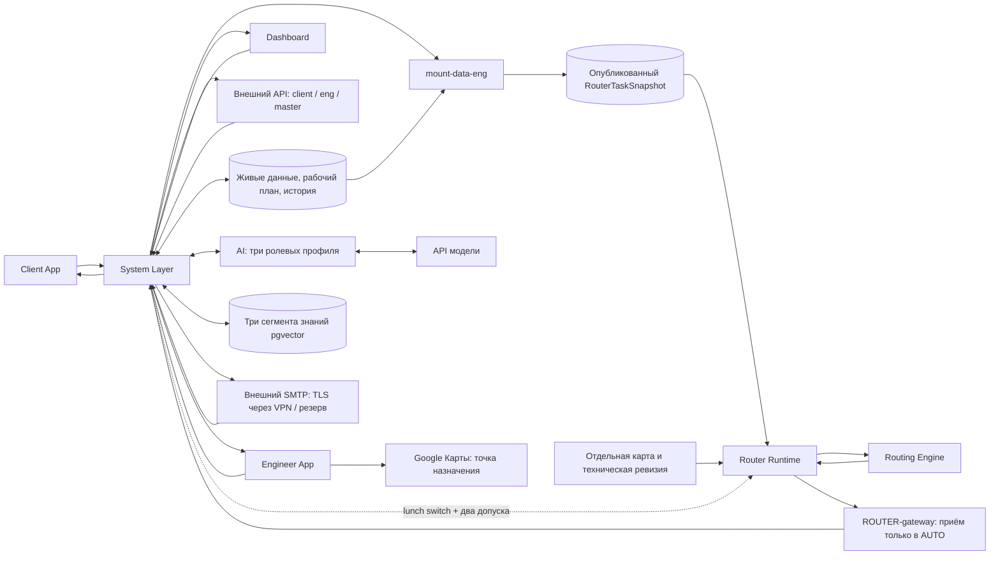
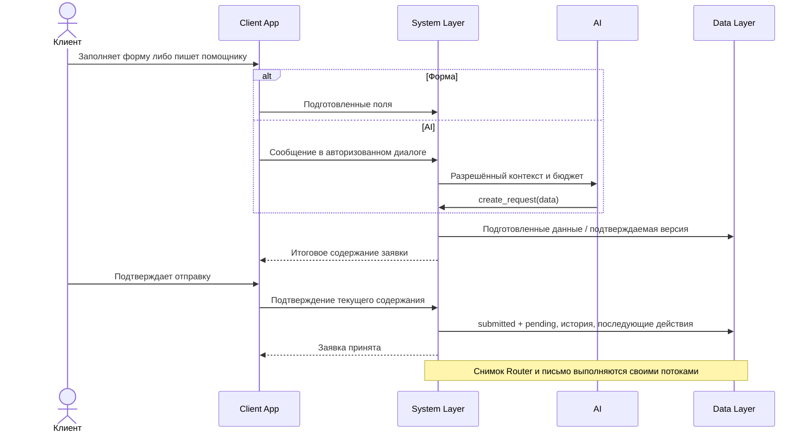
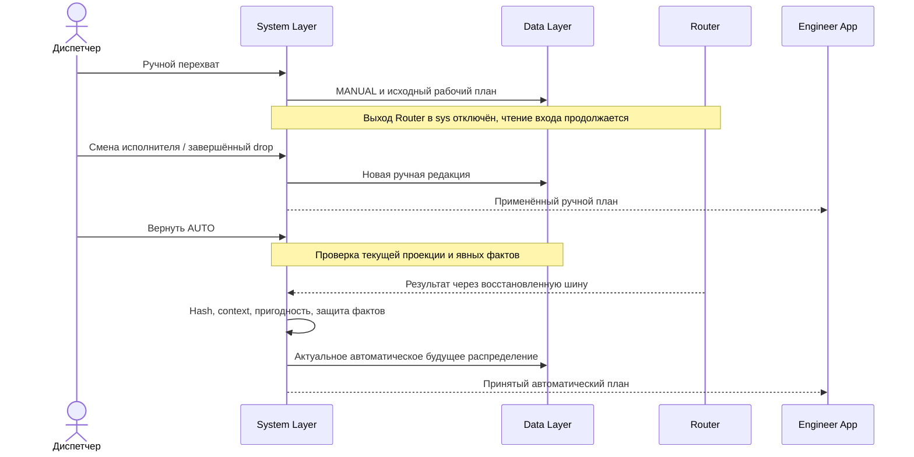
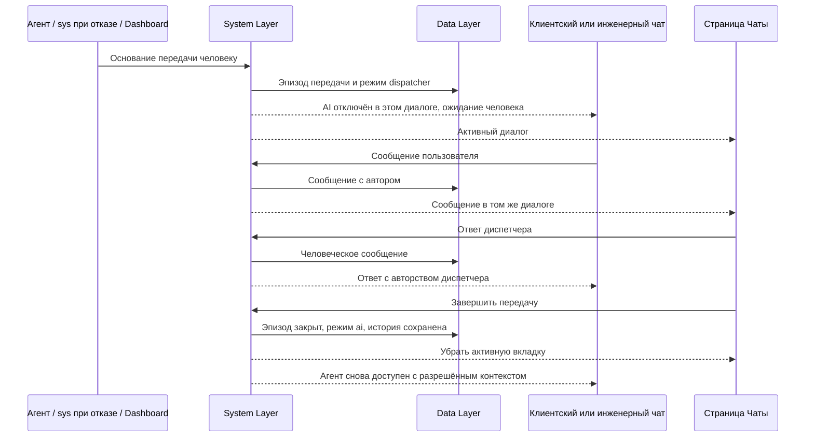

# Data flows — потоки данных приложения

**Версия:** 2. **Дата:** 16 сентября 2026 года.
**Назначение:** связать согласованные компоненты в сквозные сценарии: от источника данных до сохранённого состояния, расчёта, применения и результата для пользователя.  
**Основа:** актуальные контракты System Layer, Data Layer, Router/Engine, AI/SMTP, Client/Engineer, **Dashboard v2** и внешнего API v2; точный состав источников — в конце документа.

Dashboard — закрытая согласованная часть. При подготовке прочитана сохранённая `dashboard_concept_v2.md`, а не восстановлены её решения по предположениям из v1. Этот файл не пересматривает решения Dashboard и не создаёт новый раунд DB1–DB7.

Здесь описывается **движение данных**, а не каталог системных операций, HTTP endpoints, SQL-миграции или макеты. Стрелка означает передачу данных и ответственности; она не выбирает конкретный сетевой транспорт. Документ не подтверждает наличие готовой реализации или прохождение интеграционных тестов. Остальные файлы комплекта не изменяются.

## Как читать документ

У каждого потока указаны начало, маршрут данных, сохраняемый результат и граница, которую нельзя пересекать. Названия уже известных объектов — `RouterTaskSnapshot`, `RouterResult`, `input_hash`, `router_context_version`, `planning_as_of`, `result_id` — соответствуют контрактам. Служебные ID и версии операций используются в том же проектном смысле, что в System Layer, без назначения нового внешнего формата.

| Группа | Потоки |
|---|---|
| Запуск и доступ | DF-01 — инициализация; DF-02 — вход; DF-03 — создание инженера |
| Заявки и исполнение | DF-04 — отправка; DF-05 — изменение/отмена; DF-06 — профиль/доступность; DF-07 — факты; DF-08 — отклонения длительности (старт/финиш/превышение); DF-09 — исключён (GPS убран, [50](./50-concept-changes-after-qa.md) §2) |
| Планирование | DF-10 — публикация входа; DF-11 — расчёт; DF-12 — применение/чтение; DF-13 — контекст; DF-14 — MANUAL; DF-15 — политика; DF-16 — обед |
| Импорт диспетчера | DF-27 — новый регион или дополнительные заявки одним атомарным JSON-пакетом |
| Общение и уведомления | DF-17 — AI; DF-18 — знания; DF-19 — человек в чате; DF-20 — письма; DF-21 — heartbeat и резерв |
| Интеграция и данные | DF-22 — токены/API; DF-23 — импорт; DF-24 — сбросы; DF-25 — рестарт/очистка; DF-26 — Google Карты |

## 1. Общая схема



В диаграмме `System Layer` включает свои gateways и внутренние обработчики. Это не новый отдельный сервис на каждый прямоугольник. Внешний API использует тот же sys, но **не открывает внешние AI-вызовы**. Связь sys с AI предназначена для собственных интерфейсов. Источник статусов, прав, бизнес-переходов и почтовых событий — sys, не frontend, модель или SMTP. [S1, S5, S8]

## 2. Данные, которые нельзя смешивать

| Объект / область | Где находится | Кто изменяет | Что означает |
|---|---|---|---|
| Живые бизнес-данные | PostgreSQL / Data Layer | Sys через согласованные обработчики | Действующие заявки, профили, доступность, факты, чаты |
| `RouterTaskSnapshot` | Отдельный сектор PostgreSQL: полный документ и текущий указатель | Sys / `mount-data-eng` | Опубликованная задача оставшегося планирования |
| Текущий `RouterResult` | Собственная память Router | Router | Main и baseline на конкретных входе и контексте |
| Принятый расчётный пакет | Data Layer | Sys при принятии | Сохранённая копия результата, не управляющая память Router |
| Применённый рабочий план | Sys / Data Layer | Из Router в AUTO; диспетчером в MANUAL | План, который используют интерфейсы |
| Исполнение и история | Data Layer | Sys по явным событиям | Что действительно произошло, отдельно от расчётных времён |
| Карта и техническая ревизия | Контекст Router | Загрузка ресурса / предусмотренная служебная настройка | Карта, lunch switch и два допуска, не обычные поля сектора |
| Векторные знания | Три группы таблиц pgvector | Подготовка знаний через разрешённый системный путь | Справочные материалы с ролевым доступом |
| Очередь после принятия письма | Отдельный SMTP-сервер | Почтовое ПО | Внешняя доставка уже принятого письма |

`planning_as_of` — момент опубликованного входа; `computed_at` — момент формирования расчёта; время применения — событие sys; время фактической отметки — событие инженера. Это не взаимозаменяемые timestamps. Все абсолютные моменты в системном обмене — Unix-time в целых секундах. [S1–S3]

**Общее правило фиксации:** sys согласованно сохраняет бизнес-изменение, его происхождение и необходимые последующие действия. Сетевое ожидание Router, AI или SMTP не превращается в условие существования уже сохранённой заявки. Это принятая граница System Layer, а не предложение нового брокера или event-sourcing-платформы. [S1, §2]

---

## DF-01. Запуск и первоначальный набор данных

**Начало:** запускается подготовленный экземпляр приложения. **Вход:** серверная конфигурация, состояние инициализации Data Layer, исходный тестовый набор и файлы знаний.

1. Sys получает существующее состояние приложения и создаёт либо открывает единственную диспетчерскую учётную запись, связанную с конфигурацией `.env`. Обычный запуск не создаёт второго диспетчера.
2. Если предусмотренная первоначальная инициализация ещё не выполнена, исходный пакет проходит общий импорт DF-23. Проверяются данные и сохраняется происхождение набора.
3. Если система уже инициализирована, перезапуск не накладывает seed поверх текущих данных. Пустое состояние после намеренного полного сброса также считается инициализированным.
4. Когда создана первая задача планирования, sys публикует её через DF-10. Router обнаруживает вход самостоятельно.
5. Файлы `knowledge/client`, `knowledge/engineer`, `knowledge/dispatch` обрабатываются своим потоком DF-18. Их загрузка не является публикацией маршрутной задачи.

**Сохраняется:** исходный набор/его происхождение, учётная запись диспетчера, признак инициализации, опубликованный вход при наличии основания. **Наружу:** готовое состояние приложения либо явная ошибка подготовки.

**Граница:** отсутствие записей в `requests` не является само по себе командой загрузить тестовые заявки. Обычный рестарт и два явных сброса — разные потоки. [S1, §7; S2, §9; S7, §10]

## DF-02. Вход пользователей

### Email-код

```text
UI: email → auth-engine → код и почтовое намерение в sys
→ SMTP-gateway → внешний SMTP → почтовый ящик пользователя
→ пользователь вводит код в системную форму → auth-engine проверяет
→ сессия и соответствующая роль → разрешённые данные интерфейса
```

Код создаёт и проверяет sys. AI не получает код, пароль или сессионный секрет. После принятия кода клиентская учётная запись создаётся либо открывается; инженер получает только ранее созданную диспетчером инженерную роль. Выбор инженерного экрана не создаёт эту роль автоматически.

### Резервный вход диспетчера

```text
Dashboard: настроенный пароль → auth-engine + серверный .env
→ та же диспетчерская учётная запись → сессия → Dashboard
```

Этот путь не ждёт SMTP и не требует дополнительного кода. Email/пароль остаются на сервере; интерфейсу передаётся результат входа, не конфигурационный секрет.

**Сохраняется:** состояние подтверждения и сессии, необходимые системные сведения о входе. **Результат:** разрешённый UI-контекст. Неудачная передача письма не означает успешную проверку email. Для машинного API действует отдельный поток DF-22 без обязательной пользовательской email-сессии. [S1, §7; S5, §3; S8, §3]

## DF-03. Диспетчер создаёт инженера

**Начало:** авторизованный диспетчер добавляет профиль инженера; email может быть
неизвестен до отдельной выдачи доступа.

```text
Dashboard → sys: профиль и необязательный email нового инженера
→ проверка существующих связей и допустимости → Data Layer: профиль [+ аккаунт / роль]
→ Dashboard: результат создания
→ если email выдан: Engineer App, последующий вход этого email по DF-02
```

Создание доступа и готовность исполнителя для расчёта — разные результаты. Навыки, смена, транспорт, офис/стартовая точка должны поступить из профиля, импорта или разрешённого ввода. Пустые значения не заменяются вымышленными нормативами.

Подготовленный инженер включается в расчётную проекцию при соответствующем значимом изменении. Таблицы инженерного профиля и его состояния конкретного рабочего дня не объединяются в вечную запись «сегодня уже обедал».

**Результат:** Dashboard видит сохранённую запись и реально заполненные данные. Инженер
может войти в собственный контур только после выдачи email-доступа; неизвестный адрес
не заменяется фиктивным. [S1, §7.2; S2, §3; S7, §7]

## DF-04. Клиент создаёт и отправляет заявку

**Начало:** клиент вошёл и выбрал основной способ — форму — либо альтернативный AI-чат.

**Данные:** ФИО, адрес/точка, проблема из списка, дата и окно, срочность, подтверждённый email сессии. Длительность, навык и ограничение транспорта готовит sys по предусмотренным данным и правилам.



До подтверждения содержания подготовка не становится активной свободной заявкой Router. Sys проверяет владельца и актуальную версию данных. Повтор одной отправки не создаёт второй `request_id`.

После сохранения запускаются связанные ветви: DF-10 для новой задачи, DF-20 для `request_received`. Назначение мастера ещё не обещано. Позднее, после принятия результата, возможно отдельное `engineer_assigned`.

**Граница:** второй обязательный email-код на отправку в действующей сессии не нужен. Сбой AI не блокирует форму; ошибка почты после сохранения не отменяет заявку. [S5, §3–4; S6, §4; S1, §3]

## DF-05. Изменение условий, создание и отмена диспетчером

### Клиентский перенос

```text
Выбор новых даты/окна → «Подтвердить» → sys проверяет состояние и версию
→ новые условия той же заявки сохранены → назначение для новых условий pending
→ DF-10 → DF-11 → DF-12 → актуальные данные Client App
```

До подтверждения действующее окно не меняется. После успешной записи новое окно единственное; прежнее находится только в истории. Если новое назначение не найдено, старое окно не восстанавливается автоматически.

### Действия Dashboard

Диспетчер создаёт заявку, меняет время/локацию/приоритет либо отменяет ещё не начатую работу. Компактная форма может создать заявку до получения имени и email заказчика: такие поля остаются `null`, письмо не формируется и фиктивный владелец не создаётся. Вход идёт в общие обработчики sys; создание и изменение формируют условия задачи, отмена исключает работу из свободного пула с сохранением её истории. В AUTO это не прямая запись нового исполнителя.

**Граница начала:** как только sys сохранил «Начать», обычное изменение условий и переназначение этой работы закрыты. Старый экран, ссылка из письма, новый вход, API-токен и AI fix не обходят проверку. Дальнейшие фактические отметки и завершение при этом остаются допустимыми.

**Результат:** UI показывает реальный исход сохранения, а не успех локального нажатия. При конфликте возвращаются актуальные сведения; чужая правка не перетирается. Самостоятельную отмену клиентом до начала этот поток не добавляет: принято право отмены у диспетчера. [S1, §4/8; S6, §5; S7, §3]

## DF-06. Профиль инженера и рабочая доступность

**Начало:** инженер меняет собственные skills/транспорт/офис, выходит online/offline или сообщает о техническом перерыве; диспетчер использует свои предусмотренные действия управления инженером.

1. UI передаёт целевое изменение в sys. Инженерный UI определяется своей сессией; для машинного запроса категория и объект проверяются по DF-22.
2. Sys проверяет допустимые значения и конкурентные правки, сохраняет профиль либо состояние рабочего дня и историю.
3. Если изменились условия планирования, `mount-data-eng` подготавливает новый полный снимок. Неподготовленные параметры не заменяются случайными значениями.
4. Новый план поступает через DF-11/DF-12; в MANUAL фоновый результат не применяется.

Удаление инженера из активного состава архивирует профиль, отзывает роль и живые
сессии, но сохраняет ссылки из исторических планов и фактов. Инженера на LIVE-линии
или с незавершённой работой сначала снимают с линии и освобождают.

Для инженерного AI допустим `change_status_to(status: 0 \| 1)` только своему инженеру: `0` ожидает кнопочного подтверждения, `1` не требует дополнительной кнопки. Эта модель не добавляет агенту tools редактирования навыков или фактического выполнения.

**Данные различаются:** online/offline — рабочая доступность; потеря сети — связь; `expected_online_at` — прогноз возврата; `available_from` — готовность продолжить из конкретной точки. Технический перерыв исходно 15 минут. Смена офиса не доказывает физическое перемещение туда, offline не означает завершение текущей работы. [S1, §5/7; S5, §4; S6, §8]

## DF-07. Явные факты выполнения и штатное продвижение

| Действие инженера | Что поступает в sys | Что сохраняется / изменяется |
|---|---|---|
| «Прибыл, начинаю работу» | Подтверждённые прибытие и начало конкретной работы | Факты и `in_progress`; клиентское редактирование закрывается |
| «Прибыл, но не могу начать» | Прибытие без начала | Состояние ожидания; выполнение не приписывается |
| «Начать работу» после ожидания | Явный переход к выполнению | Время/исполнитель начала, состояние работы |
| «Выполнено» | Подтверждение завершения | Факт завершения, `completed`, продвижение активной части плана |

Сначала sys принимает факт, затем UI сообщает об успешной отметке. Отсутствие ответа сервера не считается успешной записью. Данные одного события не применяются повторно как новая работа.

После завершения заявка исчезает из клиентского активного списка, но факты и история остаются. Инженеру доступны следующие работы из применённого плана. Router не получает полный журнал стадий: при следующем действительном основании для публикации sys передаёт оставшиеся задачи и стартовые условия.

**Не запускается автоматически:** новый снимок на каждую штатную отметку, чтение карточки или движение часов. Если факт установил самостоятельное изменение условий задачи, sys обрабатывает именно это изменение; простое следование действующему плану не требует постоянной оптимизации.

Без сообщения о проблеме сохраняется прогноз «по плану», но фактические начало/конец не создаются из таймера. Напоминания о ключевых отметках и предупреждения диспетчеру не равны offline, клиентскому письму или триггеру Router. [S1, §5; S6, §6]

## DF-08. Задержка, новый прогноз, сообщение о проблеме и отклонения исполнения

**Начало:** короткое действие «Опаздываю»/«Изменить прогноз», сообщение о задержке либо «Проблема с этой заявкой»; с MVP-контура 17.09 — также факты `started`/`finished` инженера.

**Отклонения длительности (реализовано):** старт работы задаёт `expectedCompletionAt` и `continuationAvailableAt`; финиш сравнивается с порогами из технической ревизии Router — раннее завершение ≥ `early_finish_replan_threshold_sec`, опоздание > `task_overrun_tolerance_sec` или ранее выявленное превышение считаются материальным отклонением и публикуют `request.execution_variance` с новым `available_from`; отклонение внутри порогов не публикует ничего. Превышение без финиша фиксирует фоновый координатор (`overrunDetectedAt`, `request.execution_overrun`), не создавая факта завершения.

| Полученные сведения | Системная обработка | Связь с новым снимком |
|---|---|---|
| Задержка текущей работы | Связать с выполняемой заявкой и ожидаемым освобождением | Публикация при установленном изменении расчётных условий |
| Техническая остановка | Изменить предусмотренную доступность и прогноз возврата | По обычному правилу значимого изменения |
| ETA прибытия к адресу | Сохранить смысл: время прибытия именно к этой заявке | Не копировать без преобразования в освобождение в другой точке |
| Общая просьба о помощи | Открыть тот же инженерный чат с контекстом | Открытие чата само не задаёт новую географию, offline или число минут |
| «Буду вовремя» / нет сообщения об отклонении | Продолжить штатный прогноз | Само по себе не публикует снимок |

`available_from` всегда относится к `start_location`. Нельзя взять ETA к следующему адресу как время освобождения в текущей точке и затем прибавить дорогу повторно. Конкретные неоднозначные преобразования не заполняются предположениями этого документа.

Если изменение действительно опубликовано, Router обрабатывает его на своём допуске. Малое допустимое отклонение может сохранить назначения и порядок после проверки нового состояния. Допуск не расширяет клиентское окно и не меняется обычной политикой sys.

**Письмо:** внутри согласованного окна задержка письма не вызывает. Одно нажатие, отсутствие отметки или ожидание расчёта не доказывают необходимость переноса. **Молчание:** истёкший норматив сам не превращается в `null`, публикацию и пересчёт. [S1, §5; S3, входная проекция; S6, §7]

## DF-09. Исключён: телеметрия убрана из продукта

Прежний поток «необязательный GPS-сбор → `gps_observations`» удалён решением 16.09 ([50](./50-concept-changes-after-qa.md) §2): ни таблицы, ни эндпоинта, ни UI больше нет. Номер DF-09 сохранён, чтобы не ломать ссылки.

Позиция инженера нигде не собирается и не хранится. На карте Dashboard инженеры показываются плановыми стартами (`start_location`), при активной работе — точкой этой работы с `available_from` из выполнения. Получение работ, фактические отметки, обзор дня и переход к Google Картам от геолокации не зависели и сейчас не зависят.

**Направления, которых нет:** `gps_observations → Router`, `GPS → completed`, `Google Maps → наш GPS`. [S2, §5; S6, §8.3/9]

---

## DF-10. Публикация специального входного сектора

**Начало:** sys установил действительный триггер изменения задачи: новая/изменённая/отменённая заявка, расчётные параметры инженера, доступность, выбранная политика, условия обеда либо конкретное изменение прогноза. Перечень не заменяется правилом «любая строка БД изменилась».

1. `mount-data-eng` получает согласованное состояние живых данных, а не смесь независимых чтений разных моментов.
2. Формирует полный `RouterTaskSnapshot`: горизонт, оставшиеся заявки, инженеры со `start_location + available_from`, доступность, обеды, политика.
3. Уже начатые, завершённые и отменённые работы не возвращаются в свободный пул. Факты и причина занятого старта остаются у sys.
4. При публикации изменившихся условий записывает `planning_as_of`. Повторное чтение и запись того же состояния не двигают время сами по себе.
5. Сохраняет точный сериализованный JSON-документ, lowercase SHA-256 и монотонный `publication_seq`, затем переключает указатель текущего снимка одной транзакцией.
6. Представление `router_active_snapshot` выдаёт одну строку с `publication_id`, `publication_seq`, `payload_utf8`, `payload_sha256`, `published_at_epoch`. Router читает её напрямую ограниченным read-only подключением. Sys независимо читает тот же опубликованный объект для своей проверки.

```mermaid
sequenceDiagram
    participant S as System Layer
    participant M as mount-data-eng
    participant DB as PostgreSQL
    participant R as Router Runtime
    S->>M: Действительное изменение задачи
    M->>DB: Согласованные исходные данные
    DB-->>M: Проекция текущего состояния
    M->>DB: Полный JSON + смена текущего указателя
    Note over M,DB: Одна публикация, planning_as_of вместе с данными
    R->>DB: Прямое чтение текущего опубликованного документа
    DB-->>R: Неизменяемый payload
    R->>R: Hash payload; при изменении обработать снимок
    S->>DB: Чтение того же payload для независимого hash
```

`input_hash` считается как SHA-256 согласованных UTF-8-байтов payload. Сам hash, ID строки, техническое поколение sys и текущий указатель не добавляются в собственное хэшируемое содержимое. Router отклоняет откат `publication_seq`, несовпадение hash, несколько активных строк и payload больше 16 MiB.

**Результат:** целая опубликованная задача; не команда «пересчитать», не готовый маршрут и не обязательные будущие ручные назначения. Физическое размещение — PostgreSQL, без Redis в текущем варианте. [S2, §4; S3, §5/7; S1, §5]

## DF-11. Router: от снимка до main и baseline

**Начало:** Runtime обнаружил новый `input_hash` либо изменение активной `router_context_version`.

```text
Снимок + отдельная карта + технические настройки
→ Runtime фиксирует целостный вход и контекст
→ проверка формы и подготовка дорожных данных
├── Runtime рассчитывает baseline
└── Engine рассчитывает main
→ контроль/упаковка результатов без исправления main за Engine
→ RouterResult в собственной памяти Router
```

Оба расчёта используют один снимок и одни дорожные условия. Baseline сохраняет порядок поступления заявок и порядок инженеров: первая допустимая последовательная постановка без глобальной оптимизации. Main выбирает распределение, порядок, расписание и обеды по действующей политике.

Приняты три пути Engine: **проверить малое изменение с сохранением допустимого порядка; восстановить и улучшить прежний кандидат; построить новый вариант при отсутствии пригодного**. Проверка нового входа обязательна: прежнему результату нельзя просто заменить hash.

**Выход:** `result_id`, `input_publication_id`, фактически использованные `input_hash`/`router_context_version`, `planning_as_of`, `computed_at`, policy/settings/search path, main, baseline, evidence обоих планов и диагностика по контракту Router. Во время расчёта вход не мутирует; поздняя выдача не становится актуальной от изменения её меток.

**Хранение:** результаты/кандидаты и дорожные кеши принадлежат Router. В Data Layer sys сохраняет принятые пакеты по DF-12, не пишет в память Engine. В MANUAL Router продолжает этот же процесс, но sys не получает новые фоновые пакеты. Подробности OR-Tools и вычислительного цикла остаются в `engine_contract_v2.md`. [S3; S4; ТЗ, §2.3]

## DF-12. Применение результата и выдача данных интерфейсам

**Начало:** результат поступил через подключённый `ROUTER-gateway`.

| Проверка sys | Смысл |
|---|---|
| Приём разрешён режимом | MANUAL не пропускает новый результат |
| `input_hash` совпал с текущим сектором | Расчёт относится к опубликованным данным |
| `router_context_version` совпала с активной версией Runtime | Использованы действующие карта/технические настройки |
| `main.is_usable=true` | Main допустим для применения; готовность ответа сама по себе недостаточна |
| Нет конфликта с явными фактами | Не переносится начатая работа, не возрождается завершённая, не назначается второй обед |
| Это не обычное повторное применение | Повтор `result_id` не возвращает старые пункты и письма |

Sys сохраняет принятый пакет и новую редакцию применённого плана, связывает назначения с актуальными условиями заявок, обновляет производные представления и записывает необходимые последующие события. Перед фиксацией режим и актуальность не должны успеть измениться без обнаружения.

**Потребители данных:** клиент получает свою карточку; инженер — свой применённый план; Dashboard — обзор, причины, alerts и сравнения; внешний API — разрешённое чтение состояния по запросу. Способ доставки обновлений собственным UI здесь не выбирается. Внешних webhook нет.

**Два сравнения:** main/baseline — один снимок; «до/после» — прежний применённый план sys и новый. Метрики `snapshot_remaining` не превращаются в полный фактически прошедший день.

При несовпадении hash/контекста остаётся последний применённый план с «Перестраивается» и его собственным моментом актуальности. При ошибке — видимая ошибка, не фиктивный отказ всем заявкам. `ready` с неназначенными заявками не является бесконечной загрузкой. Если явные факты делают новый результат неприменимым, sys не ремонтирует его своей оптимизацией; готовит актуальный вход по установленному основанию.

**Alerts:** просмотр меняет признак просмотра, не устраняет причину и не вызывает публикацию. Изменение действительной причины поступает из sys/принятого результата. **Письма:** запускаются по бизнес-переходу DF-20, не по каждому чтению результата. [S3, §7–8; S1, §6/10; S7, §4–5; S8, §8]

## DF-13. Отдельное изменение технического контекста Router

**Начало:** полная специальная ревизия восьми технических полей (обеды, допуски, режим оценки дороги, пороги исполнения) через sys либо замена отдельно подключённой карты.

```text
Полная служебная ревизия с expected_context_version → sys → Router Runtime
→ новый активный контекст → новая router_context_version
→ Runtime обрабатывает действующий снимок в новом контексте
→ DF-12 проверяет и hash входа, и версию контекста
```

Карта и техническая ревизия не записываются в обычный специальный сектор ради искусственного изменения hash. Тот же payload может требовать другого расчёта после смены контекста. Активная версия определяется по служебному состоянию Runtime, не по старому пакету результата. Принятая ревизия атомарно сохраняется до активации и восстанавливается после перезапуска.

`lunches_enabled=false` (по умолчанию, [50](./50-concept-changes-after-qa.md) §3) аппаратно исключает будущие обеды из обоих планов, не меняя бизнес-факты sys. Допуск выхода и допуск начала задач только выбирают между REVALIDATE и полным ремонтом; режим оценки дороги (`graph_with_access_buffer`/`fixed_normative`) меняет только цену плеча; ни одно из полей не расширяет hard windows или смены.

По внешнему API предусмотренная техническая функция относится к master-категории; отдельный scope ключу не выдаётся. Это не открывает произвольное управление алгоритмом, редактирование памяти маршрутов или подмену hash.

**Результат:** новое действующее техническое состояние Router и соответствующий результат. Начатому на прежнем контексте расчёту нельзя приписать новую версию при отправке. Точные права собственных UI/AI на конкретный служебный инструмент определяются соответствующим системным контрактом; этот поток не создаёт нового tool. [S3, §7–8; S8, §6]

## DF-14. Ручной перехват, отдельные правки и возврат AUTO

### Вход в MANUAL

Экстренная кнопка Dashboard проходит в sys. Sys фиксирует применённое состояние как исходную точку, сохраняет MANUAL и отключает приём **Router → sys**. Входной сектор и вычисления Router продолжают работать. Внешний API и отладка не создают обходную подписку на фоновые результаты.

### Ручные изменения

| Источник | Передаваемые данные | Запись sys |
|---|---|---|
| Выбор инженера в заявке | Ещё не начатая заявка и новый исполнитель | Согласованная смена назначения и очередей без дубля у двух инженеров |
| Drag-and-drop в списке инженера | Завершённая перестановка ещё не начатых работ | Новый порядок действующего рабочего плана |

Группового черновика и общей кнопки «Применить изменения» нет. Завершённое действие сохраняется через sys; промежуточное движение курсора не является записью. История и версия рабочего плана меняются, интерфейс инженера получает этот план.

**Не меняется:** память маршрутов Router. Будущее ручное назначение не становится обязательным условием его снимка. Отдельная правка исходных условий заявки/доступности по-прежнему может публиковать вход, но это другое изменение.

Ввод новых ETA не обязателен для ручной смены исполнителя/порядка. Старые автоматические времена и дорожные метрики не выдаются за пересчитанные. Sys не запускает скрытый мини-оптимизатор; способ показа таких значений — техническая детализация уже принятого простого режима.

### Возврат AUTO



Результат заменяет будущее ручное распределение, не объединяется с ним и не отменяет исполненные факты. До актуального результата показывается последний план с обозначением состояния. Явный возврат — отдельный переход: обычная защита от повторного `result_id` не запрещает однократное применение всё ещё подходящего результата на этой границе.

**Рестарт:** MANUAL сохраняется. **Гонка:** запоздавший автоматический обработчик не записывается после принятого перехвата. [S7, §8; S2, восстановление; S3, применение]

## DF-15. Выбор политики

**Начало:** диспетчер выбирает готовую политику в Dashboard; допустимый master-запрос выполняет то же системное действие.

```text
Готовая политика → sys: выбранный вариант
→ Data Layer: действующая политика
→ mount-data-eng: новый снимок при изменении
→ Runtime / Engine → результат → sys → интерфейсы
```

По умолчанию используется `compact` ([50](./50-concept-changes-after-qa.md) §1). Содержимое политики задаёт иерархию целей, но Dashboard не является редактором формул, весов, произвольных параметров или настроек OR-Tools. Само наличие богатой структуры политики в контрактах не создаёт такой UI.

Пока новый расчёт не принят, различаются выбранная политика и политика, по которой построен старый показанный план. Смена значения в селекторе не равна готовности нового маршрута.

В MANUAL новое условие может попасть в фоновый расчёт, но ручной план не переписывается до возврата AUTO. Навыки, окна, смены и обязательные ограничения не становятся отключаемыми предпочтениями. [S7, §6; S3, Policy; S8, категорийные действия]

## DF-16. Планирование, исполнение и восстановление обеда

### Планирование

Dashboard включает/выключает подбор обедов. Sys сохраняет условия по инженеру/рабочему дню и публикует изменение задачи. Router получает `enabled`, окно, длительность, `required` и `lunch_taken`, затем возвращает интервал либо результат пропуска/конфликта. Sys сохраняет принятый план; Engineer App показывает соответствующий обед.

Сами часы и опубликованное расписание не устанавливают `lunch_taken`. Этот факт поступает от инженера при действительном начале обеда. Sys сохраняет его, ведёт текущую занятость и отражает в следующей обоснованной проекции. Второй обед не появляется после возврата к работе, перезапуска или смены режима.

### Конфликт и восстановление

```text
Результат: включённый обед не помещён → sys → alert Dashboard
→ диспетчер выбирает восстановление и явно исключаемые работы
→ sys согласованно фиксирует выбранные исключения и lunch.required=true
→ новый снимок → Router → новый результат обеда и план
→ sys → Dashboard / Engineer App
```

Просмотр предупреждения не возвращает обед. Восстановление не означает прямую запись времён в память Router. Если условия несовместимы, `required` не снимается молча и успешное восстановление не объявляется.

Новые дополнительные потери заявок нельзя считать уже подтверждённым выбором диспетчера. Точная техника проверки побочных отказов остаётся в системном контракте; поток не добавляет автоматическую массовую отмену. Проверенное предложение исключений может быть связано с исходным result/alert; недоказанный вариант не представляется гарантированным.

**Хранилище:** состояние инженера в рабочем дне, факты обеда, выбранные условия, история и принятый план. Конкретные длительность/часы обеда здесь не назначаются. [S2, данные дня; S1, уведомления; S3, LunchInput/LunchResult; S7, §4.3]

---

## DF-17. Собственные AI-чаты: сообщение, знания, tools и остановка

**Начало:** сообщение пользователя в собственном UI-диалоге, который не передан человеку. Внешний API сюда не входит.

1. Sys устанавливает доверенную сессию, роль, режим диалога, разрешённые объекты и бюджет. Проверенный email открывает AI; новый чат не создаёт новую дневную квоту.
2. Из Data Layer получает разрешённую историю/резюме, а актуальные сведения о заявках и плане — из текущего системного состояния.
3. Через `AI-gateway` передаёт runtime сообщение и ограниченный каталог tools. Модель вызывается своим адаптером; конфигурационные секреты и коды в контекст не входят.
4. Текст/полные tool-аргументы возвращаются в sys. Текст «готово» не является результатом бизнес-записи.
5. Sys проверяет вызов, необходимые подтверждения, текущие права/режим и стоп-сигнал; исполняет разрешённое действие либо возвращает отказ/ожидание подтверждения.
6. Сохранённый итог действия возвращается runtime и UI. Последующие данные, снимок и письма идут обычными потоками соответствующего бизнес-события.

| Агент | Согласованные tools / категории |
|---|---|
| Клиентский | `create_request(data)`, `search_documentation()`, `call_dispatch_helper()` |
| Инженерный | `change_status_to(status: 0 \| 1)`, `search_documentation()`, `call_dispatch_helper()` |
| Диспетчерский | Системное чтение, объяснения, разрешённые изменения/политики, поиск документации |

Новый диспетчерский AI-диалог начинается в `read-only`. В `fix` доступны обычные системные действия своей роли с журналом и остановкой, без универсальной дополнительной кнопки каждой записи. **Оба сброса требуют подтверждения человеком даже при подготовке агентом.** Режим AI не отменяет запрет прямых ручных назначений в AUTO или изменения уже начатой работы.

**Остановка:** запрещает дальнейшие автоматические действия запуска; не объявляет отменённой уже зафиксированную запись. Поздний текст после смены владельца чата не должен публиковаться как параллельный ответ. Идемпотентность бизнес-действия сохраняется при повторе генерации и смене модели.

**Сбой:** ограниченные retries, настроенный fallback, панель недоступности. Установленный неответ провайдера может включить человеческий путь DF-19 без ожидания решения неответившей модели. Квота и неответ — разные состояния; квота сама не создаёт постоянную кнопку вызова человека. Лимиты и момент признания отказа в источниках не заданы численно. [S5, §4–9; S6, §7; S7, §9]

## DF-18. Документация: репозиторий → pgvector → разрешённый ответ

### Подготовка знаний

```text
knowledge/client/     → клиентские документы / фрагменты / векторы
knowledge/engineer/   → инженерные документы / фрагменты / векторы
knowledge/dispatch/   → диспетчерские документы / фрагменты / векторы
```

В Data Layer сохраняются текст, источник, версия, положение фрагмента и вектор, относящийся к этой версии. Это три отдельные группы таблиц в одной PostgreSQL. Обновление текста не должно оставлять старые векторы как будто они индексируют новое содержание. Подготовка/активация редакций — задача процесса знаний, не Router.

### Поиск из диалога

```text
Агент: search_documentation()
→ sys определяет допустимые сегменты по доверенной роли
→ поиск в соответствующих таблицах
→ разрешённые фрагменты с источниками
→ AI-runtime → текстовый ответ пользователю
```

Клиент получает только client, инженер — только engineer, диспетчер — все три сегмента. Аргумент модели или текст в документе не расширяет эту матрицу. Прямой AI-SQL-доступ не появляется.

История диалога не является источником актуальных назначений; справочный фрагмент — не команда сменить роль. Чаты и ответы модели автоматически не пополняют документацию. Обновление индекса знаний **не меняет hash маршрутной задачи**. Выбор embedding-настроек и индексов относится к отдельному стеку, не к этому потоку. [S2, §7; S5, §7]

## DF-19. Один человек-диспетчер вместо AI

**Три основания:** агент вызвал `call_dispatch_helper()`; sys установил предусмотренный неответ провайдера; диспетчер отправил первое человеческое сообщение инженеру. Простое открытие вкладки диспетчером не меняет режим.



Постоянной кнопки вызова человека у клиента/инженера нет. Вызов не запускает диспетчерского AI и не выдаёт пользователю master-права или другой сегмент знаний.

Диспетчер один для всех чатов. Нет распределения между операторами или обязательного принятия обращения. При передаче отключаются автоматические ответы и ещё не применённые действия AI только этого разговора. Повторное основание не создаёт вторую активную вкладку.

Завершает передачу человек своей кнопкой. Нет автозавершения по молчанию, таймеру или закрытию браузерной вкладки. Исчезает активный эпизод, не история сообщений. Возврат AI не сбрасывает квоту и не требует немедленной новой генерации без сообщения пользователя.

**Не меняется:** рабочий online/offline инженера, AUTO/MANUAL плана, другие чаты. [S1, §9; S5, §6; S6, §7; S7, §7.3]

## DF-20. Бизнес-письмо: от события до принятия SMTP

| Системное основание | Категория письма |
|---|---|
| Запрос обычного входа по email | `account_login_code` |
| Подтверждённая отправка заявки | `request_received` |
| Принятое назначение мастера и соответствующий бизнес-переход | `engineer_assigned` |
| Установлена необходимость пересогласовать клиентское окно | `visit_change_required` |

```text
Подтверждённое событие sys
→ готовые получатель, шаблон, содержание, код/ссылка при необходимости
→ сохранённое почтовое намерение и его связь с событием
→ SMTP-gateway → разрешённый TLS-путь → внешний SMTP
→ результат приёма полного письма → sys / Data Layer
→ прикладной статус передачи
```

Код генерирует sys. SMTP не выбирает клиента, не объясняет маршрут и не формирует бизнес-содержание. AI не обращается к SMTP напрямую.

Принятие внешним сервером и его здоровье — выбранная граница контроля. Прикладной результат не называется доказанной конечной доставкой. Проектные состояния учёта из SMTP-концепции различают ожидание передачи, подтверждённый приём, отказ и неизвестный исход. Healthy-heartbeat не доказывает приём конкретного письма.

После однозначного приёма sys не повторяет письмо только из-за отсутствия конечного tracking. Потерянный ответ о приёме не даёт основания немедленно отправить дубль по резервному пути. Политика такой неоднозначной попытки остаётся транспортной настройкой.

Письмо относится к бизнес-переходу, не каждому `result_id`/read. Внутри клиентского окна письмо о задержке не отправляется. Ошибка Router и незавершённый расчёт не превращаются в массовый отказ. В MANUAL фоновые расчёты не инициируют письма; основанием служат действующий ручной план и реальные системные события.

Ссылка ведёт на обычный экран заявки с проверкой сессии/прав и текущего состояния. Открытие ссылки само не меняет окно; повторный email-вход не снимает блокировку начатой заявки. [S5, каталог писем/контроль/ссылки; S6, §5; S8, §10]

## DF-21. Здоровье SMTP, VPN и прямой защищённый резерв

Здесь **два разных направления проверки**, не один сигнал «письмо доставлено».

| Проверка | Направление и смысл | Результат |
|---|---|---|
| Проверка основы через VPN | Watchdog на SMTP-сервере → основной сервер по VPN | Управление доступностью резервного прямого TLS-входа |
| Готовность SMTP | Sys / SMTP-gateway получает состояние почтового сервера | Понимание, можно ли передавать новые письма |

В нормальном режиме приём от приложения доступен только по TLS через VPN. Если внешний SMTP-сервер не может связаться с основой по VPN, открывается дополнительный защищённый TLS-вход вне VPN. Авторизация и проверка защищённого соединения не отключаются.

Sys должен знать разрешённые адреса, иначе открытие внешнего порта само не поменяет его соединение. Результат каждой передачи сохраняется отдельно от сетевого режима. Уже принятые письма остаются в очереди внешнего сервера.

Предложенная ранее техника нескольких проб и возврата к VPN после восстановления не фиксируется здесь как выбранный численный алгоритм. Полное падение основы не устраняется открытием резервного порта: источнику новых писем всё равно требуется работоспособный sys.

**Результат для UI/диагностики:** здоровье почтового контура и статус передачи. Не сигнал о конечном попадании письма в ящик; не повод изменить маршруты. [S5, §10–14]

---

## DF-22. Токены Dashboard и машинные запросы

### Выдача и удаление

```text
Dashboard: название + тип client / eng / master
→ sys: создать ключ единственного диспетчера
→ Data Layer: запись доступа
→ Dashboard: полное значение один раз

Dashboard: удалить ключ → sys → доступ по ключу прекращён
```

Все токены бессрочные до удаления и имеют полный набор функций своей категории. Нет выбора срока, отдельных scopes, конечного пользователя или обязательной регистрации владельца-интеграции. Удаление ключа не удаляет созданные им заявки и сопоставления импортированных ID. Значение секрета не должно попадать в обычный журнал.

### Машинный вызов

1. Внешняя программа передаёт действующий токен категории и данные/ID объектов.
2. API/sys проверяет ключ и категорию. Отдельная пользовательская email-сессия не требуется.
3. Общий системный обработчик проверяет состояние, подтверждения, версии и связи объекта; выполняет то же бизнес-действие, что предусмотрено соответствующей категорией UI.
4. Сохранение, публикация снимка при триггере и письма идут обычными потоками. Ответ не выдаёт запись за завершённый расчёт маршрута.
5. Когда нужны данные, программа читает состояние sys обычным запросом. Отдельных webhook, подписок и обязательного расписания polling нет.

`client_id`/`engineer_id` — выбранные объекты, не владельцы ключа. Ограничения собственных UI-сессий не превращаются в несуществующую персональную привязку API-токена. Но client/eng не получают master-функции.

**Отладка master:** структурированные данные и предусмотренные служебные возможности через sys. Не SQL, не запись в память Router, не подмена сектора и не скрытое чтение фонового результата в MANUAL.

**Внешний AI закрыт для всех категорий.** Собственные UI-агенты продолжают работать. Письма отправляет наша система; отключение внешних уведомлений не отключает клиентскую почту. Машинное создание не отмечает чужой email лично подтверждённым. [S8, §1–11]

## DF-23. Догрузка CSV/JSON и сопоставление внешних данных

**Начало:** Dashboard «Догрузить данные», предусмотренный master-запрос либо первоначальный seed.

```text
Пакет + сведения источника
→ sys: разбор и проверка всего пакета
→ проверка дублей, ID и конфликтов
├── ошибка/конфликт → отчёт, пакет не применён
└── допустим → согласованное сохранение новых данных и происхождения
              → публикация новой задачи при изменении планирования
              → результат импорта инициатору
```

Повтор того же набора не создаёт дубликаты. Иное содержимое по существующему ID не перезаписывает ручную правку молча. Обновление конкретного объекта — отдельное намерение, не неявный upsert первоначального импорта.

Сопоставление: **источник + тип сущности + внешний ID → внутренний ID**. Источник не является отдельным владельцем токена, tenant или новой областью прав. Служебная связь остаётся в Data Layer и не добавляется в снимок Router ради интеграционной бухгалтерии.

Порядок поступления заявок и порядок инженеров для baseline сохраняются. Технические требования берутся из действительных данных/правил с происхождением; отсутствующие значения не выдумываются. Конкретный приоритет конфликтующих источников нормативов этим документом не назначается.

**Результат:** проверенный набор и отчёт либо отсутствие частичной записи. Импорт не означает личную отправку заявки каждым клиентом, не подтверждает все email и не запускает непредусмотренную массовую рассылку. Двустороннее автоматическое зеркалирование чужой БД отсутствует. [S2, §9; S7, §10.1; S8, §7]

## DF-24. Сброс к тестовым данным и полный нулевой старт

**Начало:** одно из двух отдельных действий Dashboard. **Обязательная граница:** явное подтверждение человеком с последствиями; AI может подготовить действие, но не подтвердить его за диспетчера. API-права не отменяют согласованные бизнес-подтверждения; их машинная форма остаётся будущей технической детализацией.

| Ветка | Новое состояние |
|---|---|
| Сброс к тестовым данным | Текущий сценарий заменён исходным проверенным тестовым набором, не смесь двух прогонов |
| Полный сброс | Данные приложения обнулены; тестовые клиенты/инженеры/заявки автоматически не загружаются |

По подтверждённой Dashboard v2 полный сброс включает прежние клиентские и инженерные аккаунты, роли/профили, заявки, историю, факты, рабочие дни, планы и снимки, чаты/резюме/передачи, журналы, сведения старых действий/импорта/писем, старые сессии/ключи и внутренние пользовательские счётчики/резервы AI. Прежнее предложение сохранять сотрудников либо расход AI как исключение не действует.

**Логический путь:**

```text
Подготовка выбранного сброса → человек подтверждает
→ sys отделяет старый запуск от нового и не допускает поздние старые записи
→ очистка выбранного состояния
├── тестовый вариант: проверенный seed
└── полный вариант: пустой рабочий набор
→ восстановление необходимых начальных условий из конфигурации
→ публикация корректного нового снимка обычным механизмом
→ интерфейсы получают новое состояние
```

Это сброс данных приложения, не уничтожение кода, `.env`, схемы БД, карты и исходников `knowledge`. Единственный диспетчер и необходимые исходные каталоги/параметры восстанавливаются из конфигурации, не из скрытого архива старых пользователей. Конкретная техника этой инфраструктурной границы остаётся детализацией.

Не применяются поздние результаты AI, импорта или прежнего приёма Router. Непереданные письма старого набора не продолжают отсылаться как новые. Принятые внешним SMTP письма и уже совершённые внешние расходы локальным сбросом не отменяются.

Пустая система остаётся инициализированной: последующий рестарт не возвращает seed только из-за нуля заявок. Режим AUTO/MANUAL после **намеренного сброса** не задан отдельным ответом; здесь не подставляется произвольное значение. При обычном рестарте действует DF-25.

**Граница:** sys не очищает память маршрутов прямой командой; Router получает новый вход своим обычным каналом. Конкретная защита поколений — внутренняя реализация sys, не новое поле бизнес-политики. [S7, §9–10; S2, §9 — с приоритетом S7]

## DF-25. Обычный рестарт, восстановление и очистка по сроку

**Начало:** перезапуск процесса/стенда без подтверждённого сброса данных.

Sys восстанавливает сохранённые аккаунты, заявки, факты, рабочий план, режим, опубликованный снимок, чаты/передачи, обеды, квоты и необходимый служебный учёт. MANUAL остаётся MANUAL; переданный чат не возвращается к AI сам, `lunch_taken` не обнуляется, API-ключи не истекают от рестарта.

Если собственного актуального ответа Router после его перезапуска ещё нет, интерфейсы могут показывать сохранённый применённый план с реальным состоянием актуальности. Это не разрешение назвать архив новым расчётом. Router читает текущий снимок и контекст, затем результат проходит обычный приём.

Результаты повторяемых действий и сведения о принятии письма не теряются как основание создать дубликат. Точная техника возобновления прерванных действий не задаётся новым протоколом в этом файле.

**Очистка по сроку:** данные имеют ограниченный срок жизни; `eternal-log` — название, не бессрочное хранение. Сроки по классам и зависимости сохраняемых архивов определяются эксплуатационной настройкой. Проектное правило источников — не удалять активный снимок, действующий план или открытый диалог под видом очистки старой истории.

Очистка истёкших технических записей не является событием маршрутизации, не двигает `planning_as_of` и не заменяет полный сброс DF-24. Redis остаётся backlog. [S2, §6/8–9; S7, §10.5; S8, жизнь ключей]

## DF-26. Переход инженера в Google Карты

```text
Применённый план sys → Engineer App: карточка заявки и её локация
→ кнопка поездки → локация выбранной заявки передана в Google Карты
→ дальнейшая поездка во внешнем навигаторе
```

Внутри Engineer App остаются общая карта и ознакомительный порядок работ дня. Это не собственная пошаговая живая навигация. Выбор внешних карт для поездки не выбирает поставщика подложки Dashboard или геокодирования клиентской формы.

Открытие Google Карт не подтверждает выезд, прибытие, начало или завершение работы. Никакой обратный поток маршрута, ETA, GPS или выполненных действий из внешнего навигатора в sys не добавляется. Расчётный порядок по-прежнему определяет применённый план.

Передача одной точки не обещает совпадения выбранного Google пути с геометрией и временем Router. Сбор GPS нашим приложением не является условием передачи назначения. Конкретный deep link и поведение приложения/браузера — техническая интеграция вне данного файла. [S6, §9]

## DF-27. Загрузка региона или дополнительных заявок из Dashboard

```text
Диспетчер выбирает JSON-файл → Dashboard проверяет schemaVersion/структуру и показывает preview
→ sys повторно валидирует весь пакет → одна транзакция создаёт business rows + external ID mappings + receipt
→ SnapshotPublisher публикует полный новый вход → Router рассчитывает мультизональный план
```

`new_region` требует новый region slug, depot, engineers и requests.
`append_requests` требует существующий регион и не принимает depot/engineers. Любая ошибка
структуры, координат, интервалов, повторов либо конфликт уже известного external ID
отклоняет пакет целиком. Точное повторение того же контента безопасно и не создаёт
дубликаты. Browser-проверка даёт быстрый feedback, но не заменяет серверную проверку и
транзакцию. Успешный ответ содержит новую публикацию/hash, после чего действует обычный
DF-10 → DF-12. Имя файла не становится business identity.

---

## 3. Матрица публикации: где заканчивается обычная запись

В этой таблице «публикация» означает новый полный входной снимок через `mount-data-eng`. Это не любая запись в PostgreSQL и не любое изменение UI.

| Входящее событие | Живые данные / учёт sys | Новый снимок | Другой результат |
|---|---|---|---|
| Подтверждена новая заявка | Сохранённая заявка и история | Да, новая задача распределения | `request_received`; затем результат назначения |
| Подтверждено изменение даты/окна/адреса/приоритета | Новые текущие условия того же ID | Да, если данные задачи изменились | Прежнее назначение не подтверждает новые условия |
| Диспетчер отменил ещё не начатую заявку | Статус и история | Да, изменился свободный пул | Запись не исчезает бесследно |
| Изменились расчётные параметры профиля / доступность | Профиль либо состояние дня | При действительном изменении задачи | Не создаёт фиктивный факт окончания работы |
| Выбрана другая готовая политика | Действующая политика | Да | Не мгновенно новый план на экране |
| Изменены условия обеда / подтверждено восстановление | Условия и выбранные исключения | Да | Не установка lunch_taken по расписанию |
| Явно уточнён прогноз | Сведения с правильным смыслом и связью | Когда sys подготовил действительно изменившиеся условия | Допуск оценивается в Router |
| Штатная отметка прибытия/начала/конца | Факт и продвижение плана | Не требуется только ради штатной отметки | Факт попадёт в следующую обоснованную проекцию |
| Время прошло, отметки нет | Продолжение штатного прогноза; предусмотренные напоминания отдельно | Нет только по этой причине | Не автоматический null/offline/отказ |
| Начатая работа вышла за допуск превышения | `overrunDetectedAt`, проекция с якорями, инженер выведен из задачи | Да (`request.execution_overrun`) | Факт завершения не создаётся; план не перестраивается |

| Открыт/передан чат человеку | Диалог, сообщения, эпизод | Нет только из-за передачи | AI этого чата приостановлен |
| Просмотрен alert | Признак просмотра | Нет | Причина не считается устранённой |
| Получен или повторно прочитан RouterResult | Принятие по проверкам / нет повторного применения | Нет обратной записи результата как нового входа | Применённый план/история по DF-12 |
| Смена исполнителя / drop в MANUAL | Ручной рабочий план и история | Нет только от будущего ручного назначения | Видно инженерам после сохранения |
| Изменены lunch switch / два допуска / карта Router | Технический контекст | Не требуется изменение сектора | Меняется context_version, Runtime обрабатывает вход |
| Принят пакет импорта | Новые данные и происхождение | При изменении задачи | Весь пакет либо ничего |
| Явный сброс | Новое состояние приложения | Корректный новый вход | Старые действия не оживают |
| Приём письма / heartbeat | Учёт почты и здоровье сервиса | Нет | Не маршрутизация и не конечная доставка |
| Вход / API-чтение / фильтр / RAG / очистка старых логов | Соответствующие системные сведения | Нет сами по себе | Нет почтового события от обычного чтения |

Основания матрицы — S1–S3 и поздние S6–S8. Конкретная классификация сложного отклонения остаётся обязанностью sys: таблица не разрешает из одной просьбы о помощи придумать длительность задержки.

## 4. Что должно оставаться различимым при ошибках

| Ситуация | Что уже произошло | Что нельзя утверждать / делать |
|---|---|---|
| Sys сохранил заявку, SMTP недоступен | Заявка существует; письмо не подтверждено | Не создавать её заново как якобы несуществующую |
| Sys сохранил изменение, Router ещё считает | Новые условия действуют | Не объявлять новый маршрут рассчитанным |
| Hash или контекст результата отстают | Есть результат прежних данных | Не маркировать его актуальным |
| Пришёл пригодный план с неназначенными заявками | Расчёт закончен; есть конкретные причины | Не оставлять бесконечную загрузку |
| Main непригоден либо расчёт завершился ошибкой | Актуального применимого плана нет | Не применять его и не объявлять все визиты окончательно невозможными |
| Сеть оборвалась после нажатия | Исход записи может быть неизвестен | Не рисовать успех без sys и не создавать дубль вслепую |
| Другой автор изменил объект | Существующая версия обновлена | Не перетирать новым запросом со старого экрана |
| Работа начата между открытием формы и подтверждением | Есть сохранённый факт начала | Не пропускать обычное изменение по старым условиям |
| MANUAL включён во время приёма результата | Приём автоматического плана закрыт | Не завершать позднюю автоматическую запись поверх ручной |
| AI оборвался после успешного tool | Бизнес-действие уже выполнено | Не повторять его как новое только ради текста ответа |
| Чат перешёл человеку во время генерации | Разговор уже в человеческом режиме | Не публиковать поздний автоматический ответ параллельно |
| SMTP не вернул достоверный финальный ответ | Письмо могло быть принято | Heartbeat не разрешает назвать его доставленным или бездумно дублировать |
| После полного сброса пришёл старый ответ | Действует новый пустой контур | Не восстанавливать старые данные, права, планы и чаты |

Это описание границ результата, не обещание уже реализованной устойчивости. Идентичность операций, проверки версий, транзакционные границы и отмена незавершённых запусков требуют реализации в соответствующих модулях.

## 5. Сквозные связи для проверки реализации

Ниже — проверяемые свойства будущей системы, не отчёт о выполненных тестах.

| Сквозной сценарий | Что проверить |
|---|---|
| Вход → форма → отправка → назначение | Одна сессия, один request_id, отдельные получение и назначение, правильные письма |
| Другая дата → публикация → расчёт → карточки | Только одно действующее окно; новый результат соответствует новым данным |
| Новая срочная / offline → перепланирование | Вход изменился по действительному событию; видны новые назначения и сравнение |
| Факт начала → старое клиентское подтверждение | Запись условий отклонена, факт не затёрт |
| Штатный ход дня без сообщений | Нет постоянной публикации по часам; отклонение внутри порогов исполнения тоже не публикует |
| Малое опубликованное отклонение | Новый вход проверен; допустимый порядок может сохраниться без фальшивой замены hash |
| MANUAL → назначение / drop → AUTO | Ручные действия применяются отдельно; фоновый результат не проходит; возврат заменяет будущее |
| Обед → факт начала → другой триггер | В следующем снимке lunch_taken=true, второй обед отсутствует |
| RAG всех ролей | Client/engineer не получают чужие сегменты; dispatch имеет предусмотренный доступ |
| Вызов человека / первое сообщение диспетчера | Один диалог, AI приостановлен, человеческое авторство, закрытие сохраняет контекст |
| API client / eng / master | Категории работают без второй email-сессии; чужая категория и внешний AI недоступны |
| Импорт → повтор / конфликт | Нет дублей и частичного применения ошибочного пакета |
| SMTP VPN отказ → резерв | Меняется сетевой путь, а не права/содержание письма или маршрут инженера |
| Полный сброс → рестарт | Старые пользователи, чаты, токены и планы не оживают; seed не возвращается |
| Обычный рестарт в MANUAL | Ручной режим, квоты, чат у человека и использованный обед сохраняются |

Для сравнения с кейсом основная демонстрационная цепочка: **тестовые данные → назначения и маршруты → объяснение → действительное изменение → новый план → видимая разница → сравнение с baseline**. Это не заменяет функции собственной концепции; это согласование потоков с задачей организатора. [ТЗ, §4–5]

## 6. Граница детализации

В этом файле не назначены HTTP-маршруты, SDK/версии, частоты опроса, транспорт обновления собственных UI, SQL-миграции, численные TTL/квоты/heartbeat, формат Google deep link или алгоритм hash. Не добавлены каталог операций sys, внешний AI, webhook, универсальный SQL-debug, прямой AI-доступ к БД или новый механизм маршрутизации.

Точные механизмы, которые источники оставляют технической детализацией, не заменены выдуманными решениями: стартовая проекция в дороге без GPS; подготовка нового снимка при независимом триггере после истёкшего плана без отметки; экранное время после ручного drag-and-drop; начальный режим после намеренного сброса; подтверждения машинных вызовов; порог признания неответа провайдера. **Это границы описанных потоков, не повторное открытие согласованного Dashboard.**

## 7. Источники и приоритет согласований

| Метка | Документ | Использование |
|---|---|---|
| S1 | `system_layer_concept_v2.md` | Общие обработчики, реальные триггеры, отсутствие таймерной публикации, аккаунты, состояния, факты, история, конфликт записи |
| S2 | `data_layer_concept_v2.md` | PostgreSQL/pgvector, снимок и указатель, точный JSON, GPS только сбор, сохранение после рестарта, импорт, knowledge |
| S3 | `router_contract_v2.md` из комплекта v14 | Вход и выход, start_location/available_from, hash/context, пригодность, main/baseline, применение |
| S4 | `engine_contract_v2.md` | Граница Runtime/Engine и согласованные пути основного расчёта; внутренний solver здесь не перепроектируется |
| S5 | `ai_smtp_concept_v3.md` | Email-вход, единое подтверждение, tools, история/знания, остановка, квоты, почта и сетевой резерв |
| S6 | `client_engineer_concept_v3.md` | Форма как основной путь, кнопки фактов, самостоятельный профиль, запрет изменения начатого, Google Карты, основания вызова человека |
| S7 | `dashboard_concept_v2.md` | Закрытые решения Dashboard: готовые политики, alerts, исходящее человеческое сообщение, MANUAL без группового черновика/ETA, полный нулевой сброс |
| S8 | `external_api_concept_v2.md` | Токены одного диспетчера, полные категории без сроков/scopes, API через sys, отсутствие внешнего AI/подписок, наша отправка писем |
| S9 | `system_concept_v14.md` | Общая карта компонентов с приоритетом более поздних специализированных уточнений |
| ТЗ | `3. Билайн Бизнес.pdf`, §2.1–2.4.2 и §4–5 | Задача распределения, ограничений, baseline, результата и демонстрации |

**Приоритет по темам:** S7 закрывает устаревшие формулировки об открытых DB1–DB7 и глубине сброса; S8 задаёт последнюю модель токенов и исключает внешний AI; S6 уточняет интерфейсные права, навигацию и помощь; S1 задаёт отсутствие таймерного пересчёта; S2 задаёт GPS только как сбор. Более ранняя фраза из общего файла не отменяет позднее предметное решение.

Файл составлен по перечисленным материалам и текущей переписке. Новое исследование внешних сервисов и перенос проекта на иной стек не выполнялись. Mermaid-схемы — текстовая запись этих потоков, а не изображение уже работающей системы.
