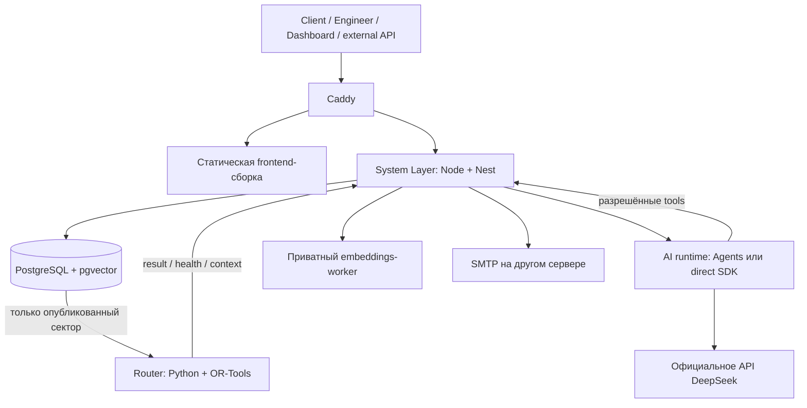

# Технологический стек приложения

**Документ:** `tech-stack.md` · **Версия:** 1 · **Дата проверки источников:** 15 сентября 2026 года.

**Проект:** сервис диспетчеризации выездных инженеров — Client App, Engineer App, Dashboard, внешнее API, System Layer, Router Core, AI, внешний SMTP и Data Layer.

**Назначение:** определить технологии, опорные версии, распределение зависимостей между компонентами и условия воспроизводимой сборки. Документ дополняет `data-flows.md` и существующие концепции, не меняет закрытые бизнес-решения и не разворачивает каталог системных операций.

Базовые технологии заданы пользователем. Дополнительные библиотеки, техническое размещение SQLAlchemy, современный пакет анимаций и конкретные версии ниже — предложенный профиль реализации. Версии сверены с официальной документацией, релизами разработчиков и реестрами пакетов. **Сборка всей комбинации, запуск приложения, обращение к платному API и интеграционные тесты не выполнялись.** Это целевой набор для фиксации в lock-файлах, не уже полученный lock-файл.

## 1. Основной стек в одном месте

| Зона | Опорный набор | Задача |
|---|---|---|
| Frontend | React / React DOM **19.3.0**, TypeScript **5.9.3** + TSX, Tailwind CSS **4.3.3**, Motion **13.2.0**, Vite **8.3.0** | Три собственных ролевых интерфейса |
| System Layer | Node.js **24.21.0 LTS**, NestJS **11.2.5**, TypeScript **5.9.3**, `pg` **8.23.0** | Бизнес-логика, REST API, авторизация, состояния, данные и gateways |
| Data Layer | PostgreSQL **18.6**, pgvector **0.8.6** | Единое постоянное хранилище и три сегмента знаний |
| Python-доступ к БД | SQLAlchemy **2.0.53**, Psycopg **3.3.5** | Чтение специального сектора Router; инструменты схемы |
| Миграции | Alembic **1.20.0** | Единственный механизм изменения структуры БД |
| Router Core | CPython **3.14.7**, Google OR-Tools **9.15.6755**, Pydantic **2.13.5** | Распределение, расписание, обеды, baseline и проверка результата |
| Служебный интерфейс Python | FastAPI **0.141.1**, Uvicorn **0.53.0** | Внутренние интерфейсы Router и вычисления embeddings |
| AI runtime | Node.js, `@openai/agents` **0.18.0**, `openai` **7.15.0** | Agents SDK предпочтителен после проверки; прямой SDK — запасной адаптер |
| Основная LLM | **DeepSeek-V4.1-Flash**, API-имя **`deepseek-flash`** | Официальное API DeepSeek |
| Embeddings | **`microsoft/harrier-oss-v1-270m`**, **640** измерений | Векторизация документов и поисковых запросов |
| Векторизация | Sentence Transformers **6.0.1**, Transformers **5.17.0**, PyTorch **2.14.0** | Приватный Python-процесс вычисления embeddings |
| Почта | Nodemailer **10.0.10** в sys; Postfix **3.11.6** на отдельном сервере | Подготовленное письмо → внешний SMTP → его очередь |
| Web edge | Caddy **2.11.4** | HTTPS, раздача frontend и reverse proxy к sys |
| Развёртывание | Docker Engine **29.8.1**, Docker Compose **5.5.1** | Контейнеры и их окружение |
| Пакеты | npm **11.19.1** + workspaces; uv **0.12.15** | JS/TS и Python соответственно |

Источники версий и технических свойств перечислены в разделе 14. Для основных runtime и СУБД: [V01–V10]; AI: [V26–V31]; инфраструктура: [V32–V40].

### Поправки после D-21 (решение тимлида 15.09.2026)

Строки таблицы выше действуют, **кроме** трёх пунктов, которые заменены решением `29` D-21. Документ сохраняется как исходный профиль; расхождения помечены, а не переписаны молча.

| Пункт этого документа | Действует вместо него |
|---|---|
| §1, §13.1: npm 11 + workspaces, `package-lock.json`, `npm ci` | **pnpm workspaces** (`AGENTS.md` §0), `pnpm-lock.yaml`, `pnpm install --frozen-lockfile` |
| §2.1, §4: доступ Node к БД через `pg` + репозитории | **Prisma ORM** в `apps/api`; правило «Node — владелец бизнес-записи, Router — только чтение сектора» сохраняется без изменений |
| §5.4: Alembic — единственная история миграций | **Prisma Migrate** — единственная история миграций; отдельного Python-мигратора в compose нет. Роли `sys_app` / `router_readonly` / отдельный владелец миграций (§5.1) сохраняются и создаются SQL-ом внутри первой миграции |

Остальное — точное представление снимка (§5.2), целые секунды в `BIGINT` (§5.3), Zod-валидация, отсутствие `synchronize`/`create_all` в рантайме и профиль испытаний (§12.1) — действует полностью.

Номера версий раздела §1 сверялись 15.09.2026 и не все достижимы на текущей машине разработки; фактически зафиксированные версии — в lock-файлах и `docs/runbook.md`.

**Это не список «обязательно самое новое».** Node выбран из LTS-ветки, NestJS — из поддерживаемой ветки 11, TypeScript — из классической ветки 5.9. Переход на новый major только ради номера не является задачей проекта. Остальные зависимости тоже фиксируются точными версиями после проверки совместной установки, а не плавающим `latest`.

## 2. Четыре важных уточнения исходного списка

### 2.1. SQLAlchemy — Python, не Node.js

SQLAlchemy — Python SQL toolkit / ORM. Установить его как ORM в процесс Node.js нельзя. [V07]

Чтобы сохранить **и Node.js, и выбранный SQLAlchemy**, предлагается такое распределение:

```text
System Layer / Node.js
    → node-postgres (pg)
    → параметризованные запросы и транзакции PostgreSQL

Router Runtime / Python
    → SQLAlchemy Core + Psycopg
    → только чтение опубликованного сектора

Однократная задача миграции / Python
    → Alembic + SQLAlchemy
    → изменение схемы с отдельными служебными правами
```

Node.js остаётся владельцем бизнес-операций. Router не получает права записи из-за использования ORM. Не создаётся дополнительный Python-сервис, через который пришлось бы пропускать каждое Node.js-обращение к БД.

В предлагаемом варианте у Node-части есть репозитории поверх `pg`, а не второй ORM. Единственная история миграций — Alembic. Автогенерация миграций допустима как черновик: индексы, ограничения, права и SQL надо проверить до применения. [V08–V10]

Это явная техническая адаптация исходного списка, а не утверждение, что связка Node + SQLAlchemy работает в одном runtime. Для обязательного использования ORM именно в Node потребуется отдельно выбрать JavaScript/TypeScript ORM; здесь он не подставлен молча.

### 2.2. `react-motion` и Motion for React — разные пакеты

Литеральный npm-пакет **`react-motion` 0.5.2** — отдельная старая библиотека. Для проекта на современном React предлагается **Motion for React**, пакет **`motion` 13.2.0**, импорт из `motion/react`. Он ранее назывался Framer Motion. [V05, V06]

```tsx
import { motion } from "motion/react";
```

Оба пакета одновременно не устанавливаем. Замена относится к реализации анимаций, не к дизайну экранов. Если имелся в виду именно старый `react-motion`, его выбор потребует отдельной проверки; в этом опорном профиле используется современный `motion`.

### 2.3. TSX — формат исходников

**TypeScript + JSX → файлы `.tsx`.** TypeScript 5.9.3 проверяет типы, Vite собирает frontend. TSX не отдельный UI-фреймворк и не самостоятельная версия React. Одноимённый npm-пакет `tsx` для запуска Node-кода не становится обязательным только из-за расширения frontend-файлов. [V02]

### 2.4. Docker Compose — современный плагин

В документе используется **Docker Compose 5.5.1** и команда `docker compose`, а не legacy Python-бинарник `docker-compose` v1. Номер Compose не совпадает с номером Docker Engine. [V35, V36]

`compose.yaml` описывает сервисы; автоматически подставлять в него старое поле `version: "3.8"` для соответствия версии плагина не нужно.

## 3. Frontend

### 3.1. Пакеты

| Компонент | Пакет / версия | Использование | Источник |
|---|---|---|---|
| React | `react` **19.3.0** | Компоненты и состояние интерфейса | V01 |
| React DOM | `react-dom` **19.3.0** | DOM-рендеринг; версия совпадает с React | V01 |
| TypeScript | `typescript` **5.9.3** | Типы, TSX; `strict: true` | V02 |
| Сборщик | `vite` **8.3.0** | Dev server и production build | V03 |
| React-плагин | `@vitejs/plugin-react` **6.1.1** | React-интеграция Vite | V11 |
| Стили | `tailwindcss` **4.3.3** | Стили и дизайн-токены | V04 |
| Интеграция стилей | `@tailwindcss/vite` **4.3.3** | Сборка Tailwind через Vite | V04 |
| Анимации | `motion` **13.2.0** | Переходы, появление панелей, локальная анимация | V05 |
| Навигация | `react-router` **7.18.4** | Клиентская навигация, без обязательного SSR | V12 |
| Серверные данные | `@tanstack/react-query` **5.101.4** | Загрузка, инвалидирование и состояние запросов | V13 |
| Схемы данных | `zod` **4.6.5** | Проверки формы и схемы JSON на TS-границе | V14 |
| Drag-and-drop | `@dnd-kit/core` **6.3.1** + `@dnd-kit/sortable` **10.0.0** | Перестановка очереди в MANUAL | V15 |
| Карта | `leaflet` **1.9.4** + `react-leaflet` **5.0.0** | Слои, точки и обзор дневных маршрутов | V16 |

React Router выбран в поддерживаемой ветке 7; новое framework-приложение с серверным рендерингом не создаётся. TanStack Query выбран как стабильный пакет React, а не prerelease другого адаптера из того же монорепозитория. Для drag-and-drop используется классическая пара `core/sortable`, не смешанная с новым API `@dnd-kit/react`.

Типы `@types/react`, `@types/react-dom`, `@types/leaflet`, `@types/node`, `@types/pg` подбираются к выбранным основным версиям при формировании lock-файла. Их patch-номера здесь не выдумываются. Производственные зависимости выше уже имеют точные опорные номера.

### 3.2. Что не добавляется без необходимости

Один frontend-проект может содержать три ролевые области и общие компоненты. Конкретные экраны, их число, названия и композицию определяет дизайнер. Данный стек не возвращает ранее отклонённую обязательную навигацию «Мой день / Мои заявки».

Не требуются Next.js, второй UI-фреймворк, Redux и отдельная библиотека форм только ради короткой формы заявки. Локальное состояние — средствами React; серверное — через Query; проверка — Zod. Дополнительные библиотеки вводятся под конкретную сложность интерфейса.

### 3.3. Работа с данными

Базовый HTTP-клиент — встроенный `fetch`. Запросы действий идут в sys; frontend не подключается к PostgreSQL, Router или провайдеру LLM напрямую.

Локальное отображение drag-and-drop допустимо, но успешное сохранение подтверждает sys. При конфликте возвращается актуальная версия без скрытой перезаписи. Query-cache не считается постоянной БД или подтверждённым фактом выполнения.

Для собственных UI предлагаются обычные REST-чтения и обновление после действий. Потоковый ответ AI, если включён, передаётся отдельным соединением HTTP-stream; формат следует за проверенным AI-адаптером. Наличие этой внутренней возможности **не открывает внешние AI-endpoints, webhook или подписки интеграционному API**.

Полноценная автономная очередь пользовательских изменений не объявляется готовой из-за наличия кеша. Обрыв ответа не означает ни успешную, ни неуспешную запись до выяснения результата sys.

## 4. System Layer на Node.js

| Компонент | Версия / механизм | Ответственность |
|---|---|---|
| Runtime | Node.js **24.21.0 LTS** | Один выбранный JS-runtime для backend и сборки frontend |
| Framework | `@nestjs/common`, `@nestjs/core`, `@nestjs/platform-express` **11.2.5** | Модули, контроллеры, dependency injection, middleware |
| Язык | TypeScript **5.9.3** | Строгие типы; backend собирается до запуска |
| Драйвер БД | `pg` **8.23.0** | Pool, параметризованные SQL-запросы, транзакции |
| Валидация | Zod **4.6.5** | Формы и контрактные проверки через системные adapters/pipes |
| SMTP-клиент | Nodemailer **10.0.10** | Передача готовых писем внешнему серверу |
| Сетевой обмен | REST / JSON / HTTPS | Внешние и собственные прикладные обращения |
| Внутренние HTTP-запросы | `fetch` выбранной версии Node | Получение результата Router, служебные обращения |

Node 24 выбран как LTS; текущая ветка Node 26 не требуется для нашего функционала. NestJS 11.2.5 — опорная поддерживаемая ветка, а не заявление, что это самый новый major. [V17, V18]

**Сборка backend:** `tsc` с необходимой для Nest конфигурацией декораторов и metadata; не использовать Vite как единственный компилятор серверных Nest-классов. Фактический ESM/CommonJS-режим задаётся единообразно в backend-пакете и проверяется импортным smoke-test всех зависимостей.

`reflect-metadata`, `rxjs` и зависимости Express-адаптера устанавливаются в версиях, удовлетворяющих peer requirements выбранного Nest, и фиксируются lock-файлом. Не нужно независимо обновлять один из `@nestjs/*` на другой major.

### 4.1. Границы модулей остаются прежними

`REST API`, `auth-engine`, `dataengine`, `orchestrator backend`, `mount-data-eng`, `AI-gateway`, `SMTP-gateway`, `ROUTER-gateway` — внутренние модули sys, не по отдельному микросервису на каждый.

Бизнес-запись, история и необходимые последующие действия сохраняются согласованно. Реализация фоновой передачи писем/публикации может использовать сохранённые задания в PostgreSQL. Для этого не вводятся Redis, BullMQ, Kafka или RabbitMQ как обязательная зависимость.

### 4.2. Авторизация и секреты

Сохраняются серверные сессии UI и бессрочные до удаления API-ключи `client / eng / master`, принадлежащие одному диспетчеру. Отдельная OAuth-платформа не добавляется. В API не возникает пользовательская привязка ключей, которую пользователь отверг.

Email/пароль диспетчера берутся из серверного `.env`. В frontend попадает результат входа, а не секрет. Реальные `.env`, ключи LLM, SMTP, токены и приватные сертификаты не включаются в Git, клиентский build или общий журнал. Статус удаления токена хранится так, чтобы следующий запрос перестал авторизовываться.

Способ hashing/проверки пользовательских секретов и защиты сессионных cookies определяется auth-реализацией. Ни наличие Nest, ни JWT сами по себе не обеспечивают эти правила; дополнительный JWT-механизм здесь не выбирается.

## 5. PostgreSQL, pgvector и миграции

### 5.1. Версии и роли

**PostgreSQL 18.6 + pgvector 0.8.6.** Для Python-доступа — **SQLAlchemy 2.0.53 + Psycopg 3.3.5**; миграции — **Alembic 1.20.0**. [V07–V10, V19]

| Подключение | Назначение | Граница |
|---|---|---|
| `sys_app` | Бизнес-данные, чаты, учёт, публикация снимка | Прикладной writer через System Layer |
| `router_readonly` | Чтение активного опубликованного снимка | Нет записи и чтения остальных закрытых таблиц |
| `migration_owner` | Применение Alembic-миграций и начальная настройка прав | Только однократная deployment-задача |

Точные SQL-имена ролей — предложение реализации. Разрешения не определяются одним названием схемы; они должны реально назначаться в PostgreSQL.

**Router не запускает Alembic при своём старте и не использует `migration_owner`.** SQLAlchemy в его процессе применяется только к чтению. Полные Python-модели схемы, если используются для миграций, не дают вычислительному процессу дополнительные credentials.

### 5.2. Представление данных

ID, связи, версии объектов, текущие статусы и поля фильтрации — реляционные колонки. Полные архивы main/baseline, объяснения и ограниченные конфигурации могут храниться JSONB. Все данные приложения не сворачиваются в один изменяемый JSON.

Для хэшируемого `RouterTaskSnapshot` сохраняются **точные UTF-8-байты JSON**: в `text` с контролируемым кодированием либо в эквивалентном сохраняющем исходное представление типе. Парсинг не должен заново форматировать документ перед сравнением hash. JSONB не сохраняет первоначальные пробелы и порядок ключей. [V20]

Документ и активный указатель публикуются транзакционно. Предлагаемый алгоритм общего hash — **SHA-256**: `node:crypto` у sys, `hashlib` у Python. Это технический выбор, а не изменение полей сектора. `input_hash` не включается в собственное содержимое. Бизнес-порядок заявок/инженеров не заменяется случайной сортировкой сериализатора.

### 5.3. Время и числа

По принятому контракту timestamps и длительности — целые секунды. Для соответствующих SQL-полей предлагается `BIGINT`; API сохраняет числовые Unix-seconds. На стороне `pg` нужен явный контролируемый перевод PostgreSQL `int8` в JS-число с проверкой безопасного диапазона либо внутренний `bigint` с преобразованием на границе JSON. Нельзя оставлять в API случайную смесь строк и чисел.

Для локального отображения используется `Intl.DateTimeFormat` с явно выбранной зоной. Часовой сдвиг не прибавляется к хранимому timestamp. Дата рабочего периода разворачивается sys в реальные временные границы.

### 5.4. Единственная история схемы

Alembic — единственный владелец schema migrations. Node-репозитории работают с той же схемой, но не создают её собственной второй системой миграций. В production-процессе нет автоматического `create_all`, `synchronize=true` или пересоздания таблиц при каждом старте.

Контрактные тесты проверяют, что TypeScript-представления, Python-схемы и SQL совпадают. Это необходимые проверки двух языков, а не обещание их автоматической синхронизации ORM.

## 6. Router Core

### 6.1. Пакеты

| Компонент | Версия | Назначение | Источник |
|---|---|---|---|
| CPython | **3.14.7**, обычная сборка | Python-runtime | V21 |
| OR-Tools | `ortools` **9.15.6755** | Routing Solver | V22 |
| Pydantic | **2.13.5** | Строгая проверка снимков, результатов и конфигурации | V23 |
| SQLAlchemy | **2.0.53** | Read-only чтение опубликованного сектора | V07 |
| Psycopg | `psycopg[binary]` **3.3.5** | PostgreSQL-драйвер SQLAlchemy | V09 |
| FastAPI | **0.141.1** | Внутренний интерфейс результата/health/разрешённой настройки | V24 |
| Uvicorn | **0.53.0** | ASGI-сервер внутреннего интерфейса | V24 |
| NetworkX | **3.6.1** | Предлагаемая обработка подготовленного дорожного графа в Runtime | V25 |

Используется стандартный CPython, не free-threaded вариант с отдельным ABI. OR-Tools 9.15 имеет поддержку Python 3.14; наличие подходящего wheel надо подтвердить для целевой платформы контейнера. [V22]

### 6.2. FastAPI не становится вторым System Layer

Python-сервис отдаёт результат, состояние и активную версию контекста, а также обслуживает уже согласованную узкую настройку допуска. Он не добавляет публичные `create_request`/пользовательские роли и не принимает команды произвольного переписывания маршрутов.

Runtime читает снимок из PostgreSQL напрямую. Обычной команды sys «пересчитай» нет: изменился вход или технический контекст — Runtime обнаруживает это сам.

### 6.3. Выполнение вычислений

Опорная схема — один Runtime-координатор и отдельный вычислительный процесс. CPU-поиск не должен блокировать выдачу health/result и обнаружение нового снимка. Один активный расчёт и последний ожидающий снимок сохраняют концепцию latest-wins без длинной очереди устаревших задач.

Uvicorn для этого экземпляра — **один управляющий worker**; запуск нескольких независимых workers со своей памятью результатов запрещён без общего координатора. Масштабирование за пределы этой схемы не выбирается данным стеком.

Стартовые стратегии OR-Tools из engine-контракта: `PARALLEL_CHEAPEST_INSERTION` для построения кандидата и `GUIDED_LOCAL_SEARCH` для улучшения. Предыдущий план используется как необязательный seed. Малое изменение проходит отдельную проверку/пересчёт расписания. Политика `fast` задаёт оценку результата, а не переключает произвольный внешний solver. Бюджеты времени остаются конфигурацией для измерений.

### 6.4. Известная проверка OR-Tools

В официальном релизе 9.15 указан дефект `SetAllowedVehiclesForIndex` в обёртках, включая Python. Это должно быть учтено по схеме обхода из `engine_contract_v2.md` и проверено тестом ограничений навыка/транспорта. Одного успешного `import ortools` недостаточно. [V22]

Не делаем обязательный переход на git-main или сборку произвольного коммита ради обхода. Изменение версии solver возможно только с повторной проверкой модели и явной фиксацией.

## 7. Карты: отображение, вычисление и поездка

Это три разных назначения, не одна внешняя зависимость.

### 7.1. Отображение

**Leaflet 1.9.4 + React Leaflet 5.0.0** для общего дневного обзора, точек и слоёв. Стабильная Leaflet 1.9.4 выбрана вместо 2.0 alpha. React Leaflet 5 предназначен для современной React-ветки; совместная установка React 19.3 проверяется в frontend smoke-test. [V16]

Данные OpenStreetMap могут быть источником подложки; URL тайлов и атрибуция задаются конфигурацией. Сам выбор библиотеки не означает неограниченного права скачивать/кешировать публичные тайлы. Подложка не вычисляет назначения и не является автоматически нашим дорожным графом.

### 7.2. Расчёт

Предлагается **NetworkX 3.6.1** для чтения подготовленного направленного графа и вычисления времени/расстояния между нужными точками. Версия графа и правила транспортных профилей входят в контекст Router. [V25]

Источник/подготовка фактической дорожной карты ещё не названы пользователем. Поэтому выбор NetworkX не выдаётся за уже готовые дороги, геокодер или расписания транспорта. Для каждого из `car / walk / bike / transit` нужны явные исходные данные либо документированные упрощающие допущения; нельзя всем незаметно подставить автомобильный профиль.

Main и baseline пользуются одинаковыми матрицами/путями. Геометрия выбранных участков восстанавливается из тех же исходных путей, а не из отдельного запроса с другими временами.

Отдельный OSRM/Valhalla-сервер сейчас не включается обязательным компонентом. Такой сервис можно добавить за существующим TravelProvider, когда определён источник карты и нужные транспортные профили. Live-пробки и расписания общественного транспорта не считаются реализованными.

### 7.3. Поездка инженера

**Google Maps URLs, параметр `api=1`**: передать координаты выбранной заявки в Google Карты. Это официальная URL-интеграция, а не требование подключать Maps JavaScript SDK; ключ API для самих Maps URLs не требуется. [V41]

```text
https://www.google.com/maps/dir/?api=1&destination=<lat>,<lon>
```

Координаты и параметры кодируются приложением. Конкретный режим поездки передаётся только из поддержанного соответствия. Установленное приложение Google Maps либо браузерный вариант открываются согласно поведению устройства.

Точное совпадение маршрута/ETA Google Карт с расчётом Router не гарантируется передачей одной точки. Обратный импорт времени/позиции и подтверждение выезда/начала по открытию ссылки не добавляются. GPS собственного приложения остаётся добровольным сбором, не обязательным входом маршрутизации.

## 8. AI runtime и официальный DeepSeek API

### 8.1. Версии

| Компонент | Выбор | Назначение |
|---|---|---|
| Runtime | Node.js **24.21.0 LTS** + TypeScript **5.9.3** | Общий с sys язык интеграции |
| Предпочтительный агентный слой | `@openai/agents` **0.18.0** | Агентный цикл, инструменты и поток событий после проверки |
| Клиент провайдера | `openai` **7.15.0** | Настраиваемый OpenAI-совместимый клиент |
| Схемы инструментов | Zod **4.6.5** | Проверяемый инструментальный контракт |
| Провайдер | Официальное API DeepSeek | Не прокси неизвестного посредника |
| Название модели | **DeepSeek-V4.1-Flash** | Выбор пользователя |
| API-идентификатор | **`deepseek-flash`** | Фактическое поле `model` |
| API base URL | `https://api.deepseek.com` | Конфигурация клиентского адаптера |
| Протокол | **Chat Completions** | Совместимый путь к DeepSeek |

Версии SDK: [V26, V27]; официальная модель и адрес: [V28]. В документации Agents SDK отдельно указан минимум `openai` 7.2 для самостоятельно переданного клиента; выбранный 7.15.0 выше этого минимума. Это проверка заявленного требования, не доказательство всей интеграции. [V29]

### 8.2. Agents предпочтителен, прямой SDK — предусмотренный запасной путь

`AgentsAdapter` и `DirectOpenAIAdapter` реализуют одну внутреннюю границу: вход, события, запросы tools, отмена, usage и итог. Не создаём два разных набора бизнес-инструментов.

**Выбираем AgentsAdapter основным только после проверок:**

| Проверка | Условие принятия |
|---|---|
| DeepSeek | Текст и последовательность нескольких tool-вызовов проходят через официальный endpoint |
| Служебная история | Не теряются `tool_call_id` и обязательные provider-поля, включая `reasoning_content`, когда выбранный режим этого требует |
| Полномочия | Read-only действительно не пишет; ролевые tools и три сегмента знаний не смешиваются |
| Подтверждения | Отправка заявки и инженерный offline следуют sys-подтверждениям |
| Остановка | Новые записи после stop/handoff не начинаются; завершённые не объявляются отменёнными |
| Повторы | Один retry-владелец, ограниченный бюджет, нет повторного создания бизнес-объекта |
| Человек | Переданный чат не получает поздний параллельный ответ AI |

Если конкретный адаптер не проходит эти условия, используется прямой OpenAI SDK. Сама библиотека не объявляется «нестабильной вообще»; проверяется её пригодность для нашего протокола. [V29, V30]

Agents SDK по умолчанию не должен незаметно отправлять наши запросы в Responses API/OpenAI-модель. Base URL, модель и Chat Completions задаются явно. Внешний экспорт tracing отключён до отдельного решения; внутренний журнал действий сохраняет sys.

### 8.3. Настройки, не являющиеся версией библиотеки

Thinking-режим и лимит генерации задаются профилем. Скрытые рассуждения не становятся интерфейсным обязательством; журнал строится по фактическим sys-tools. Резервная модель пока не названа: поле конфигурации сохраняется, но другой поставщик не включается без выбора и разрешения на передачу данных.

Алиас `deepseek-flash` не является неизменяемым commit модели. Название и дату проверки надо записать в конфигурационный паспорт; перед демонстрацией выполняется короткий вызов совместимости. Изменение поставщиком алиаса не объявляется нашей проверенной новой версией автоматически.

Сохраняются жёсткие квоты по email, три ролевых профиля, человеческая передача и отсутствие внешнего AI API. Эти ограничения не отменяются выбором Agents SDK.

## 9. Embeddings и три сегмента знаний

### 9.1. Ранее выбранная модель

Сохранённый выбор `harrier-oss-270m` уточнён до официального идентификатора **`microsoft/harrier-oss-v1-270m`**. Это именно модель семейства v1 размером 270M, не подмена на 0.6B. Официальная карточка указывает выход **640 измерений**. [V31]

| Компонент | Версия / значение |
|---|---|
| Модель | `microsoft/harrier-oss-v1-270m` |
| Размер вектора | **640**, SQL-тип `vector(640)` |
| Python | CPython **3.14.7** |
| Sentence Transformers | **6.0.1** |
| Transformers | **5.17.0** |
| PyTorch | **2.14.0** |
| Стартовый профиль вычисления | CPU; тип данных и память проверяются на целевой машине |
| Поиск | pgvector **0.8.6**, сначала точный поиск на небольшом наборе |

PyTorch 2.14 имеет CPython 3.14 wheels, но CPU-индекс/архитектуру, зависимости Sentence Transformers и фактическую загрузку checkpoint необходимо совместно проверить. Наличие файла wheel не является проведённым benchmark. [V32]

### 9.2. Место выполнения

Предлагается один приватный `embeddings-worker`, который загружает модель и вычисляет векторы. Он может обслуживать и первоначальное индексирование, и запросы поиска. Сервис получает текст от sys и возвращает embedding; не хранит собственную вторую векторную БД и не получает бизнес-права.

```text
knowledge/client | knowledge/engineer | knowledge/dispatch
    → загрузчик sys
    → embeddings-worker
    → векторы возвращаются sys
    → запись в соответствующие таблицы PostgreSQL

search_documentation()
    → sys определил ролевой scope
    → embeddings-worker векторизовал запрос
    → sys выполнил поиск только по разрешённым сегментам
    → AI получил найденные фрагменты и их источники
```

Три группы таблиц сохраняются. Фрагмент хранится с текстом, происхождением, версией и embedding. Чаты сами не пополняют документацию.

### 9.3. Модельный контракт

Применяются рекомендованные карточкой модели last-token pooling и L2-нормализация; Sentence Transformers выполняет соответствующую модельную обработку. Для поискового запроса используется подходящая инструкция, например преднастроенный `web_search_query`; документы не получают искусственно такую же инструкцию. [V31]

При загрузке зафиксировать **точный revision SHA checkpoint** и одинаковые параметры векторизации для индексирования и поиска. SHA здесь не придуман: его записывают после получения выбранного артефакта. Смена модели, pooling или нормализации требует версии индекса и переиндексации, а не смешивания векторов в старой таблице.

HNSW/IVFFlat и отдельный reranker не становятся обязательными для небольшого `knowledge`. Их можно добавить по измерениям. Redis не возвращается в основную схему из-за embeddings.

## 10. Почтовый сервер и сетевой резерв

| Часть | Опорный выбор | Где работает |
|---|---|---|
| SMTP-клиент | Nodemailer **10.0.10** | В `SMTP-gateway` System Layer |
| SMTP/MTA и очередь | Postfix **3.11.6** | На отдельном почтовом сервере |
| VPN | Hysteria **2.12.2** как целевая версия | Существующая внешняя VPN-инфраструктура |
| Heartbeat/watchdog | Небольшой собственный процесс с минимальными правами | На SMTP-сервере |
| Защищённый канал | TLS с проверкой сертификата и авторизацией сервиса | И через VPN, и в прямом резерве |

Сведения о Nodemailer/Postfix/Hysteria: [V33, V34, V40]. Реальная установленная версия Hysteria не была предоставлена; запись 2.12.2 — целевой профиль после проверки, не утверждение о текущем сервере и не выполненное обновление. Аналогично Postfix ещё предстоит установить.

Postfix выполняет SMTP и очередь; собственный SMTP-протокол не пишем. Sys создаёт коды, заполняет шаблоны и передаёт готовое письмо. Nodemailer может подписывать подготовленные сообщения DKIM; выбор этой точки подписи позволяет не добавлять отдельный milter только ради подписи. [V33]

**Авторизацию приёма необходимо настроить отдельно:** целевой простой вариант — клиентский сертификат сервиса/mTLS и ограничение отправителей; допустима согласованная SASL-конфигурация. TLS без проверки клиента не считается защитой от открытого relay. Конкретный механизм доверия проверяется перед открытием прямого входа; он не заменяется одним наличием VPN.

Нормальный путь — TLS через VPN. Watchdog на SMTP проверяет основной сервер; при потере связи открывает также разрешённый прямой TLS-вход. Основной sys знает оба пути. Heartbeat не означает конечную доставку письма.

Для watchdog не нужна новая платформа оркестрации: конфигурация, таймауты, несколько последовательных проб и ограниченная смена сетевого правила. Пороговые значения остаются эксплуатационными настройками. Уже принятые письма не отправляются повторно только из-за переключения пути.

Почтовая очередь сохраняется на удалённом диске/томе. Контроль нашего приложения заканчивается на принятии SMTP-сервером и проверке его работоспособности, не на прочтении письма клиентом. Почтовый сервер не включается в Docker-сеть основного приложения.

## 11. Docker, Compose и окружение

### 11.1. Версии

| Инструмент | Версия | Использование | Источник |
|---|---|---|---|
| Docker Engine | **29.8.1** | Контейнерный runtime Linux-сервера | V35 |
| Docker Compose | **5.5.1** | Команда `docker compose`, описание окружения | V36 |
| Caddy | **2.11.4** | HTTPS, SPA assets, reverse proxy | V37 |
| npm | **11.19.1** | JS/TS-зависимости и workspaces | V38 |
| uv | **0.12.15** | Python environments, lock и запуск | V39 |

Операционную систему уже существующих серверов документ не переустанавливает. Для образов Node/Python предлагается Debian-based slim, без смешивания musl/Alpine и manylinux wheels в первой конфигурации. Это выбор базового окружения; точные tags и image digests фиксируются после получения образов.

PostgreSQL-образ должен содержать именно проверенные **PostgreSQL 18.6 + pgvector 0.8.6**. В upstream pgvector есть теги по major PostgreSQL; такой тег сам по себе не доказывает minor 18.6. Проверить `server_version` и `extversion` внутри выбранного образа либо собрать свой образ от нужного PostgreSQL. [V19]

### 11.2. Состав развёртывания



| Сервис / задача | Постоянный процесс? | Важное ограничение |
|---|---|---|
| `edge` | Да | Единственная публичная HTTP-точка; статическая сборка и sys |
| `system` | Да | Бизнес-writer; не отдаёт внешнему API внутренние AI-ручки |
| `postgres` | Да | Постоянный том, не публичный порт по умолчанию |
| `router` | Да | Отдельные read-only credentials; собственная память результата |
| `ai` | При включённой функции | Внутренний сервис/процесс, не отдельная публичная интеграция |
| `embeddings` | При работе знаний | Вычисление векторов, не самостоятельный бизнес-writer |
| `migrate` | Нет, однократно | Alembic с отдельными правами до готовности приложения |
| `knowledge-import` | Нет, служебный запуск | Через sys-контур записи, идемпотентная загрузка сегментов |
| SMTP | Отдельный сервер | Не локальный контейнер внутри общей сети |

Внутренние модульные границы не требуют создавать отдельный контейнер на каждый gateway. AI может иметь свой процесс, но его инструменты всё равно исполняет sys.

Node/Python dev-server не используется как production-раздача SPA. Caddy хранит TLS-состояние на постоянном томе. PostgreSQL и очередь SMTP также не должны теряться при обычном перезапуске контейнеров.

### 11.3. Зависимости готовности

`postgres healthy → migrate completed → sys ready`. Router стартует после готовой схемы и доступного сектора/состояния ожидания. Пустое рабочее состояние допустимо и не является ошибкой healthcheck.

Health основного приложения не должен проваливать парольный вход диспетчера только из-за недоступности внешнего SMTP/LLM. Состояние каждого сервиса показывается отдельно. Это не разрешает скрывать ошибки или обещать отправку не принятого письма.

Обычный restart сохраняет данные, MANUAL, чаты и квоты. Полный сброс «всё в ноль» остаётся отдельным подтверждённым действием приложения; команда удаления Docker-volumes не подменяет его контракт и не должна случайно удалить конфигурацию/карты/сертификаты.

## 12. Разработка, тестирование и CI

| Задача | Инструмент / версия | Применение | Источник |
|---|---|---|---|
| Типы TS | TypeScript **5.9.3** | Проверка frontend/shared/backend |
| Форматирование и lint JS/TS | `@biomejs/biome` **2.5.13** | TS, TSX, JSON; конфигурация под выбранный синтаксис | V46 |
| Unit-тесты frontend/shared | Vitest **5.0.1** | Чистые функции, состояние, проверки форм | V42 |
| Сквозные UI/API-тесты | Playwright **1.63.0** | Реальный браузер и HTTP-проверки | V43 |
| Backend-тесты | `node:test` из Node **24.21.0** | Скомпилированный JS; HTTP и чистые модули |
| Python-тесты | pytest **9.1.1** | Контракты, ограничения, снапшоты и алгоритмы | V44 |
| Python lint/format | Ruff **0.16.7** | Статические проверки и форматирование | V45 |
| CI | GitHub Actions | Пайплайн репозитория; actions фиксировать по commit SHA |

Строки без отдельного источника используют уже зафиксированный runtime. Для Nest-тестов сохраняется та же metadata/decorator-сборка, что и в production. Vitest не объявляется автоматически корректным преобразователем Nest-классов.

Тесты базы запускаются на PostgreSQL с pgvector, а не только на SQLite или mock: нам важно проверить транзакции, read-only права, точный payload и векторную размерность. Платный LLM и реальная почтовая рассылка по умолчанию заменяются контрактными fixtures; отдельные разрешённые smoke-tests проверяют настоящие интеграции.

### 12.1. Обязательные проверки выбранной комбинации

| Область | Проверка |
|---|---|
| Зависимости | Оба lock-файла разрешаются без `--force` и игнорирования peer conflicts |
| Frontend | React 19.3, Motion, Leaflet и dnd-kit собираются и работают в браузере |
| Nest | Bootstrap, metadata, импорты SDK/pg, работа репозиториев |
| БД | Миграция пустой базы, роли, snapshot JSON, независимый hash TS/Python |
| Router | Python/ORTools wheels; навыки/транспорт; окна; обеды; три пути обработки |
| Контекст | Изменение карты/допуска не маркирует старый результат новой версией |
| MANUAL | Поздний ответ не переписывает ручной план; рестарт не включает AUTO |
| AI | Проверки адаптера из §8; provider-поля, stop, handoff и квоты |
| Embeddings | Checkpoint загружается, выход имеет 640 измерений, поиск изолирован по ролям |
| SMTP | Принятие, очередь, авторизация обоих путей, heartbeat без ложной доставки |
| API | Полные категории ключей, удаление, отсутствие AI endpoints и user-level ключей |
| Reset | Старые фоновые действия не оживляют данные предыдущего запуска |

Первая реализация не получает обещания SLA, времени расчёта или качества маршрута только на основании версий. Производительность проверяется на реальном датасете отдельно от успешной установки пакетов.

## 13. Фиксация версий и технический backlog

### 13.1. Как превратить опорную таблицу в воспроизводимый build

**JS/TS:** указанные основные версии заносятся без `^`/`~` там, где нужна строгая фиксация. Один корневой `package-lock.json`, npm workspaces и одинаковая версия npm у команды. В CI — `npm ci`, не независимое обновление зависимостей при каждом запуске.

**Python:** отдельный `pyproject.toml`/`uv.lock` для Python workspace либо согласованные lock-файлы runtime и embeddings, если зависимости разделены. Интерпретатор фиксируется в `.python-version`. В CI выполняется `uv sync --locked` для проверки соответствия manifest и lock. Python-пакеты не устанавливаются через npm. [V39]

**Образы:** после успешной сборки фиксируются tags и image digests. Одного `postgres:18`, `python:3.14` или `node:lts` недостаточно для точного воспроизведения.

**Модели:** Harrier закрепляется по revision SHA. API-модель DeepSeek фиксируется доступным provider-идентификатором и паспортом проверки; собственный неизменяемый snapshot весов провайдера здесь не существует.

**Параметры не подменяют версии:** квоты email, TTL, интервалы heartbeat, допуск Router, время поиска, окно/длительность обеда — настройки проекта. Их значения этот файл не выдумывает.

### 13.2. Что остаётся вне обязательных зависимостей данного профиля

Redis — backlog, как согласовано. Kafka/RabbitMQ, Kubernetes, отдельная векторная БД, live-навигация, обязательный GPS, публичный LLM-прокси, внешние webhooks и редактор политик не появляются из-за выбора стека.

Политики — готовые варианты, выбранные диспетчером. Карта и навигация не меняют архитектуру Router. Полный каталог endpoint и операций sys по-прежнему отложен.

### 13.3. Что ещё нужно закрепить при первой сборке

| Пункт | Почему не подставлен произвольный номер |
|---|---|
| Model revision SHA Harrier | Нужен hash реально полученного checkpoint, не придуманная строка |
| Docker image digests | Появляются после выбора registry/архитектуры и получения образов |
| Полный transitive lock | Только разрешение и тест сборки определяют совместимую комбинацию |
| Fallback-модель | Пользователь не выбрал второй endpoint; нельзя молча передать данные другому поставщику |
| Источник дорожного графа и тайлов | Библиотека NetworkX/Leaflet не является готовым набором дорог/условий использования |
| Фактическая версия установленной Hysteria | На сервер не подключались, обновления не проводили |

Эти пункты не возвращают закрытые бизнес-разделы на повторное обсуждение. Основной стек и опорные версии заданы; завершение package-lock, uv.lock и smoke-tests — следующий технический шаг реализации.

## 14. Источники версий и технических уточнений

### Проектная основа

- `data-flows.md`: согласованные потоки и разделение компонентов; Dashboard v2 учтён как закрытый раздел.
- `engine_contract_v2.md`: Runtime/Engine, три пути расчёта, интеграционные ограничения OR-Tools.
- `router_contract_v2.md`: input/output, hash/контекст, Unix-time и доступ к сектору.
- Последние решения по AI/SMTP, System Layer, Data Layer, клиентским/инженерным интерфейсам и внешнему API в переписке.
- ТЗ «Билайн Бизнес», §3.2: свободный выбор технологий. Само ТЗ не предписывает этот конкретный набор версий.

### Официальные релизы и документация

Номера в таблицах соответствуют следующим проверенным источникам. В таблице указаны **выбранные опорные версии**, а не обещание, что они навсегда останутся latest. Новые библиотеки и разделение SQLAlchemy — решение предлагаемой реализации, не дословное требование источников.

| Код | Источник | Что проверено |
|---|---|---|
| V01 | [React Versions](https://react.dev/versions) | React 19.3.0 |
| V02 | [TypeScript 5.9.3](https://github.com/microsoft/TypeScript/releases/tag/v5.9.3) | Выбранный классический compiler |
| V03 | [Vite releases](https://github.com/vitejs/vite/releases) | Vite 8.3.0 |
| V04 | [Tailwind releases](https://github.com/tailwindlabs/tailwindcss/releases), [Vite integration](https://tailwindcss.com/docs/installation/using-vite) | Tailwind 4.3.3 и plugin |
| V05 | [Motion for React](https://motion.dev/docs/react), [motion package](https://www.npmjs.com/package/motion) | Современный пакет и 13.2.0 |
| V06 | [react-motion package](https://www.npmjs.com/package/react-motion) | Отдельный старый пакет 0.5.2 |
| V07 | [SQLAlchemy](https://www.sqlalchemy.org/), [2.0.53 release](https://www.sqlalchemy.org/blog/2026/09/14/sqlalchemy-2.0.53-released/) | Python toolkit и стабильная версия |
| V08 | [node-postgres](https://node-postgres.com/), [pg changelog](https://github.com/brianc/node-postgres/blob/master/CHANGELOG.md) | Node-драйвер pg 8.23.0 |
| V09 | [Psycopg на PyPI](https://pypi.org/project/psycopg/3.3.5/) | 3.3.5 |
| V10 | [Alembic на PyPI](https://pypi.org/project/alembic/1.20.0/), [Tutorial](https://alembic.sqlalchemy.org/en/latest/tutorial.html) | 1.20.0 и назначение миграций |
| V11 | [Vite React plugin releases](https://github.com/vitejs/vite-plugin-react/releases) | 6.1.1 |
| V12 | [React Router releases](https://github.com/remix-run/react-router/releases) | Поддерживаемая 7.18.4 |
| V13 | [TanStack Query releases](https://github.com/TanStack/query/releases) | React Query 5.101.4 |
| V14 | [Zod releases](https://github.com/colinhacks/zod/releases) | 4.6.5 |
| V15 | [dnd-kit core](https://www.npmjs.com/package/%40dnd-kit/core), [sortable](https://www.npmjs.com/package/%40dnd-kit/sortable) | 6.3.1 / 10.0.0 |
| V16 | [Leaflet downloads](https://leafletjs.com/download.html), [React Leaflet releases](https://github.com/PaulLeCam/react-leaflet/releases) | 1.9.4 / 5.0.0 |
| V17 | [Node.js](https://nodejs.org/en) | Node 24.21.0 LTS |
| V18 | [NestJS 11.2.5](https://github.com/nestjs/nest/releases/tag/v11.2.5) | Версия framework |
| V19 | [PostgreSQL versioning](https://www.postgresql.org/support/versioning/), [pgvector](https://github.com/pgvector/pgvector) | PostgreSQL 18.6 / pgvector 0.8.6 |
| V20 | [PostgreSQL JSON types](https://www.postgresql.org/docs/current/datatype-json.html) | Различие исходного JSON-текста и JSONB |
| V21 | [Python downloads](https://www.python.org/downloads/) | CPython 3.14.7 |
| V22 | [OR-Tools на PyPI](https://pypi.org/project/ortools/9.15.6755/), [v9.15 release](https://github.com/google/or-tools/releases/tag/v9.15) | Версия, Python 3.14, дефект SetAllowedVehiclesForIndex |
| V23 | [Pydantic на PyPI](https://pypi.org/project/pydantic/2.13.5/) | Stable 2.13.5, не 2.14 beta |
| V24 | [FastAPI](https://pypi.org/project/fastapi/0.141.1/), [Uvicorn](https://pypi.org/project/uvicorn/0.53.0/) | Внутренний HTTP/ASGI стек |
| V25 | [NetworkX](https://pypi.org/project/networkx/3.6.1/) | Работа с графом, 3.6.1 |
| V26 | [OpenAI Agents JS releases](https://github.com/openai/openai-agents-js/releases) | 0.18.0 |
| V27 | [OpenAI Node releases](https://github.com/openai/openai-node/releases) | 7.15.0 |
| V28 | [DeepSeek API](https://api-docs.deepseek.com/) | DeepSeek-V4.1-Flash, alias deepseek-flash, base URL |
| V29 | [Agents SDK — Models](https://openai.github.io/openai-agents-js/guides/models/) | Кастомный endpoint/client, Chat Completions, требование openai >=7.2 |
| V30 | [DeepSeek Thinking Mode](https://api-docs.deepseek.com/guides/thinking_mode) | Служебные поля диалога с tools |
| V31 | [Microsoft Harrier model card](https://huggingface.co/microsoft/harrier-oss-v1-270m) | Официальный ID, 640 измерений, pooling/нормализация и prompt |
| V32 | [Sentence Transformers](https://pypi.org/project/sentence-transformers/6.0.1/), [Transformers](https://pypi.org/project/transformers/5.17.0/), [PyTorch](https://pypi.org/project/torch/2.14.0/) | Версии ML-библиотек; wheel PyTorch для CPython 3.14 |
| V33 | [Nodemailer releases](https://github.com/nodemailer/nodemailer/releases), [SMTP](https://nodemailer.com/smtp), [DKIM](https://nodemailer.com/dkim) | 10.0.10, transport и подпись писем |
| V34 | [Postfix announcements](https://www.postfix.org/announcements.html) | Stable release 3.11.6 |
| V35 | [Docker Engine 29 release notes](https://docs.docker.com/engine/release-notes/29/) | Engine 29.8.1 |
| V36 | [Docker Compose releases](https://github.com/docker/compose/releases) | Compose 5.5.1 |
| V37 | [Caddy releases](https://github.com/caddyserver/caddy/releases) | 2.11.4 |
| V38 | [npm CLI releases](https://github.com/npm/cli/releases) | npm 11.19.1 |
| V39 | [uv на PyPI](https://pypi.org/project/uv/0.12.15/), [Locking and syncing](https://docs.astral.sh/uv/concepts/projects/sync/) | 0.12.15, lock/sync |
| V40 | [Hysteria releases](https://github.com/HyNetworks/hysteria/releases) | Целевой 2.12.2; не проверка установленного сервера |
| V41 | [Google Maps URLs](https://developers.google.com/maps/documentation/urls/get-started) | Передача места назначения, api=1, без API-ключа для URL |
| V42 | [Vitest releases](https://github.com/vitest-dev/vitest/releases) | 5.0.1 |
| V43 | [Playwright releases](https://github.com/microsoft/playwright/releases) | 1.63.0 |
| V44 | [pytest](https://pypi.org/project/pytest/9.1.1/) | 9.1.1 |
| V45 | [Ruff](https://pypi.org/project/ruff/0.16.7/) | 0.16.7 |
| V46 | [Biome releases](https://github.com/biomejs/biome/releases) | 2.5.13 |

---

**Итог:** React/TSX/Tailwind/Motion для интерфейсов; Node/Nest/pg для sys; PostgreSQL/pgvector для данных; SQLAlchemy/Psycopg в Python-части и Alembic для единственной истории миграций; Python/OR-Tools для маршрутизации; Agents SDK с проверенным DeepSeek-адаптером и прямым SDK как запасным путём; Harrier для embeddings; внешний Postfix; Docker/Compose/Caddy и воспроизводимые npm/uv зависимости.
