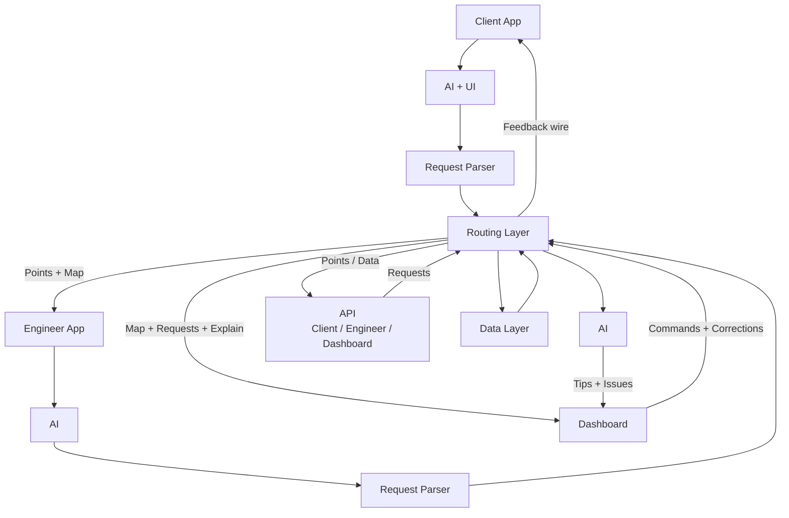

> ⚠️ **АРХИВ (2026-09-15).** Файл устарел и не развивается. Актуальное содержание: заменено консолидированной редакцией: `32-system_concept_v14.md`, кратко — `19-short_concept.md`. Сохранён как история решений и источник цитат D-№ (цитаты вида `NN` в `29-decision-log.md` указывают сюда, в `context/archive/`).

# Концепция продукта — заметки тимлида (v0, полный перенос)

> Статус: сырой перенос записей тимлида без редактуры — фиксируем идеи как есть. Следующий шаг: отобрать главное и собрать короткий ёмкий концепт-файл для команды.
> Пометки распознавания речи проверены и подтверждены автором: «логи роутинга» (не локи), «основной бэкенд» (Routing Layer).
> Связанные файлы: `context/01` (разбор ТЗ), `context/10` (UX), `context/11` (объяснимость), `context/23` (коммуникации), `context/29` (ADR).

---

# Архитектура системы

Примечание к диаграмме: в исходных записях блоки были подписаны «Engineer App» и «Master App» — это ошибка меток; исправлено на «Client App» и «Engineer App» соответственно (тексты приложений всегда назывались верно).

---

# Client App

## Создание заявки

- Возможность подать заявку через форму.
- Выбор типа проблемы.
- Выбор локации:
  - ввод адреса с определением местоположения;
  - выбор точки на карте.
- Выбор даты.
- Выбор желаемого временного окна.
- Отметка **«Срочная заявка»** — заявка требует выполнения в ближайшее время (вместо/поверх обычного окна).
- Указание телефона.
- Указание электронной почты.
- Комментарий мастеру.
- При отправке заявки — подтверждение через код, отправленный на почту.

## Создание заявки через AI

Вместо обычной формы пользователь может описать проблему в свободной форме в чате.

AI-ассистент на основе описания пользователя генерирует заявку целиком:
- определяет проблему;
- заполняет необходимые поля;
- уточняет недостающую информацию;
- формирует готовую заявку для отправки.

## Управление отправленной заявкой

После отправки заявки пользователь может войти по электронной почте:

**Авторизация:**
- почта;
- код подтверждения.

После входа пользователь может:

- посмотреть текущий статус заявки;
- посмотреть информацию о заявке;
- изменить / подвинуть время;
- отменить заявку.

---

# Engineer App

## Статус инженера

Инженер может переключаться между двумя состояниями:

- **Онлайн** — инженер вышел на линию и может получать заявки.
- **Офлайн** — инженер не принимает заявки.

Логика примерно как «выход на линию» в Яндекс Go.

---

## Список заявок

Когда инженер находится онлайн, он видит список заявок.

Для каждой заявки отображается:

- место;
- временное окно;
- отметка **«Срочная»** — если заявка срочная;
- кнопка построения маршрута.

---

## Карточка заявки

В заявку можно провалиться и посмотреть подробную информацию.

В карточке заявки доступны:

- подробные данные заявки;
- описание проблемы;
- информация о клиенте;
- адрес;
- точка на карте;
- временное окно;
- построение маршрута.

---

## Техническая остановка

Инженер может нажать кнопку:

**«Техническая остановка»**

Продолжительность:

**15 минут.**

Она нужна для учёта реального рабочего времени инженера и корректного расчёта временных окон следующих заявок.

---

## Статус прибытия на заявку

Когда приближается время ближайшей заявки, под ней появляются три кнопки:

- **Опаздываю**
- **Буду вовремя**
- **На месте**

### После наступления времени заявки

После наступления назначенного времени:

- кнопка **«Опаздываю»** исчезает;
- кнопка **«Буду вовремя»** исчезает;
- вместо них появляется кнопка **«Завершить»**.

Кнопка **«На месте»**:

- если инженер уже нажал её — она исчезает;
- если инженер её не нажал — остаётся доступной до завершения заявки.

---

## Чат инженера / AI-ассистент

В Engineer App есть чат, через который инженер может сообщить о возникшей проблеме.

Например:

- проблема в дороге;
- задержка;
- поломка;
- проблема у клиента;
- невозможность выполнить заявку вовремя;
- необходимость помощи;
- другие нестандартные ситуации.

Основной интерфейс работает через AI-ассистента.

AI анализирует сообщение инженера и выполняет соответствующее действие через системные tools.

Примеры tools:

- `delay_tool` — сообщить о задержке и пересчитать время;
- `breakdown_tool` — сообщить о поломке / технической проблеме;
- `operator_help_tool` — запросить помощь оператора / диспетчера.

В стандартных ситуациях AI решает проблему автоматически.

В сложной или нестандартной ситуации AI передаёт диалог диспетчеру / оператору.

---

# Dashboard

- Показываются автомашины (машины мастеров/инженеров) с метками всех позиций и стрелочками между ними — порядок перемещений.
- Каждый мастер — своим цветом.
- Отмечается **активная точка** — там, где мастер сейчас находится; в UI это интуитивно понятно.
- Если у мастера проблема или задержка — активная точка (или линия) обводится **красным**.
- Показывается список **всех заявок**:
  - можно выставлять приоритетность;
  - можно смотреть подробности каждой заявки.
- **Срочные заявки выделяются** — отдельной пометкой в списке и на карте (поступление срочной заявки — событие для перепланирования дня).
- **Двойной чат:**
  1. **Помощник** — на базе AI разгружает конфликты, советует диспетчеру (помощник диспетчера).
  2. **Живые чаты** — возможность общаться с клиентами или с мастерами: свой интерфейс подключения к активным чатам и общение вместо ассистента.

---

# API

- Подпись: **Client / Engineer / Dashboard** (в исходнике было «Master» — заменено).
- **Принцип паритета с UI:** через API доступно вообще всё, что мы отдаём в интерфейсах — любые данные, которые видит клиент, инженер и диспетчер в Dashboard.
- **Назначение:** заказчик может подключить **свои приложения вместо наших** — полный доступ к выходным данным для клиента и для инженера.
- **Расширенный доступ:** даже дополнительные данные по системе (то, что не показывается в UI напрямую) — тоже доступны через API.

---

# Data Layer

- Детальная спецификация будет раскрываться позже — материализуется, когда сделаем основной бэкенд в Routing Layer.
- Пока точно: хранятся данные
  - обо всех **инженерах** (мастерах);
  - обо всех **заявках**;
  - о **логах роутинга** и **причинах произошедших событий** (почему что-то произошло — база для объяснимости).
- Стек: скорее всего **PostgreSQL** и **Redis**.

---

# Routing Layer

- **Уточняется позднее** — это основная часть системы, требует отдельного разбора.
- Уже зафиксировано из других разделов: принимает заявки (из Client App и Engineer App через Request Parser), управляет планом/маршрутами, отдаёт Points + Map в Engineer App, Map + Requests + Explain в Dashboard, данные через API; опирается на Data Layer.
- База для проработки уже собрана: `context/04` (алгоритмы), `context/05` (солверы), `context/07` (перепланирование), `context/11` (объяснимость), `context/29` (решения D-1…D-17).
