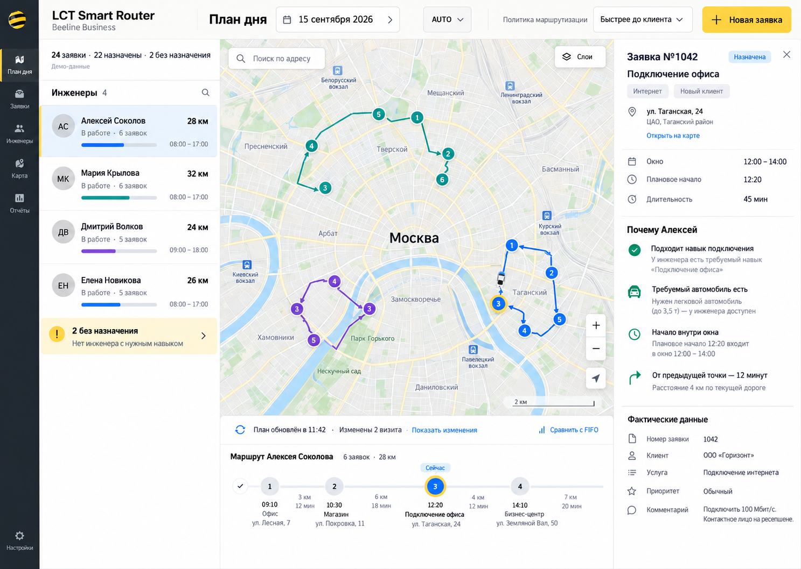
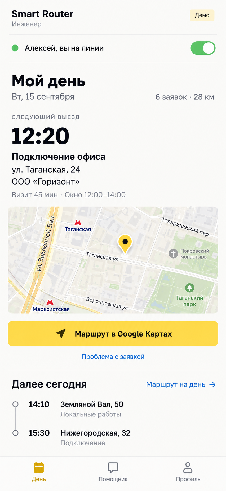
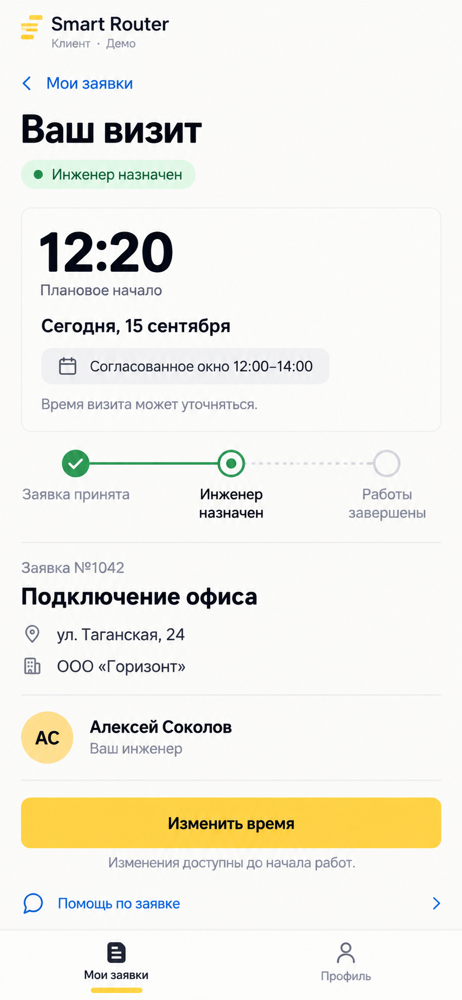

# Примеры UI-макетов

Сгенерированы 15.09.2026; добавлены в репозиторий 16.09.2026 по запросу владельца
проекта. Эти три оригинальных PNG иллюстрируют интерфейсы ролей LCT Smart Router.
Это материал для дизайн-обсуждения, а не утверждённые спецификации, реализованные
экраны или официальная графика Билайн.

## Дашборд диспетчера

Рабочее место на карте: инженеры, выбранная заявка, причины назначения и таймлайн
маршрута.

## План дня инженера

Мобильный вид ближайшего визита, внешней навигации и остатка дня.

## Статус визита клиента

Мобильный вид собственной заявки клиента, согласованного окна и расчётного времени
визита.

## Как использовать эти примеры

- Все имена, времена, адреса, количества и расстояния — демонстрационный контент.
  Карты иллюстративны: это не вывод маршрутизации и не проверенная география.
- На изображении диспетчера inconsistent-цвета маршрутов и повторяющиеся номера
  маркеров. Не воспроизводить эти ошибки генерации в приложении.
- Изображения старше проверенного бренд-референса: их приблизительный жёлтый
  (`#FFD54A` в брифе генерации) и сгенерированные логотипы не авторитетны.
  Для `#FED305`, оригинального официального символа и различения «сourced/проектные»
  цвета следуйте [визуальному референсу Билайн](../beeline/README.md).
- Текущие продуктовые контракты и ролевые концепты главнее любых контролов, подписей,
  статусов и раскладок, подразумеваемых этими картинками. См.
  [индекс контекста](../../../context/INDEX.md), особенно документы 38 и 39.
- Файлы хранятся без изменений от сгенерированных оригиналов. Это растровые
  референсы: редактируемого Figma-файла или интерактивного HTML/React-прототипа нет.
